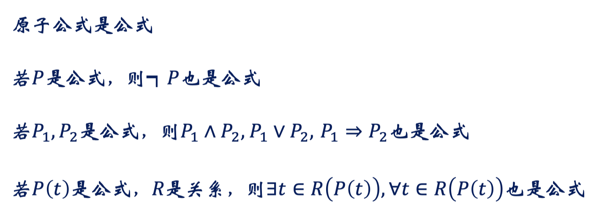
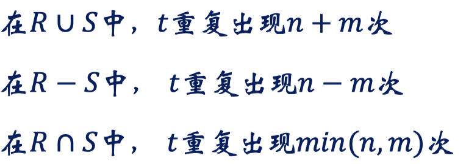

# 第三章 关系模型

## 关系基本概念

###  关系模型的诞生

E.F.Codd于70年代初提出关系数据理论，他因此获得1981年的ACM图灵奖关系理论建立在集合代数理论基础之上，有着坚实的数学基础

早期代表系统
System K：由IBM研制
INGRES：由加州Berkeley分校研制

目前主流的商业数据库系统
Oracle, SQL Server, DB2
MySQL, PostgreSQL
OceanBase, GaussDB, 达梦
Access, SQLite

### 笛卡尔积 (Car'tesian Product)

域 (Domain)：具有相同数据类型的一组值的集合，如整数集合、宇符串集合、全体学生集合

一组域$D_1,D_2,...,D_n$的笛卡尔积为：

$$
D_1\times D_2\times\cdots\times D_n=\{(d_1,d_2,...,d_n)\mid d_i\in D_i,i=1,...,n\}
$$
n元组(tuple)：笛卡尔积的元素$(d_1,d_2,...,d_n)$ 

分量 (component)：元组的每一个值 di

苗卡尔积的基数：若 $D_i$ 的基数为 $m_i$ , $\prod_{i=1}^nm_i$

#### 苗卡尔积：可能的世界

老师集合T
学生集合S
课程集合C

TSC是个三元组集合，元组个数 2×3×2
它是所有可能的（老师，学生，课程）元组集合

笛卡尔积可表为二维表的形式：

### 关系：笛卡尔积的子集

笛卡尔积$D_1\times D_2\times\cdots\times D_n$的子集称作在域$D_1,D_2,...,D_n$上的关系，用$R(D_1,D_2,...,D_n)$表示， $R$是关系的名字，$n$是关系的度或目

关系是笛卡尔积中有意义的子集

1. 关系名体现了现实实体或联系
2. 关系集合包含了真正存在的实体或发生的联系

#### 过江之鲫：关系实例的数目

$$
{\mathrm{D1:=\{A,B,C,D,E\}}}\\
\mathrm{D}2:=\{1,2,3,4\}\\
D3:=\{甲，乙，丙，丁\}
$$
 D1×D2×D3包含多少个关系？$2^{80} $ 

 $\{\mathcal{A},\mathcal{B},\mathcal{C},\mathcal{D},\mathcal{E},1,2,3,4,甲，乙，丙，丁\}$​
 划分为多少个域，每个域多少个元素， 使得笛卡尔积包含的关系数目最多？原则是一个域3个元素，最后剩下的拆成2，答案是 {3, 3, 3, 2, 2}，如果是连续的，那就是 e

#### 关系的性质

P1：列是同质的，是同一类型的数据，即每一列中的分量来自同一域

不同质违反了关系对实体联系的表达，以及对实体属性的刻画：

P2：不同的列可以来自同一域，每列必须有不同的属性名

什么时候两个列会来自同一个域？一元联系、类型相同的属性

Р3：行列的顺序无关紧要

P4：任意两个元组不能完全相同（集合内不能有相同的两个元素）

P5：每一分量必须是不可再分的数据，称其为作满足第一范式（INF）的关系

嵌套关系：

1NF关系：

以查询的角度，深入分析嵌套关系的利弊： 声明性查询 VS 路径式查询，**<u>嵌套关系不能反向查询</u>**

## 关系模型三要素

### 数据结构

单一的数据结构— 关系，实体集、联系都表示成关系

思考：单一数据结构带来的好处是什么？数据结构单纯，都是表，处理简单

#### 码

候选码（Candidate Key）：关系中的一个属性组，其值能唯一标识一个元组若从属性组中去掉任何一个属性，它就不具有这一性质了，这样的属性组称作候选码（如DEPT中的dno，dname都可作为候选码）

主属性：任何一个候选码中的属性（如SC中的sno，cno， DEPT中的dno，dname）

主码（PK，Primary Key）：进行数据库设计时，从一个关系的多个候选码中选定一个作为主码（如可选定dno作DEPT的主码）

外码 (FK，Foreign Key)：关系R中的一个属性组，它不是R的码，但它与另一个关系S的码相对应，称这个属性组为R的外码（如S关系中的dno属性）

#### 关系模式

关系的描述，记作R（A1,A2，...  ，An），包括：关系名、关系中的属性名
属性向域的映象，通常说明为属性的类型、长度等
属性间的数据依赖关系，比如在特定的时间和教室只能安排一门课

关系模式是型，是稳定的

#### 关系：

某一时刻对应某个关系模式的内容（元组的集合）

关系是某一时刻的值，是随时间不断变化的

#### 关系数据库的型

是关系模式的集合，即数据库描述。称作数据库的内涵（Intension）

#### 关系数据库的值

是某一时刻关系的集合。称作数据库的外延（Extension）

### 数据操作

关系操作是集合操作
操作的对象及结果都是集合
是一次一集合（Set-at-a-time）的方式

#### 关系数据语言的特点

都是由于关系操作是基于集合的

一体化：对象单一，都是关系，因此操作符也单一

非过程化：用户只需提出“做什么”，无须说明“怎么做”，存取路径的选择和操作过程由系统自动完成

面向集合的存取方式：操作对象是一个或多个关系，结果是一个新的关系（一次一关系），非关系系统是一次一记录的方式

#### 抽象的关系模型查询语言：

1. 关系代数：用预定义操作算子的执行序列来表达查询
2. 关系验算：用谓词来表达查询，只需描述所需信息的特性
   1. 元组关系验算：谓词变元是元组
   2. 域关系验算：谓词变元是属性列

SQL：介于关系代数和关系演算之间，由IBM公司在研制System R时提出

### 数据完整性

#### 实体完整性

关系的主码中的属性值不能为空值

空值：不知道或无意义

意义：关系对应到现实世界中的实体集，元组对应到实体，实体是相互可区分的，通过主码来唯一标识，若主码为空，则出现不可标识的实体，这是不容许的

#### 参照完整性

如果关系$R_{2}$的外码$F_{k}$与关系$R_{1}$的主码$P_{k}$相对应，则$R_{2}$中每个元组的$F_k$值或者等于$R_1$中某个元组的$P_k$值，或者为空值

如果关系$R_{2}$的某个元组$t_{2}$参照了关系$R_1$的某个元组$t_1$, 则$t_{1}$必须存在，也即必须与客观存在的实体发生联系

#### 用户定义完整性

用户针对具体应用环境定义的完整性约束条件

1. Sno要求是8位整数，首位是0或1
2. 飞行员的飞行里程与星级评定
3. 选课人数不能少于10人，多于100人
4. 在本地纳税记录超过5年才有购房资格
5. 婚姻登记必须购买百年好合保险……

实体完整性和参照完整性由系统自动支持，系统提供定义和检验用户定义的完整性的机制

#### 课堂练习：关系模型完整性例子

只有3、4可以

1：主码不能是空值，违反了实体完整性

2：重复的主码

5：不存在的外码，违反了参照完整性

## 关系代数的运算

### 关系代数运算汇览

### 基本关系代数运算

#### 选择运算

在关系中选择满足给定条件的元组（行角度）
$$
\sigma_F(\mathbb{R})=\{t\mid t\in\mathbb{R},F(t)=^{\prime}\text{ 真}^{\prime}\}
$$

$$
\begin{aligned}&F\text{是选择的条件,}\forall t\in R,F(t)\text{要么为真,要么为假}\\
&F\text{由逻辑运算符连接算术表达或而成}\end{aligned}
$$

##### 选择运算计算例子

##### 用选择远算表达查询

找年龄不小于20的男学生
$$
\begin{aligned}\sigma_{age\geq20\wedge sex=\prime M{\prime}}(S)\\\sigma_{age\geq20}(\sigma_{sex=^{\prime}M^{\prime}}(S))\\\sigma_{sex=^{\prime}M^{\prime}}(\sigma_{age\geq20}(S))\end{aligned}
$$
哪种执行方或更为高效，主要取决于数据分布和索引配置

比如对于年龄有一个索引，那么选择最后一种查询方式，可以更快得缩小查询范围。这就是查询优化器的原理，检查那个执行路径更高效

#### 投影运算

从关系中取若干列组成新的关系（从列的角度）
$$
\prod_A(R)=\{t[A]\mid t\in R\},A\subseteq R
$$
注意：投影的结果中要去掉相同的行

##### 投影查询示例

给出所有学生的姓名和年龄：$\prod_{sno,age}(S)$

找001号学生所选修的课程号： $\prod_{cno}(\sigma_{sno=001}(SC))$

#### 更名

将关系R更名为S: $\rho_S(R)$

将计算表达式E更名为关系S: ${\rho_{S(A_1,A_2,...,A_n)}(E)}$

更名运算的必要性：

1. 将更名运算施加到关系上，得到具有不同名字的同一关系
2. 当同一关系多次参与同一运算时需要更名

#### 并运算

所有至少出现在两个关系中之一的元组集合
$$
\mathbb{R}\cup\mathbb{S}=\{r\mid r\in\mathbb{R}\lor r\in \mathbb S\}
$$

关系R和S进行并运算的前提是它们必须是相容的

1. 关系R和S必须是同元的，其属性数目必须相同
2. 对∀i，R的第I个属性和S的第I个属性的域必须相同

##### 并运算计算例子

##### 并运算查询示例

求选修了001号或002号课程的学生号
$$
\prod_{sno}(\sigma_{cno=001\lor cno=002}(SC))
$$
或者
$$
\prod_{sno}(\sigma_{cno=001}(SC))\cup\prod_{sno}(\sigma_{cno=002}(SC))
$$

#### 差运算

所有出现在一个关系而不在另一关系中的元组集合
$$
R-S=\{r\mid r\in R\land r\notin S\}
$$

R和S必须是相容的

##### 差运算计算例子

##### 差运算查询示例

求选修了001号但未选修002号课程的学生号
$$
\prod_{sno}(\sigma_{cno=001}(SC))-\prod_{sno}(\sigma_{cno=002}(SC))
$$
注意下面这种写法是错误的， $\sigma$ 下面的条件是对于一行来说的，所以这样就相当于选出来了选了001号课程的同学
$$
\prod_{sno}(\sigma_{\color{red}{cno}=001\wedge cno\neq002}(SC))
$$

#### 集合的交

是扩展运算，不算是关系模型的基础运算

#### 苗卡尔积运算：如何跨表（多行比较）查询？

行级思维：逐一扫描SC中的行，过滤出cno=C1的行，获得其sno，再根据得到的sno到S中查找对应的行

什么是集合级思维？运算的对象是集合

如何把多表数据融合到一个表中，以便施加选择和投影运算？

##### 元组的连串 (Concatenation)

$$
\begin{gathered}r=(r_1,\ldots,r_n),\mathrm{~}s=(s_1,\ldots,s_n),\mathrm{~}r\text{与}s\text{的连串定义为}:\\\widehat{\mathrm{rs}}=(\mathrm{r}_1,\ldots,\mathrm{r}_{\mathrm{n}},\mathrm{s}_1,\ldots,\mathrm{s}_{\mathrm{m}})\end{gathered}
$$

##### 关系的苗卡尔积 

$$
R\times S=\{\widehat{rs}\mid r\in R\wedge s\in S\}
$$

R x S的度为R与S的度之和
R x S的元组个数为R和S的元组个数的乘积

##### 笛卡尔积运算示例

##### 苗卡尔积运算查询示例

求选修C1课程的学生姓名

注意在选择运算时候，两个表的学生编号要相同！！！
$$
\prod_{sname}(\sigma_{S.sno=SC.sno\wedge cno=c1}(S\times SC))
$$

##### 关系自身的笛卡尔积运算

求数学成绩比王红同学高的学生

$$
\prod_{S.姓名}\left(\sigma_{R.姓名=王红\ Λ\ R.课程=数学\ Λ\ S.课程=数学\ Λ\ R.成绩<S.成绩}(R\times\rho_S(R))\right)
$$

### 关系代数扩展运算

#### 交运算

所有同时出现在两个关系中的元组集合
$$
R\cap S=\{r\mid r\in R\land r\in S\}
$$

交运算可以通过差运算来重写
$$
R\cap S=R-(R-S)
$$

##### 交运算计算例子

##### 交运算查询示例

求同时选修了001号和002号课程的学生号

#### $\theta$ 连接

从两个关系的广义笛卡儿积中选取给定属性间满足一定条件的元组
$$
{R_{A\theta B}^{{\bowtie}}S=\{\widehat{rs}\mid r\in R\wedge s\in S\wedge r[A]\theta s[B]\}}
$$
A,B为R和S上度数相等且可比的属性列， $\theta$为算术比较符，为等号时称为等值连接
$$
R_{A\theta B}^{\bowtie}S=\sigma_{r[A]\theta s[B]}(R\times S)
$$

#### 自然连接

从两个关系的广义笛卡儿积中选取在相同属性列B上取值相等的元组，并去掉重复的列
$$
R\bowtie S=\{\widehat{rs}[\overline{B}]\mid r\in R\wedge s\in S\wedge r[B]=S[B]\}
$$
自然连接与等值连接的不同：自然连接中相等的分量必须是相同的属性组，并且要在结果中去掉重复的属性，而等值连接则不必

自然连接为什么非常有用？自动合并公共属性列

##### 自然连接的计算例子

##### 自然连接表达查询的例子

求001号学生所在系的名称： 第一种算法比较慢，第二种算法快

关系R（A, B），S（A, C），R与S中元组个数分别为10，15，试填写下表

无任何条件，自然连接：两个表公共属性列完全不同，0；所有公共属性列都一样，150

无任何条件，投影并集：投影相当于去重了，再作并至少有一个元素，最多的时候两个去重过后完全不同，25个

A是R的主码，自然连接：两个表公共属性列完全不同，0；所有公共属性列都一样，但是第二个表每行只能对应第一个表的一行，15

A是R的主码，投影并集：R中主码肯定至少10个；S中也可以有另外15个不同的主码，加起来25个

A是R的主码S的外码，自然连接：R有10个不一样的A，S有15个从R的A中选出来的A，必然有产生15对相同的A

A是R的主码S的外码，投影并集：R有10个不一样的A，由于是外码，S中的A一定是R中的A，取并集无论如何就是R的10个A

##### 自然连接的问题

问题：有关P03号职工的姓名和工资信息没有显示出来？没有授课，没有和他相等的公共属性列，就丢失了他的第一个表的信息

##### 如何由关系表生成报表——生成所有信息的全能榜？

涉及到多个表之间的连接全能榜？

#### 外连接

为避免自然连接时因失配而发生的信息丢失，可以假定往参与连接的一方表中附加一个取值全力空值的行，它和参与连接的另一方表中的任何一个未匹配上的元组都能匹配，称之为外连接

外连接= 自然连接＋ 未匹配元组（悬挂元组）

外连接的形式：左外连接、右外连接、全外连接

左外连接 =  自然连接 + 左侧表中未匹配元组
右外连接 = 自然连接＋右侧表中未匹配元组
全外连接 = 自然连接＋两侧表中未匹配元组

##### 外连接的执行顺序

此时结合律不成立：对于这个情况，从左向右没有孙立，从右向左有孙立

##### 外连接结合律不成立的反例

#### 半连接

##### 猜想一下什么是反半连接？

表达：没有参与xxx联系的

##### 半连接的应用场景：减少分布式查询中的通讯量

方案2是传输数据很少的，使用了半连接，很好

#### 外部并

R(AB) outer union S(BC) 在B上相同的行合并为一行

一般用于信息集成，将子实体集合并为父实体集

实体识别是判别两个子实体是否对应同一个实体

注意第二个例子，展示了外部并与外连接的区别之处

外部并不是根据所有相同数据列合并，只根据主码列合并，比如B代表了身份证号，可以唯一确定一个人，那么其他的数据虽然不同，但是必然是同一个人，就要合并起来，不能开两行

#### 像集 (Image Set)

关系R（X, Z），X,Z是属性组，x是X上的取值，定义 X在R中的象集 ：
$$
\mathbb{Z}_x=\{{t[\mathbb{Z}]}\mid t\in\mathbb{R}\wedge{t[X]}=x\}
$$
其实就是选择运算+投影运算

象集的含义：张军同学所选修的全部课程

##### 问题：如何求得选修了全部课程的学生？

思路一：判断每个学生的课程象集是否包含了整个课程集合

$$
\{\boldsymbol{u}\mid\boldsymbol{r}\in\boldsymbol{S}\boldsymbol{C}\wedge\boldsymbol{u}=\boldsymbol{r}[\text{姓名}]\wedge\boldsymbol{\text{课程名}_u}\supseteq\boldsymbol{C}\}
$$
思路二：判断学生与课程集合构成的笛卡尔积是否完全包含在选课集合中

$$
\{\boldsymbol{u}|\boldsymbol{u}\in\prod_\text{姓名}{ ( \boldsymbol { S }\boldsymbol{C})\wedge\forall\boldsymbol{v}\in\mathcal{C}}(\vec{\boldsymbol{u}}\vec{\boldsymbol{v}}\in\boldsymbol{S}C)\}
$$

##### 如何求得没有进修全部课程的学生？

如何求得选修全部课程的学生？

$$
\prod_X(\mathbb{R})-\prod_X(\prod_X(\mathbb{R})\times\prod_Y(S)-\mathbb{R})=\mathbb{R}(X,Y)\div\mathbb{S}(Y)
$$

体会减法操作在区分开两类不同性质子集时的作用

#### 除法的本能：所有、全部、任意

找到包含所有Y的一行x

除法的定义表达式

除法的计算表达式 （先求没有选修全部课程的，再用所有人减去这些人）

##### 除运算示例

SC(sno, cno, grade)

求选修了所有课程的学生

方案二是错误的。因为方案二在除法的时候没有删除成绩，所以导致除法的时候，一个人的所有成绩都一样才能被选中，相当于把人名和成绩看作一个整体再进行的二元除法。

### 关系代数更新运算

不是重点，增删改的过程是什么样的

为使查询表达简单、清晰，可以将一个复杂关系代数表达式分成几个部分

每一部分都赋予一个临时关系变量

该变量可被看作关系而在后续表达式中使用

临时关系变量 ← 关系代数表达式

#### 赋值运算

#### 广义投影

在投影列表中使用算术表达式来对投影进行扩展
$$
\begin{gathered}\prod_{F_1,F_2,\ldots,F_n}(E)\\F_1,F_2,\ldots,F_n\text{是算术表达式}\end{gathered}
$$
求教工应缴纳的所得税
$$
\begin{gathered}\prod_{\boldsymbol{pno},\boldsymbol{sal}*0.05}(PROF)\\\rho_{\boldsymbol{pno},\boldsymbol{income}-\boldsymbol{tax}}(\prod_{\boldsymbol{pno},\boldsymbol{sal}*0.05}(PROF))\end{gathered}
$$

#### 数据库修改：删除

将满足条件的元组从关系中删除
$$
R\leftarrow R-E
$$
是对永久关系的赋值运算

对于第二个式子，找到了没有选课的同学之后还有和原始表做一个连接，从S中筛选出来拥有没选课同学学号的那些同学，这样才能最终相减。否则格式不同的表不能相减

#### 数据库修改：插入

插入一个指定的灭组，或者插入一个查询结果
$$
\mathbb{R}\leftarrow\mathbb{R}\cup E
$$

加入计算机系学生选修“数据结构”的信息

#### 数据库修改：更新

利用广义投影改变元组的某些属性上的值
$$
R\leftarrow\Pi_{F_1,F_2,...,F_n}(R)
$$

### 关系代数查询实例

#### 求没有选修C1号课程的学生

求没有选修C1号课程的学生 ⇔ 所有学生-选修了C1号课程学生
$$
{\prod_{sno}(SC)-\prod_{sno}(\sigma_{cno=c1}(SC))}
$$

$$
\text{写成}\prod_{\mathrm{sno}}(\sigma_{\text{спо ≠ с}1}(SC))\text{ 对不对?}
$$

不对，这样就变成了除了（仅选了c1课程的学生）之外的学生

#### 求仅选修了C1号课程的学生号

= 选修C1号课程的学生 - 仅选C1号课程之外的学生
$$
{\prod_{sno}(\sigma_{cno=c1}(SC))-\prod_{sno}(\sigma_{cno\neq c1}(SC))}
$$

#### 如何甄别开只选C1的同学和选修C1同时又选修其他课程的同学？

直选c1的同学：
$$
\prod_{sno}(\sigma_{cno=c1}(SC))-\prod_{sno}(SC-\sigma_{cno=c1}(SC))
$$
注意在关系运算中，考虑Venn图，S-A其实是S-A加上A与别的集合的交集

#### 求选修C1课程比S1学生的该门课程成绩高的学生

表达式写错了，少了一个 S.cno = c1 ，否则无法确定另一个人的成绩是哪个课。

#### 求每门课程的先修课的先修课

递归查询：找到所有的祖辈先修课？不告诉递归几次，关系代数做不了

关系代数不具有生成传递闭包的能力，不满足关系完备性

#### 求选修了至少两门课的学生

求选修了至少N门课的学生 

求只选修了1门课的学生

#### 求最低的成绩

#### 求选修课程中包含了所有 S01号学生所选修课程的学生号

#### 求其选修课程被S01号学生所修课程包含的学生号

反过来，先找没有被包含的

#### 找出一直上涨的股票

## 关系验算

### 元组关系演算

形式化定义 {t | P(t) }

表示所有使谓词P为真的元组集合

P是公式由原子公式和运算符组成

t为元组变量，如果元组变量前有全称（V）或存在（彐）量词，则称其为约束变量，否则称为自由变量

#### 原子公式

#### 公式的递归定义

#### 公式的等价性

#### 元组关系演算示例

如何转换为关系代数？

1. 一个选择运算
2. 差运算
3. 笛卡尔积，选择运算，然后投影出来S
4.  S中任意的都比R小，不好表示，反过来算，R-不是全都比S大的
5. $R-\Pi_{R}(\sigma_{R.A\geqslant S.B}(R\times S))$
6. $\Pi_{R.A,R.B,S.C}(\sigma_{R.A\geqslant S.B}(R\times S))$

#### 元组关系演算查询示例

求选修了全部课程的学生号：

其中错误写法没有先固定学生，C是所有课程，SC是所有选课记录

错误写法几乎会输出所有学生，因为错误写法相当于对于所有课程，输出他们选课学生的并集，而不是交集。

求选修了S1同学所修全部课程的学生号：

#### 元组关系演算与关系代数的等价性

#### 关系演算表达式的安全性

元组关系演算有可能会产生无限关系，这样的表达式是不安全的，如｛t | !（t in R）｝，求所有不在R中的元组

表达式安全域的例子

### 域关系演算

#### 域关系演算形式化定义

#### 域关系演算的计算例子

#### 域关系演算查询示例

找出工资在800元以上的老师

找出工资在800元以上的老师的姓名

给出计算机系老师的姓名

#### 采用域关系验算的实际查询系统：QBE

#### 关系代数和关系验算的比较

R（A, B）是二元关系，求R中的那些元组，其属性列交换后组成的元组仍在R中

讨论：如何理解“相比关系演算，关系代数是过程性操作语言”？

关系模型相比以前的网状关系，是非过程化的，这是关系模型的显著特点。但是在这个语境下，关系代数的过程性体现在，它需要人定义出操作过程，而关系验算不需要。

## 补充材料

### 包

允许重复的集合，或者多集（multi-set）｛1,2,2,3,3,3｝

引入包的原因
•效率，不用去重
•合理地计算聚集函数的值

#### 包的关系代数运算

包的选择、投影、苗卡尔积：和集合上定义是一样的，只需保留重复即可

包的并、交、差：假定一个元组t在包R中重复出现了n次，在包S中重复出现了m次，则：

哪些对包成立，哪些不成立？

成立的：

不成立：

### 作为约束语言的关系代数

#### 参照完整性

R（A,B），S（B,C），S中的B是参照R的B的外码

#### 函数依赖

R（A,B），要求在A上相等的在B上也相等

表达违反约束的情形不存在

#### 确定A的唯一性

对于R（A,B）如何确定A的唯一性？

对于R(A, B, C)如何确定A的唯一性？

### 全关系系统

#### 关系系统

表式系统：仅支持关系（即表）数据结构，不支持集合级操作。表式系统不能算关系系统

最小关系系统：仅支持关系数据结构和三种关系搡作。许多微机关系数据库系统如FOXPrO属于此类

完备关系系统：支持关系数据结构和所有的关系代数操作。90年代初的许多关系数据库管理系统属于这一类

全关系系统：这类系统支持关系模型的所有特征

#### 全关系系统的十二条准则

准则0：一个关系型的DBMS必须能完全通过它的关系能力来管理数据库

准则 1：信息准则——关系型DBMS的所有信息都应在逻辑一级上用一种方法即表中的值显式地表示

准则 2：保证访问准则——依靠表名、主码和列名的组合，保证能以逻辑方式访问关系数据库中的每个数据项（分量值）：以关联寻址代替面向机器的访问方式

准则3：空值的系统化处理——全关系型DBMS应支持空值概念，并用系统化的方式处理空值

准则 4：基于关系模型的动态的联机数据字典——数据库的描述在逻辑级上应该和普通数据采用同样的表示方式，使得授权用户可以使用查询一般数据所用的关系语言来查询数据库的描述信息

准则 5：统一的数据子语言——一个关系系统可以有几种语言和多种终端使用方式（如QBE、嵌入式SQL），但必须有一种语言，它的语句可以表示为具有严格语法规定的字符串

准则 6：视图更新准则——所有理论上可更新的视图也应该由系统更新，即对视图的更新要求，存在一个算法可以无二义地把更新要求转换力对基本表的更新序列

准则7：高级的插入、删除和修改操作——关系系统的操作对象是单一的关系

准则 8：数据物理独立性——无论数据库的数据在存储表示和存取方法上作任何变化，应用程序和终端活动都保持逻辑上的不变性

准则9：数据逻辑独立性——当对基本关系进行理论上信息不受损害的任何改变时，应用程序和终端活动都保持逻辑上的不变性

准则 10：数据完整性的独立性——关系数据库的完整性约束条件必须是用数据库语言定义并存储在数据字典中的，而不是由应用程序加以定义

准则 11：分布独立性分布独立性是指DBMS具有这样的数据庫语言，使得应用程序和终端活动在下列情况下都保持逻辑上的不变性：

- 在第一次引入分布式数据时，即如果原来的DBMS只管理非分布式的数据，而现在引入了分布式数据
- 当数据重新分布时，即如果原来DBMS能管理分布式数据，现在要改变原来的数据分布

准则 12：无破坏准则——如果一个关系系统具有一个低级（一次一记录）语言，则这个低级语言不能违背或绕过完整性准则

- 为获得完整性的独立性，需要让完整性约束条件和数据的逻辑结构相独立
- 不能旁路（bypass）或者关闭约束检查子系统
