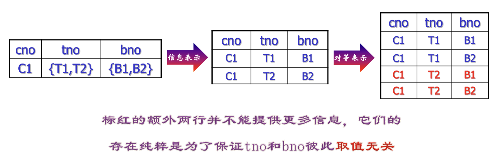

# 第七章 关系规范化

## 关系模式设计问题

## 函数依赖

不同的码:

## 范式

范式是对关系的不同数据依赖程度的要求

### 1NF

### 2NF

AB->C

A->D

D被部分码决定

### 3NF

AB->C

C->D

C, D都被全码决定, 但是D同时还间接被决定

一个全是主属性的关系模式一定是3NF的吗？一定是

### BCNF

所有的属性都是由码直接决定的

————————————————————————————————————————————

属于.

————————————————————————————————————————————

上面查询更快,但是不是BCNF,所以需要3NF. 并且可能有函数依赖被BCNF拆到两个表里面,丢失函数依赖 (参考以下例子).

————————————————————————————————————————————

全码属于BCNF吗？属于.

————————————————————————————————————————————

和BCNF就是区别在Y是不是主属性

## 多值依赖

————————————————————————————————————————————

————————————————————————————————————————————

多值依赖的子集不一定仍然还是

### 4NF

### 5NF

了解即可

### 思考题

留作作业题

————————————————————————————————————————————

一些证明题,比较难

## Armstrong 公理系统

Armstrong公理的应用示例

## 闭包计算

一般用这个定理来检查一个依赖是否正确

这个定理的证明不考察

## 候选码计算

所以所有候选码是 {AC, AD, AE}

判定范式:

2NF: 计算所有主属性元素的闭包,看是否包括B,发现都不包括,那么是2NF

3NF:对于非主属性是否存在传递依赖,AB->CD->B,不是3NF

注意传递依赖的定义!

## 函数依赖的等价和覆盖

————————————————————————————————————————————

等价.

### 函数依赖集F的最小覆盖

无冗余化是跟测试顺序有关系的, 测试顺序不同, 删除的冗余关系也不同

要遵守先既约化(变量无冗余), 最后再无冗余化

如果两个反了, 可能有冗余的函数依赖

#### 多值传递律

不是理想的多值传递律, 举一个反例:
$$
X\rightarrow\rightarrow Y, Y\rightarrow\rightarrow Z
\Rightarrow X\rightarrow\rightarrow Z-Y
$$
根据已有的知识:
$$
X\rightarrow\rightarrow YZ
$$
那么不一定有
$$
X\rightarrow\rightarrow Y
$$
具体例子:

从而举出反例:
$$
A\rightarrow\rightarrow BC, BC\rightarrow\rightarrow C\Rightarrow A\rightarrow\rightarrow C
$$
这个推出和上述的结论矛盾 ($BC\rightarrow\rightarrow C$ 是因为: 函数依赖是多值依赖的特例)

#### 联合律

略过  

## 模式分解

### 函数依赖在属性集上的投影

不需要考虑了. 因为A已经决定了BCD, 所以组合属性 AB、AC、AD都没有必要考虑了, 同理其实CD也没有必要考虑

### 模式分解定义

## 保持函数依赖的分解

### 如何判断分解是保持函数依赖的

### 丢失函数依赖的分解实例

## 无损连接分解

### 有损分解的例子

### 无损连接分解的定义

### 无损连接分解的判别算法

无损连接分解的判别算法考试不要求

### 分解为两个关系模式的无损分解

判定算法:

 但是其实正向不成立,只能推出多值依赖

### 分解为两个关系模式的无损分解示例

 

## 关系模式分解算法

### 保持无损: 分解之后BCNF

是不是无损的? 是的  

#### 例子

#### 练习：如何构造一个有N种BCNF分解结果的关系模式

1. 
2. 

第二种不知道多少, 没讲

### 达到4NF无损连接分解算法

不讲

#### 例子

### 关于BCNF分解的额外讨论

左边分解太碎了

### 保持函数依赖的分解: 最高3NF

为什么第三点的时候算法终止? 因为此时已经是3NF了

如果XA=U, 此时B不可能是违反3NF的例子

#### 丢失函数依赖的BCNF分解

跳过了

#### 达到3NF保持函数依赖的分解

### 同时保持函数依赖和无损连接的分解

不能在保持无损的结果上改进, 很难, 应该在保持函数依赖的结果上改进

#### 同时保持函数依赖和无损连接的分解算法

再加一个表, 代表了原来的码, 可以限定不会出现新的行, 比如给上面的例子加一个表AB

## 模式调优

跳过
