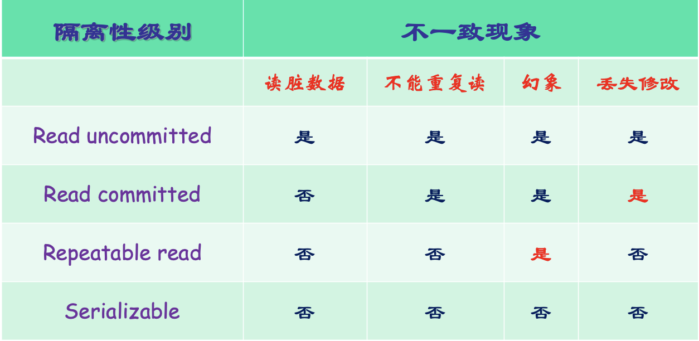
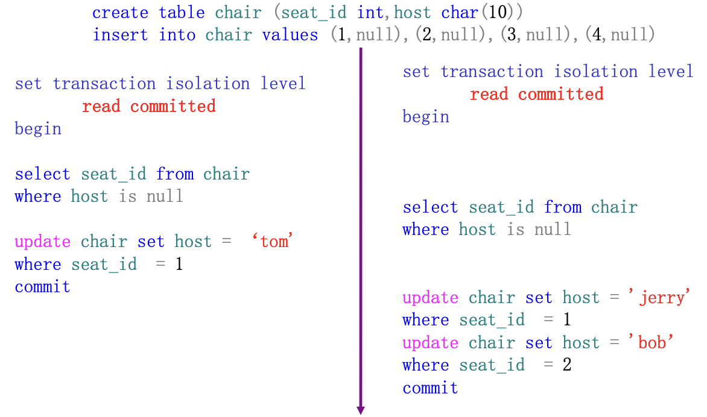
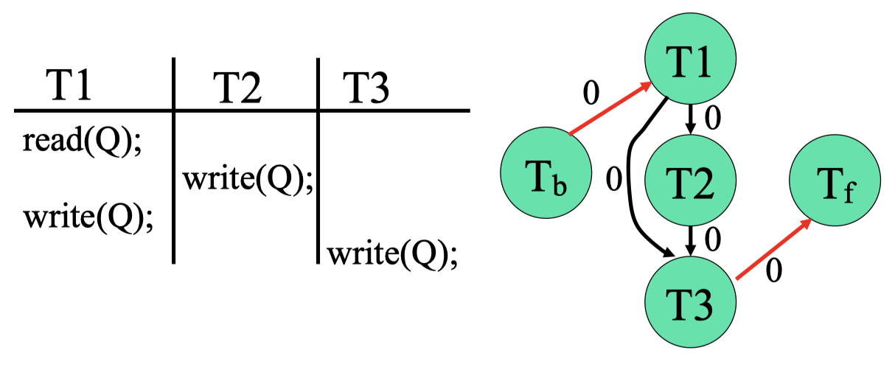
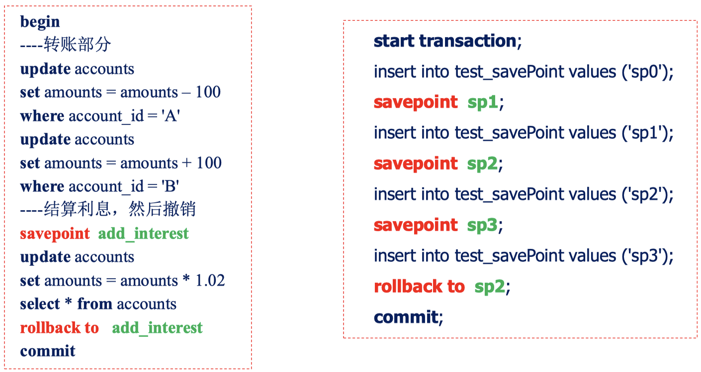

#  第八章 事务

## 事务

核心：完整性

完整性的威胁: 网络故障、并发

一致性条件：两个账户总和在转账前后保持不变

### 事务的定义

事务是由一系列操作序列构成的执行单元，这些操作要么都做，要么都不做，是一个不可分割的工作单位

#### 事务中的数据访问原语

#### 转账事务的原语表达

银行转帐：事务T以A帐户过户50¥到B帐户

read (A);
A : = A - 50;
write (A);
read(B);
B := B + 50;
write (B);

### SQL中事务的定义

事务以Begin transaction 开始，以Commit transaction或 Rollback transaction结束

Commit transaction表示提交，事务正常结束

Rollback transaction表示事务非正常结束，撤消事务已做的操作，回滚到事务开始时状态

#### 基于SQL编写转账事务

#### 事务中的错误检查

事务中的错误检查：MySQL

### 事务基本特性ACID

原子性（Atomicity）

一致性（Consistency）

隔离性（Isolation）两个事务并行结果等于串行结果

持久性（Durability）

### 事务生命周期图

## 事务调度

### 定义

事务的执行顺序称为一个调度，表示事务的指令在系统中执行的时间顺序

一组事务的调度必须保证: 包含了所有事务的操作指令、一个事务中指令的顺序必须保持不变

### 串行和并行

这么多: 不考

串行事务效率低，并行事务有可能破坏数据库的一致性

如何检验并行调度的正确性? 下节课讲

### 事务调度示例

#### 串行调度1

#### 串行调度2

#### 并行调度3

#### 并行调度4

### 可恢复调度

事务的恢复

- 一个事务失败了，应该能够撤消该事务对数据库的影响
- 如果有其它事务读取了失败事务写入的数据，则该事务应该撤消

可恢复调度: 对于每对事务T1与T2，如果T2读取了T1所写的数据，则T1必须先于T2提交

### 无级联调度

无级联调度: 对于每对事务T1与T2，如果T2读取了T1所写的数据，则T1必须在T2读取之前提交

无级联调度必是可恢复调度

**无级联调度就是多对可恢复调度**

## 并发调度中的不一致现象

### 丢失修改

写写不一致: 两个事务T1和T2读入同一数据并修改，T1提交的结果破坏了T2提交的结果，导致T2的修改丢失

### 读脏数据

**就是不可恢复调度**

写读不一致: 事务T1修改某一数据并将其写回磁盘，事务T2读取同一数据. 此后T1由于某种原因被撤消，其已修改过的数据恢复原值，造成T2读到的数据与数据库中数据不一致，则T2读到的就是脏数据

### 不能重复读

不能重复读: 事务T2读取某一数据后，事务TI对其做了修改，当T2再次读取该数据时，得到与前次不同的值

例子:

list：订票客户列表；airline（..count）：航班人数
r1(list) r2(list) w2(list) r2(count) w2(count) commit(t2) r1(count)

r1(list) 和 r1(count)  如果中间加入了旅客, 就会出现不能重复读的问题

### 发生幻象（Phantom）

插读不一致: 事务T2按一定条件读取某些数据后，事务T1插入一些满足这些条件的数据，当T2再次按相同条件读取数据时，发现多了一些记录

## 事务隔离性级别

### 定义

read uncommitted: 允许读取未提交的记录

read committed: 只允许读取已提交的记录，但不要求可重复读

repeatable read: 只允许读取已提交记录，并且一个事务对同一记录的两次读取之间，其它事务不能对该记录进行更新

serializable: 调度的执行必须等价于串行调度

 SQL中事务隔离性级别一般选择 read commit

###  隔高性级别的内部实现: read uncommitted

读脏数据

### 隔离性级别的内部实现： read committed

读完一次就释放读锁

读写读: 不可重复读:

### 隔离性级别的内部实现：repeatable read

直到所有读事务结束, 才释放读锁

### 隔离性级别与不一致现象的关系

注意: read committed 也会导致丢失修改 (两个修改一个覆盖另一个)

Read commit: 读锁读完就结束

Repeatable read: 读锁持续到事务结束 

例子:

在第一个commit之后释放写锁, 然后第二个就可以修改了, 这导致了丢失修改.

## 快照隔离

### 乐观并发控制

悲观并发控制的缺点是什么？

- 基本思想：通过加锁预防冲实（读-写、写一写）
- 基本机制：事务在进行读写操作之前先申请锁
- 不适合以读为主的冲突几率低的应用场合（读密集）
- 不必要的预防代价过高（读-读）

针对读密集应用，不加锁直接访问数据会怎样？

- 避免了加锁开销，直接执行读写操作效率高
- 通过回滚一方事务来解决事务间已经发生的冲突

### 快照隔离SI的基本恩想：多版本+回滚

**这一页很重要**

- 对数据库的写发生在提交时，形成数据项的一个提交版本（快照）
- 执行时间和访问数据项有交叠的写事务之间会产生冲突，先提交者赢
- 读操作访问该读事务开始那一刻的数据项最新版本，读写相互不会阻塞

问题出现在T3提交的时候, T3提交和T4提交产生 Y 的冲突, 因此按照T4来, T3 的修改全部被回滚, 最后的结果是 T4 的X=8, Y=9

T2在 commit 的时候会出现被 T3 造成的丢失修改吗? 不会, 因为这是快照隔离, 相当于每一个事务都有自己的快照 (buffer) , T3 的修改不会修改到 T2 的快照, 所以 T2 commit 的 X 仍然是 6

### 快照隔离中的不一致现象

问题出在两个 commit 实际上是产生了不一致现象的, 两个事务按理来说会透支信用, 不能同时成功进行, 但是由于快照隔离不考虑两者之和大于0, 只要没有同时修改就行, 所以产生了透支信用 (和小于0) 的现象

Question: 在悲观锁定下会发生这样的不一致吗？

Answer: 从常用的 read committed 开始, 就不会产生了, 因为在 T1 commit 之前, T2 是不能读取 X 的, 所以 T2 不能判定是否 X+Y 大于 0

这个例子是说明了: 快照隔离的结果可能不是任意一种串行调度的结果

### 区分MySQL的当前读和快照读

只有这两种 select 和以下这三种操作 (update, insert, delete) 是悲观锁, 其他操作都是快照读

如果设置 Serializable , 那么就走悲观封锁

## 冲突可串行化 

mix调度和mix调度之间的等价, 最后可以等价为两个串行的调度

核心问题： 如何判定一个调度是可串行化的？如何判定两个调度是等价的？

微观视角：交换非冲突指令, 如何把一个调度转换为另一个等价调度？

宏观视角：从读一致性, 如何保证每个事务在两个调度中是相同的？

### 指令顺序对调度结果的影响

考虑一个调度 S 中的两条连续指令 （ 仅限于 read与 write操作）Ii 与Ij ，分别属于事务Ti 与Tj 

① I i = read(Q), I j = read(Q) 

② I i = read(Q), I j = write(Q) 

③ I i = write(Q), I j = read(Q) 

④ I i = write(Q), I j = write(Q)

在①情况下，Ii 与Ij 的次序无关紧要。其余情况下，Ii 与Ij 的 次序不同，其执行结果也不同，数据库最终状态也不同

### 冲突指令

两条指令是不同事务在**相同数据项**上的操作，并且其中**至少有一个是write**指令

非冲突指令交换次序不会影响调度的最终结果 (read的结果)

### 冲突等价 

如果调度S可以经过交换一系列非冲突指令转换成调度S'，则称调度S与S'是冲突等价的

使用交换证明冲突等价的例子:

### 冲突可串行化

当一个调度S**与一个串行调度冲突等价**时则称该调度是冲突可串行化的

非冲突串行化的例子：

### 冲突可串行化的判定

优先图(precedence graph): 调度S的优先图的构造方式：它是一个有向图 G =(V，E)， V是顶点集，E是边集。顶点集由所有参与调度的事务组成 ， 边集由满足下述条件之一的边Ti →Tj 组成：

① 在Tj 执行read(Q)之前，Ti 执行write(Q)

② 在Tj 执行write(Q)之前，Ti 执行read(Q) 

③ 在Tj 执行write(Q)之前，Ti 执行write(Q)

如果优先图中存在边 Ti →Tj ， 则在任何等价于S的串行调度S'中，Ti 都必须出现在 Tj 之前

如果调度S的优先图中有环，则S是非冲突可串行化的；如果图中无环，则是冲突可串行化的 (因为一个图论定理: 在一个有向无环图中, 总有一个顶点入度为0)

串行顺序可由拓扑排序得到，求出与优先图的偏序相一致的线序

可串行化但但非冲突可串行化的调度:

左边这个调度不是冲突可串行化的, 但是其实是可串行化的, 因为改成串行化后不会影响最后A的值, 但是会影响 read 的值, 所以它不是冲突可串行化的. 

其实**第一种会造成死锁**, 在T1访问B之前, AB都已经被锁住了, 就死锁了.

练习: 给出该调度的优先图，该调度是冲突可串行化的吗？若是， 给出该调度一个的等价的串行调度

对T1, 查找其他T234是否有writeABC和readC, 如果有就会产生一条边, 或者产生两条边

T2 → T3 → T1 → T4

## 视图可串行化

考察读指令读取的数据来源是否一致

### 从读一致性等价

s1 和 s2 是交换顺序得到的

在这种情况下, 两个调度是等价的

在这种情况下, 两个调度不等价

### 从读一致性 + 终值一致 = 视图等价

考虑关于某个事务集的两个调度 𝑆 , 𝑆 ′ , 若调度 𝑆 , 𝑆 ′满足以下条件，则称它们是视图等价的：

视图等价的例子:

### 视图可串行化

如果某个调度视图等价于一个串行调度, 则称该调度是视图可串行化的

**两个串行化的定义: 冲突可串行化调度一定是视图可串行化的**

视图可串行化, 但是不是冲突可串行化的例子:

在 Venn 图中: **可串行化 > 视图可串行化 > 冲突可串行化**

### 带标记的优先图的构造

直接看例子即可

设调度 $S$ 包含了事务 $\left\{T_1, T_2, \ldots, T_n\right\}$, 设 $T_b, T_f$ 是两个虚事务, 其中 $T_b$为 $\mathrm{S}$ 中所有write $(\mathrm{Q})$ 操作, $\mathrm{T}_{\mathrm{f}}$ 为 $\mathrm{S}$ 中所有 $r e a d(\mathrm{Q})$ 操作。在调度 $\mathrm{S}$ 的开头插入 $T_b$, 在调度 $S$ 的末尾插入 $T_{\mathrm{f}}$, 得到新的调度 $S^{\prime}$

### 视图可串行化判定

核心是保持从读关系.

先找出所有从读关系, 然后对于所有已有的从读关系, 保证其它的write不能影响它们

T2 的 write(A) 不能夹在 Tb → T1 或 T1 → Tf 中间, 所以 T2 的 write(A) 一定要在中间, 否则要么影响第一个从读关系, 要么影响第二个从读关系

这个例子只有两个从读关系, 最后产生环了, 说明不可以视图串行化

先写好两个从读关系

然后考虑 T1 和 T2 的write

T1的write应该处于两个从读关系中间, 但是因为有一个从读关系就是 T1的, 所以只用写 T1 → T3

T2的write处于两个从读关系中间, 所以要写  T1 → T2 和 T2 → T3

这个例子只有两个从读关系, 但是最后没有产生环, 说明可以视图串行化

先考虑 T1 的 write 和另外三个从读关系的前后联系

T1的write在 T3 → Tf 之前:  T1 → T3

T1的write在 T2 → T3 之前或之后:  T1 → T2 和 T3 → T1, 打上标记 1

然后考虑 T2 的 write 和另外两个从读关系的前后联系

T2的write在 Tb → T1 之后:  T1 → T2

T2的write在 T3 → Tf 之前:  T2 → T3, 但是已经有这个箭头了, 跳过

这个例子存在没有环的优先图, 说明可以视图串行化

判定准则：只要有一个优先图无环，则调度是视图可串行化的

$r_1(A) r_1(B) w_2(A) w_2(B) w_1(A) r_3(B) w_3(A) w_1(B) w_3(B)$ 视图可串行化否？

对AB都做以上画图过程, 看看是不是都没有环并且顺序相同

### 可串行化但非视图可串行化的调度

可串行化: 只满足最后结果一致

## 事务模型

### 平面事务的缺点: 不能部分回滚

### 保存点: 数据库部分回滚

例子:

### Moss的嵌套事务模型

叶结点事务是平面事务，实际工作只发 生在叶结点事务中，只有它们可以访问 数据库。上层事务只是组织控制流以及 决定什么时候该激活哪个子事务

子事务可以提交也可以回滚，但它的提 交并不起作用。只有根结点事务的提交 才会使得所有子事务提交；子事务具有 一般事务的ACI特性，但不具有D特性

1. 提交规则：当一个子事务提交了，只有它的一直到根的所有祖先也都提 交了，该子事务才最终提交。只有根结点提交了，所有子事务才会提交
2. 回滚规则：任何一个嵌套层次的事务回滚都会使得其所有子事务也被回 滚，不管它们当前是否已经提交。根结点回滚，整个嵌套事务也被回滚
3. 可见规则：当子事务提交后，它的修改对其父事务是可见的，而对其兄 弟是不可见的；父事务的任何对象对其子事务都是可访问的

### 分布式事务

简单提一下

### XA事务规范

XA 是由 X/Open 组织提出的分布式事务规范 。 XA 事务由一个或多个 资源 管理器（RM）、一个事务管理器（TM）和一个应用程序（AP）组成

### MySQL XA事务语法

### 工作流（workflow）

实现某种商业目的的一组相关活动 （或步骤）

• 银行或保险公司的贷款申请或保险索赔
• 一次科技会议的规划（邀请、评论、通知等等）
• 购买房地产的行政程序
• 病人在医院中的“行程”

工作流使得机构把他们重复的、 一成不变的处理自动化，同时能根据不断变化的商业需求来快速调整处理过程

工作流可能跨越不同的负责人和独立的信息系统，甚至跨越不同的企业

#### 如何执行一个工作流？

整个工作流作为一个事务？
• 工作流持续时间很长

每个活动作为一个事务？
• 如何取消一个活动？
• 补偿事务

#### 工作流的一般化: 长事务

运行时间过长，不能采用传统的封锁机制

Saga：由长事务一系列动作构成的有向图

saga的并发控制:

1. 每个动作是一个短事务，执行时采用传统的并发控制机制 
2. 整个事务即任何通向终止结点的路径通过 补偿事务 来管理 ， 也即每个结点上短事务的逆

在saga中，每个动作 𝐴 都有一个补偿事务 𝐴 −1

如果𝐷 是任一数据库状态，𝐵 1 𝐵 2 … 𝐵 𝑛 是任一动作和补偿事务序列，则在 𝐷上运行序列𝐵 1 𝐵 2 … 𝐵 𝑛 和𝐴𝐵 1 𝐵 2 … 𝐵 𝑛 𝐴−1 所产生的数据库状态是一样的

#### SQL Server 的 Service broker

通过消息队列对长事务解耦

业务事务：涉及多个相关步骤，运行较长时间