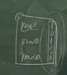

# 第九章 并发控制

## 两段锁协议

### 封锁的定义

一个事务对某个数据对象加锁 , 取得对它一定的控制,限制其它事务对该数据对象使用

要访问数据项 𝑅 , 事务 Ti 必须先申请对 𝑅 的封锁,如果𝑅 已经被事务 Tj 加了不相容的锁,则 Ti 需要等待,直至 Tj 释放它的封锁

长锁：保持到事务结束时才释放

短锁：在事务中途就可以释放的锁

### 两阶段封锁协议

增长阶段(Growing Phase): 事务可以获得锁,但不能释放锁

缩减阶段(Shrinking Phase): 事务可以释放锁,但不能获得锁

问题：哪个事务隔离性级别不满足两阶段封锁协议 2PL?

Read uncommit 和 Read commit 都不满足

### 两阶段封锁协议的作用

保证可串行化

若一组事务均服从两阶段封锁协议,则它们的调度一定是可串行化的

#### 问题：如何确定等价的串行顺序?

封锁点：事务获得最后封锁的时间

事务调度等价于和其封锁点顺序一致的串行调度

问题：t1, t2, t3满足2PL则等价的串行顺序是? 132

### 为什么两阶段封锁协议保证可串行化?

## 封锁类型

### 基本锁类型

#### 排它锁（X锁,eXclusive lock）

lock-X(R) ：又称写锁 , 持有 X 锁

可以读写数据项 事务 T 对数据对象 R 加上 X 锁 , 则 其它事务对 R 的任何封锁请求都 不能成功,直至T释放R上的X锁

#### 共享锁（S锁,Share lock）

lock-S(R)：又称读锁,持有S锁

只能读取数据项 事务T对数据对象R加上S锁,则 其它事务对 R 的 X 锁请求不能成功,而对R的S锁请求可以成功

### 相容矩阵

并发度很低

### 先读后写场合中的锁转换

并发度太低了, 两种更好的并发策略:

### 带有锁转换的两段锁协议

增长阶段

1. 可获得lock-S和lock-X 
2. 可将lock-S升级为lock-X (upgrade)

缩减阶段

1. 可释放lock-S和lock-X 
2. 可将lock-X降级为lock-S (downgrade)

#### 升级锁和重新申请锁有区别吗?

排队顺序不同

升级锁已经在队列中, 可以更快获得批准; 重新申请锁需要从头排队, 获取锁更慢

#### 在哪个隔离性级别下会出现锁转换?

repeated committed 以及更高的隔离级别

Read committed 和 read uncommitted 不出现锁转换, 因为锁转换要求一直持有读锁, 没有释放

#### 锁转换带来的问题

如果都使用升级锁:

T1要升级锁的时候, 会被T2的读锁阻止

T2要升级锁的时候, 会被T1的读锁阻止

这是一个死锁

#### 避免死锁

使用更新锁, 其实就是S和X锁之间的一种锁, 相容性也是处于两者之间

更新锁（U锁,Update lock）: 当一个事务查询数据以便将来要进行修改时,可以对数据项施加更新锁

如果事务修改资源, 需将更新锁转换为排它锁, 一次只有一个事务可以获得资源上的更新锁

S和U锁相容吗? 相容, S不能被升级, 纯读, 一直可以相容

持有U锁可以对数据执行什么操作? 将来可以升级

更新锁的相容性:

注意S<U<X, 锁的级别越来越高, 直到完全不相容

### 封锁粒度

封锁对象：属性值、元 关系、数据库、索引项、 索引、物理页、块

封锁粒度大,则并发度低,开销小; 封锁粒度小,则并发度高,开销高

访问小部分数据, 使用粒度小的锁; 访问大部分数据, 使用粒度大的锁

系统必须支持多粒度锁, 根据查询范围选择最佳粒度

#### 多粒度封锁中的隐含冲突

如何检测冲突?直接封锁无法防范包含对象之间的潜在冲突

意向锁：告示条

症结：在分层封锁中,封锁了上层节点就意味着封锁了所有内层节点。如果有事务T1对某元组加了S锁,而事务T2对该元组所在的关 系加了X锁,因而隐含地X封锁了该元组,从而造成矛盾 

措施：引入意向锁I（Intend）。当为某节点加上I锁,表明其某些 内层节点已发生事实上的封锁,防止其它事务再去显式封锁该节点

过程：I锁的实施是从封锁层次的根开始 ,依次占据路径上的所有 节点,直至要真正进行显式封锁的节点的父节点为止

就是从root开始到叶子结点路径上除了叶子结点都是意向锁

#### 意向锁I的相容性

为什么I锁**之间**是相容的? 在非叶子结点上的I锁是可以相容的

#### 意向锁I的不足之处

第一个冲突是对的, 第二个按理来说不应该冲突, 因为内部是S锁, 不应该和另一个S互斥

I锁告白不明,没有揭示内层锁的类型

#### 更为精细化的意向锁

IS锁：对一个数据对象加IS锁,表示它的 后裔节点拟（意向）加S锁

IX锁：对一个数据对象加IX锁,表示它的 后裔节点拟（意向）加X锁

### 共享与意向排他锁SIX

SIX = S + IX

在表上对表加SIX锁,则表示该事务要读整个表（S锁）,同时会更新个别元组（IX锁）

### 码范围锁

索引是有序的

码范围锁定原理解决了幻像并发问题

码范围锁通过覆盖索引行和索引行之间的范围来工作,因为第二个事务在 该范围内进行任何行插入、更新或删除操作时均需要修改索引,而码范围 锁覆盖了索引项,所以在第一个事务完成之前会阻塞第二个事务的进行

召唤神龙,码范围锁出现的条件: 索引 + serializable

#### 码范围锁模式兼容性矩阵

RangeS_S: 第一个S代表对这个范围上锁S, 第二个S代表对索引码上锁S   

一个读取的事务上锁 RangeS_S, 另一个插入的事务上锁 RangeI_N

#### 查询示例

Dallas, Donovan和Duluth是叶级顺序索引码,前两个码将获得码范围锁RangeS_S

码范围锁防止任何向以这两个码结束的区间插入数据 。没有大于Dallas且小于等于 Donovan的行可以插入,也没有大于Donovan且小于等于Duluth的行可以插入

#### 其他事务能插入'Dashagua' 吗? 

看起来不在查询范围之内, 但是实际上也不能插入. 因为实际封锁的区域是按照表中实际存在的表项来看的, Delaney 不在表中, 所以上界会变大, 变成了 Dallas, 这样的话Dashagua就不能插入了

### 闩锁

lock：保护逻辑对象

latch：保护内存页

如果不对内存页加锁保护会如何?页头会被写错误

为什么不用通常的排宅锁实现?代价太高,延迟太大

闩锁类似于多线程编程里的临界区（Critcal Section）自旋锁 spinlock

查看互斥锁：show engine innodb mutex

使用序列号做聚簇索引码的问题：多个进程往同一页密集写入数据

## 封锁问题

### 阻塞

缺少索引而引起的阻塞

1. 连接1在表上没有找到索引, 因此进行全表探查, 全部加U锁
2. 找到101表项, 讲其升级为X锁, 释放其余所有U锁
3. 连接2在表上没有找到索引, 因此进行全表探查, 全部加U锁
4. 在试图对101表项加U锁的时候与X锁冲突
5. 出现阻塞问题
6. 因此需要创建索引, 就不用对所有表项加U锁了

根据这个例子, 因此建立索引有助于提高并发性

### 死锁

两个事务都封锁了一些数据对象, 并相互等待对方释放另一些数据对象以便对其封锁, 结果两个事务都不能结束,则发生死锁

① 互斥条件：事务请求对资源的独占控制 

② 占有等待条件：事务已持有一定资源,又去申请并等待其它资源 

③ 非抢占条件：直到资源被持有它的事务释放之前,不能将该资源强制从持有它的事务夺去 

④ 循环等待条件：存在事务相互等待的等待圈

定理：在条件① ② ③成立的前提下,条件④ 是死锁存在的充分必要条件

#### 死锁示例

循环等待条件如图所示

根据资源在谁那里画有向图, 如果有环就说明有死锁

#### 如何避免死锁

1. 选择较低的隔离性级别
2. 封锁粒度小一些
3. 编程技巧: 不同事物访问一组对象, 按照相同顺序访问

#### 循环死锁示例

被回滚的连接会收到死锁消息, 在这里就是连接二

#### 转换死锁示例

解决方式:

1. 调整事务的隔离性级别

2. 强制使用更新锁 SELECT * FROM S(UPDLOCK), 在申请U锁的时候就会阻塞一个, 防止到了写的时候产生死锁

#### 预防死锁：破坏占有等待条件

死锁根源： T1持有R1,申请R2, T2持有R2,申请R1

1. 预先占据所需的全部资源, 要么一次全部封锁, 要么全不封锁

   1. 缺点：难于预知需要封锁哪些数据并且数据使用率低

2. 所有资源预先排序, 事务按规定顺序封锁数据

   1. 规定资源顺序：𝑅1 → 𝑅 2 → 𝑅3 

      𝑇1: 𝑅2, 𝑅3 

      𝑇2: 𝑅1 , 𝑅2 , 𝑅3 

      𝑇3: 𝑅1, 𝑅2

#### 预防死锁：破坏非抢占条件

使用抢占与事务回滚（规定老事务优先级高于新事务）

规定老事务优先级高于新事务

wait-die：如果T1等待T2,仅当T1的时间戳小于T2时,允许T1等待,否则回滚T1

最后一步, T2 开始等待 T1, 需要回滚新事务

wound-wait：如果T1等待T2,仅当T1的时间戳大于 T2时,允许T1等待,否则回滚T2

r1(R2), T1 开始等待 T2, 需要回滚老事务

#### 实际数据库: 死锁检测和恢复

环路检测

超时法：如果等待封锁的时间超过限时,则撤消该事务

等待图法：LOCK_MONITOR

打破圈即可

### 活锁 (live lock)

可能存在某个事务永远处于等待状态, 得不到执行, 称之为活锁（饿死）

活锁的例子：身处众多读锁中的写锁

* T2持有对R的S锁,T1申请对R的X锁,则T1必须等待T2释放S锁
* 若在T2完成之前有T3申请对R的S锁,则可以获得授权封锁
*  于是T1必须等待T2、T3释放S锁

避免活锁的策略是遵从“先来先服务”的原则, 按请求封锁的顺序对各事务排队

当事务Ti对数据项R加M (任意一种) 型锁时,获得封锁的条件是

* 不存在在R上持有与M型锁冲突的锁的其他事务
* 不存在等待对R加锁且先于Ti申请加锁的事务

## 其他锁概念

简单说一下, 不重要

### 锁管理器

* 事务向锁管理器发送封锁请求和释放请求
* 锁管理器维护一个锁表记录锁的授予情况和处于等待状态的封锁请求

锁表: 一般作为内存中的hash表,按被封锁对象的名字建立索引

* 黑矩形表示已被授予的锁, 白色表示等待的锁。锁表同时记录锁的类型
* 新的封锁请求加到请求队列末尾, 当封锁请求与前面的锁相容时被批准
* 释放封锁时从队列中将其删除并检查后续请求是否满足
* 如果事务放弃, 所有授予的和等待的锁请求都被删除. 为提高效率, 锁管理器会记录每个事务持有锁的情况

### 锁升级

行锁代价高、并发度高
表锁代价低、并发度低

MySql没有锁升级, 用位向量表示表中每一行的锁

InnoDB不是根据记录来产生行锁, 而是对页进行加锁, 并采用位图定位到行, 锁住页中一个还是多个记录,其开销是一样的

假设一张表有3000000个数据页，每个页大约有100条记录，那么总共有 300 000 000条记录。若有一个事务执行全表更新的SQL 语句，则需要对所有记录加又锁。若根据每行记录产生锁对象进行加锁，并且每个锁占用10字节，则仅对锁管理就需要差不多需要3GB的内存。而InnoDB 存储引擎根据页进行加锁，并采用位图方式，假设每个页存储的锁信息占用30个字节，则锁对象仅需90MB 的内存。由此可见两者对于锁资源开销的差距之大。

### 绑定连接

减少阻塞的发生

* 绑定连接允许两个或多个连接共享同一个事
* 绑定连接可以对同一个数据进行操作，而不会有锁冲突
* 绑定连接本质上是让事务跨 session ， 这有利于一些多部门协同任务的实现

### 应用锁

把数据库内部的锁机制拿出来当作应用程序, 进行协调服务

比如 Chubby 和 zookeeper

sp_getapplock 资源名、锁模式、锁拥有者

sp_releaseapplock 资源名、锁拥有者

* 资源名称经过内部哈希计算后存储在SQL Server锁表中
* 锁模式：Shared、Update、Exclusive、IntentExclusive、IntentShared
* 锁拥有者可以是Transaction或Session

## 时间戳协议

事务时间戳的分配:

* 每个事务 𝑻𝒊 进入系统被分配一个时间戳 𝑻𝑺(𝑻𝒊)
* 如果 𝑻𝒋 晚于 𝑻𝒊 进入系统， 𝑻𝑺(𝑻𝒊) < 𝑻𝑺(𝑻𝒋)
* 回滚的事务重新启动，分配新的时间戳

1. 时间戳顺序决定了串行化顺序
2. 回滚违反发出串行性操作的事务

### 例子

start(t1), r1(A), start(t2), r2(B), w2(B), commit(t2), r1(B), commit(t1)

r1(B)发现问题: 根据串行原则, 事务1是在事务2之前, 但是这里出现了事务1读取事务2的情况, 违反了串行原则, 因此**回滚事务1**

### 实现过程

每个数据项𝑸有两个时间戳与之联系

𝑾𝑻(𝑸): 所有执行 𝒘𝒓𝒊𝒕𝒆(𝑸) 的事务中最大的时间戳

𝑹𝑻(𝑸): 所有执行𝒓𝒆𝒂𝒅(𝑸) 的事务中最大的时间戳

其中最后一个 w1(Q) 会触发错误, 回滚事务1

### 脏读

但是回滚可能会造成脏读, 例子如下:

start(t1), w1(Q), start(t2), r2(Q), commit(t2), rollback(t1)

可以为数据项 𝑸 设置提交位 𝑪(𝑸): 表示拥有 𝑸 上写时间戳的事务是否提交

### 过晚的读

如果 𝑻𝑺(𝑻𝒊) < 𝑾𝑻(𝑸), 𝑻𝒊需读入的值已经被覆盖, 𝒓𝒆𝒂𝒅(𝑸) 操作被拒绝, 回滚 𝑻𝒊 

### 正常的读

如果TS（Ti）≥WT（Q）

* 若C（Q）为真则执行read（Q）操作，RT（Q）=max(RT（Q），TS(Ti))
* 若C（Q）为假则推迟到C（Q）为真或写Q的事务中止

### 过晚的写

要求已经commit

如果TS（Ti）＜ RT（Q）
Ti产生的值是先前所需要的值，Write （Q）操作被拒绝，回滚Ti

### 跳过的写

如果 TS(Ti) < WT(Q)

Ti产生的值已经被其后的写事务覆盖，跳过Ti的write （Q） 

存在特殊写规则

Thomas写规则：写操作在更晚的写操作已经发生时可以跳过

### 正常的写

要求readtime也更大

如果 TS(Ti) > RT(Q) 并且 TS(Ti) > WT(Q)
则执行Ti的write （Q）， WT（Q）=TS（Ti）

### 时间戳协议的练习

上课跳过了

### 实际实现

逻辑时钟: 确定偏序

## 有效性检查协议

### 三个阶段

1. 读阶段: 事务𝑇𝑖 在这一阶段中执行。数据项被读入并保存在𝑇𝑖 的局部变量中。所有 𝑤𝑟𝑖𝑡𝑒 操作都是对局部临时变量进行的，并不对数据库进行真正更新
2. 有效性检查阶段: 𝑇𝑖 进行有效性检查，通过与其他事务的读写集合进行比较，来判定是否可 以将 𝑤𝑟𝑖𝑡𝑒 操作所更新的临时局部变量值拷入数据库而不违反可串行性
3. 写阶段: 若𝑇𝑖 通过有效性检查，则在本阶段进行实际的数据库更新，否则回滚𝑇𝑖

### 如何确定是否是有效的

需要给每个事务分配三个时间戳

每个事务𝑻𝒊 有3个时间戳与之联系

* 𝑺𝒕𝒂𝒓𝒕(𝑻𝒊): 𝑻𝒊 开始执行的时间
* 𝑽𝒂𝒍𝒊𝒅𝒂𝒕𝒊𝒐𝒏 ( 𝑻 𝒊 ) ： 𝑻𝒊 进入其有效性检查阶段的时间
* 𝑭𝒊𝒏𝒊𝒔𝒉(𝑻𝒊): 𝑻𝒊 完成其写阶段的时间

TS(Ti) = Validation(Ti): 等价的串行顺序与有效性确认时间戳一致

### 违反串行性的情况

T2确认的时候, 发现T2读在T1写之前, 要判断有没有交集, 如果有交集就出现不满足串行的错误, T2就不能通过检查

T2确认的时候, 发现T1还没有写回, 所以要判断两者的写集合是否有交集, 如果有交集, T2的检查就不能通过

### 总结一下有效性协议的检查条件

只要不完全按照串行来操作, 有效性协议总要检查前后两个的交集是否空, 前面的这个事务只用出写集合即可. 

F(T1)多往后一个就要多检查一个交集.

不需要.

下一个例子:

## MVCC

MVCC：Multi-Version Concurrency Control: 多版本并发控制

### 快照隔离

悲现并发控制的缺点：通过加锁预防冲实（读-写、写一写），不必要的预防代价过高（读一读）不适合以读为主的冲突几率低的应用场合

所以产生出快照隔离SI:

适于读密集的快照隔离SI的基本思想：多版本 + 回滚

* 对数据库的写发生在提交时，形成数据项的一个提交版本（快照）
* 执行时间和访问数据项有交叠的写事务之间会产生冲突，先提交者赢
* 读操作访问该读事务开始那一刻的数据项最新版本，读写相互不会阻塞

### 数据行结构

InnoDB为每行数据增加三个隐藏列用于实现MVCC

* db_trx_id：插入或更新行的最后一个事务的全局标识符（每个事务创建都会分配id，全局递增）
* db_roll_ptr ：指向当前记录的前一个undo log版本
* db_row_id： 行标识（隐藏单调自增id）每一行都得有一个唯一的ID

### 读视图

read_view 事务在进行快照读的时候会创建一个读视图

* current_trx_id：当前事务的id
* alive_trx_list：读视图生成时刻系统中正在活跃的事务id
* min_trx_id：上面的 alive_trx_list 中的最小事务id
* max_trx_id：读视图生成时刻目前已创建过的事务id最大值 +1

前两个事务在活跃列表, 第三个事务已经提交了不再活跃, 不是alive_trx_list 中的事务, 但是它是目前已创建过的最大事务id

### 可见性算法

### 例子

基于读视图, 如何返回合适读行版本

#### 假定TA处于read committed

第一次读取返回上面那一行

第二次读取返回下面那一行

read committed下事务每次读取都会生成新的read_View.

但是如果是 repeated read, 第二次就不会产生新的读视图了

#### 假定TA 处于repeatable read

第一次读取返回上面那一行

第二次读取返回上面那一行

repeatable read下事务的read_view始终保持不变

### MVCC能解决幻读吗？

以下都是 repeatable read

可以解决, 因为 repeatable read, 但是最后一个命令写的时候就会出现不一致情况

同上, repeatable read 保证了读一致性, 但是刷新之后就会出现不一致情况

先上 update lock, 对 (1, a) 上锁

然后因为 repeatable read 只锁住了一行, TB可以插入新的

TA再读, 因为 repeatable read, 所以没有出现新的, 可以解决幻觉读的情况

但是如果额外加了共享锁, 就会出现幻觉读了

而且因为显式说明共享 share 锁, 在 repeatable read 下锁住了全表, TB再想插入就不行了

## 锁分析

不要求