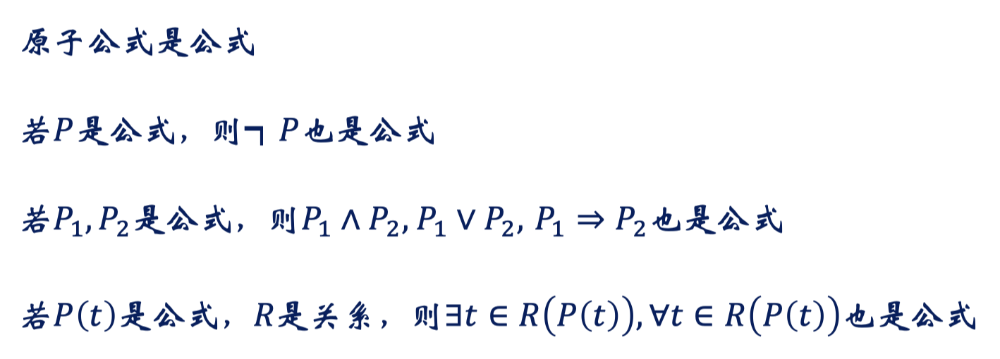
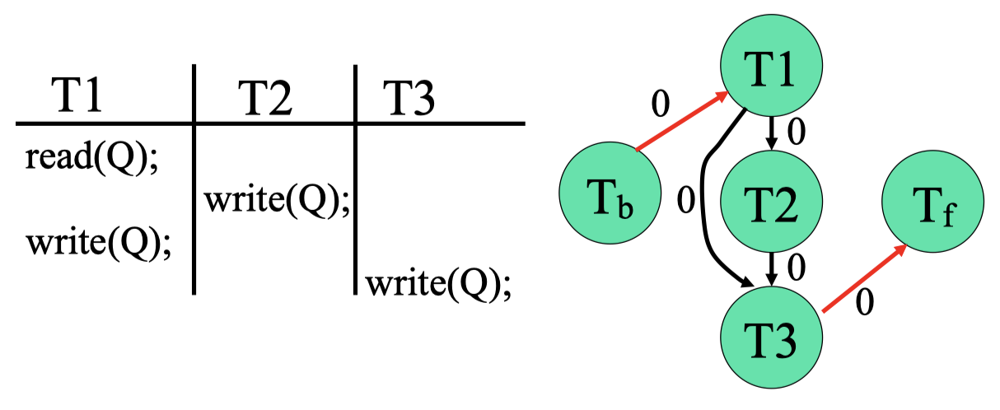
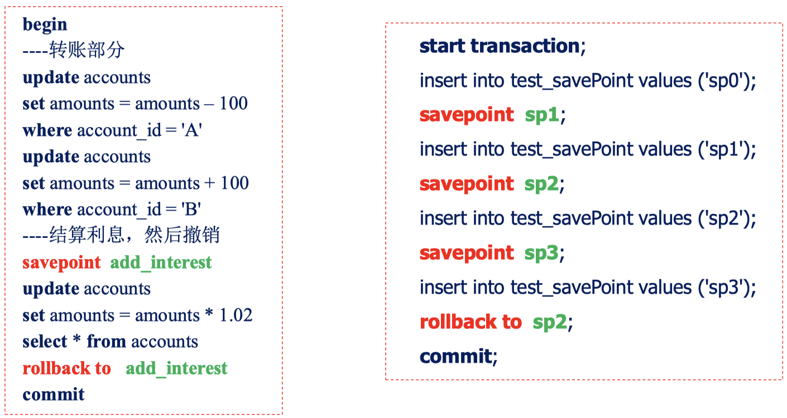
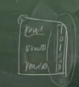

# 第一章：数据库系统简介

**数据独立性：**当数据结构发生变化时，通过系统提供的映象（转换）功能，使应用程序不必改变

- 物理独立性：当数据存储结构发生变化时，使应用程序不必改变
- 逻辑独立性：当数据逻辑结构发生变化时，使应用程序不必改变

**文件系统的不足：**

- 数据定义独立性：数据与程序紧密结合，数据分散管理，数据的语义信息只能由程序来解释，数据共享困难
- 数据完整性独立性：多副本，修改维护困难，不一致性
- 数据操作独立性：数据查询困难（字符流）

**数据库系统在数据管理方面的特性：**

- 面向全组织的数据结构（结构化数据）
- 数据的冗余度小，易扩充（冗余度小、集中管理、易扩充性）
- 数据库的高数据独立性
- 数据库统一的数据控制功能（安全性、完整性、并发、恢复控制）

**数据模型：**

- 概念：是数据库系统中用于提供信息表示和操作手段的形式构架
- 种类：
    - 概念数据模型：按用户的观点来对数据和信息建模
        - ER模型
        - ODL模型
    - 结构数据模型：从计算机实现的观点来对数据建模（三要素：数据结构，数据操作，数据约束条件）
        - 层次模型：树结构，节点代表实体型，连线表示两实体型间的一对多联系（特点：结构简单，易于实现、支持的联系种类太少、数据操纵不方便）
        - 网状模型：有向图（可以有一个以上的节点无父节点，非树），节点代表实体型，有向边（从箭尾到箭头）表示两实体型间的一对多联系（特点：表达的联系种类丰富、性能良好，存取效率高、结构复杂，语言复杂）
        - 关系模型：用二维表来表示实体及其相互联系（特点：简单、非过程化的数据请求、数据独立性高、坚实的理论基础、（曾经的）效率低）
        - 面向对象模型：用嵌套表表示复杂实体

**数据库模式：**

- 三级模式：
    - 外模式
        - 用户的数据视图
        - 数据的局部逻辑结构，模式的子集
    - 模式
        - 所有用户的公共数据视图
        - 数据库中全体数据的全局逻辑结构和特性的描述
    - 内模式
        - 存储模式, 数据的物理结构及存储方式
        - 位置、压缩、分区、合并、索引、列式
- 两级映象：
    - 外模式/模式映象
        - 定义某个外模式和模式之间的对应关系
        - 映象定义通常包含在各外模式中
        - 当模式改变时，修改外模式/模式映象，使外模式保持不变，从而应用程序可以保持不变，称为数据的逻辑独立性
    - 模式/内模式映象
        - 定义数据逻辑结构与存储结构之间的对应关系
        - 存储结构改变时，修改模式/内模式映象，使模式保持不变，从而应用程序可以保持不变，称为数据的物理独立性

**DBMS各项功能：**

- 数据定义功能：
    - DDL语言：描述源模式
    - 模式翻译程序：源模式翻译成目标模式存入数据字典
- 数据存取功能：
    - DML语言：对数据库增删查改
    - DML类型：宿主型（嵌入高级语言使用），自含型（独立使用，交互式）
    - DML语句执行方式：宿主型（预编译和增强编译），自含型（解释执行）
- 数据控制功能
    - 数据库运行管理
    - 数据组织存储和管理
    - 数据库建立和维护功能

**DBA的职责：**

- 建库方面
    - 确定模式、外模式、存储结构、存取策略
    - 负责数据的整理和装入
- 用库方面
    - 定义完整性约束条件
    - 规定数据的保密级别、用户权限
    - 监督和控制数据库的运行情况
    - 制定后援和恢复策略，负责故障恢复
- 改进方面
    - 监督分析系统的性能（空间利用率，处理效率）
    - 数据库重组织，物理上重组织，以提高性能
    - 数据库重构造，设计上较大改动，模式和内模式修改

# 第二章：实体-联系模型（ER模型，Entity-Relationship Model）

## 基本概念

### 实体：客观存在，相互区分

- 属性：实体所具有的某一特性，可以有多个
    - 域（Domain）：属性的取值范围

### 实体型（Entity Type）：实体名＋属性名，如学生（学号、姓名、年龄、性别、系、年级）

- 实体（值）：实体型的一个特例，如（9808100，王平，21，男，计算机系，2）是一个实体
- 实体集（Entity Set）：同型实体的集合，如全体学生，但是实体集比全体实体型的集合可能要小

### 联系：实体之间的相互关联

- 联系也可以有属性，如学生与课程之间有选课联系，每个选课联系都有一个成绩
- 联系的元（Degree）：参与联系的实体集的个数学生选修课程是二元联系，供应商向工程供应零件则是三元联系
- 一些问题：
    - 学生与学生的班长联系是几元联系？1
    - 有时称一元联系为递归联系，道理何在？领导的领导的领导：实体集内部的递归
    - 联系是发生在实体集之间的还是实体型之间的？实体集，比如北大同学和清华同学是两个实体集，但是是同一个实体型，实体集更细化一些

### 亚里士多德之辩谬篇

- 你有一只钢笔
    它是蓝色的
    所以它是一只蓝色的钢笔
    它是你的
    所以你有一只蓝色的钢笔

- 你有一条狗
    它是有儿女的
    所以它是一个父亲
    它是你的
    所以它是你的父亲

第一个蓝色是实体属性，第二个是父亲是实体联系，这说明实体属性是附属于实体的，而实体联系不附属

课堂练习：

### 基本E -R图要点

- 一般模型

    

- 一元联系

    

- 一个实体集只能有一个方块

### ER图的连通性

- ER图适合操作型操作，这样的蜘蛛网**不适合分析型操作**


- 但是星形状的图适合分析型操作，中心的借阅记录，周围是利用这个数据的不同分析

### 习近平 入主 中南海，陈立军 讲授 数据库

- 这是错误的，不能写实体的名字，要写实体集的名字

### 实体的码（Key）

- 超码（superkey）：能唯一标识实体的属性或属性组
    - 超码的任意超集也是超码

- 候选码（candidate key）
    - 其任意真子集都不能成为超码的最小超码

- 主码（primary key）：从所有候选码中选定一个用来区别同一实体集中的不同实体
    - 如学号是学生实体的主码
    - 一个实体集中任意两个实体在主码上的取值不能相同

- 下面实体集的候选码有哪些？**<u>能够唯一确定实体</u>**
    通讯录（姓名，**<u>住址</u>**，**<u>座机</u>**，**<u>微信号</u>**，**<u>Email</u>**, MP）
    上课通知单（课程号、课程名、任课老师、**<u>教室号、上课时间</u>**）

### 联系的码

1. 学生和老师之间的“导师”联系：可以用学生的码作为联系的码
2. 学生和课程之间的“选修”联系：只能用学生+课程整体作为联系的码
3. 联系的种类：一对一、一对多、多对多，可以据此确定联系的码
4. 实体集属性中作为主码的一部分的属性用下划线来标明

### 许多码

1. 替代码：除去主码之外的候选码，VP
2. 代理码：人工码，只起唯一标识作用的序列号，ssn（美国社保号，没有任何可以辨识的信息）
3. 自然码：一个与行中属性有還辑联系的候选码，它是实体的“真正的”属性，比如院系名
4. 智能码：经过编码的标识符，比如X JV 1023 293 9 2 000123，身份证、千年虫

### 简单属性 VS 复合属性

把相关属性聚集起来以反映更高层次的概念，可以使模型更清晰

1. 简单属性：不可再分的属性，如学号、年龄、性别

2. 复合属性（Composite）：可以划分为更小的属性，如电话号码=区号 + 本地号码、出生日=年+月+日


### 单值属性 VS 多值属性

1. 单值属性：每一个特定的实体在该属性上的取值唯一，如学生（学号，年龄、性别、系别）

2. 多值属性：某个特定实体在该属性上有多于一个的取值，如学生（学号，所选课程，联系电话）


### 派生属性

派生属性（Derived）：可以从其他相关的属性或实体派生出来的属性值
学生（学号，姓名，绩点），选课（学号，课程号，成绩），则绩点可由学生所选课程的成绩计算得来，称绩点为派生属性，成绩为基属性，或存储属性

数据库中，一般只存基属性值，而派生属性只存其定义或依赖关系，用时再从基属性中计算出来

基属性：基本表（模式）、派生属性：视图（外模式）

### NULL属性

#### null表示“值未知”
值存在，但目前没有获得该信息

如职工（姓名，部门，工种，身份证），如果目前不知道，职工身份证号码，则设身份证值为null

类比：墨镜人眼睛的颜色

#### null表示“无意义”
当实体在某个属性上没有值时设为null

如通讯录（姓名，email，电话，MP），若某人没有email地址，则在email属性上取值为null

如员工（姓名，学历，学位，…），若员工没有接受过高等教育，则其学位信息为null

类比：汽车眼睛的颜色

#### NULL属性对数据库设计的影响

如果不支持NULL，数据库就无法录入缺失部分信息的实体、无法将稍具差异的实体放入同一模式中

三值逻辑：true, false, unkown，存在着非真既假和非假既真之间的灰色地带

实体完整性：主码取值不能为null，保证实体一定是相互可区分的

### 各种属性在E-R图中的表示

多值属性用双椭圆表示

派生属性用虛椭圆表示


### 联系的种类

实体之间的联系的数量，即一个实体通过一个联系集能与另一实体集相关联的实体的数目

一对一的（1:1）
一对多的（1:m）
多对多的（m:n）

### 联系种类在E-R图中的表示

用箭头或线段来表示联系的种类

箭头指向单方实体集 = 多方实体的箭头指向联系集 = 在多方实体和联系之间的线段上标注字母，在单方实体和联系之间的线段上标注数字1


### 二元联系的种类

注：一对一不是一一对应

一对一的（1:1）
一对多的（1:m）
多对多的（m:n）

### 多元联系


每个职工只有一个工种 OR 每个职工在每个部门只有一个工种？？？

每个职工在每个部门只有一个工种因为否则部门就没用了，不如表示成二元联系

* 多元联系中最多允许出现一个箭头


（学生，环估报告）-›老师？抑或（学生，评估报告，项目）->老师？所以不允许这样画图

### 联系的势：表达了一个实体出现在联系中的次数


区分强制性和可选性联系

### 其它

- 弱实体集：一个实体集的所有属性都不足以形成主码
- 特化：实体集中某些子集具有区别于该实体集内其它实体的特性，可以根据这些差异特性对实体集进行分组，这一分组的过程称作特化
    - 学生：本科生，研究生，使得联系的对象更精确
- 概化：各个实体集根据共有的性质，合成一个较高层的实体集。概化是一个高层实体集与若干个低层实体集之间的包含关系
- 聚集：两个实体集以及它们的联系可被看成实体集，和另一实体集发生联系
    - 一个看上去的三元联系实则是两个先后动作的序列
    - 职工、项目、机器

## 基于业务描述的ER设计实例

设计关键：如何抽象订单？将其作为买家、卖家、商品之间的三元联系？还是直接将订单抽象为实体？


### 参与（Participation）

“职工”与“部门”之间的“经理”联系：职工实体集部分参与，而部门实体集完全参与


### 角色

实体在联系中的作用称为实体的角色

对于一元联系，为区别各实体参与联系的方式，需要**<u>显式指明</u>**其角色

学生之间的班长关系
职工之问的经理关系
课程之间的先修关系


当需要显式区分角色时，在连接菱形和矩形的线上加上说明性标注以区别不同的角色

### 存在依赖 (Existence Dependency)

X存在依赖于y：实体X的存在依赖于实体y的存在

如果y被删除，则x也要被删除


存在依赖必是完全参与：还款存在依赖于贷款，则还款全部参与和贷款之间的属于联系

### 复合实体


## 扩展ER特性

### 弱实体集 (Weak Entity Set)

弱实体集：一个实体集的所有属性都不足以形成主码

标识性联系（identifying relationship）：弱实体集与其拥有者之间的联系，弱实体集与强实体集之间是一对多的联系

弱实体集必然存在，依赖于强实体集⇔存在依赖并不总会导致一个弱实体集，从属实体集可以有自己的主码

#### 如何对贷款与还款之间的联系建模？引入弱实体集

把还款作为普通实体？


问题：还款的所有属性都不能作为主码？把贷款号借给还款实体


问题：贷款号冗余？把还款作为多值属性


问题：还款概念消失了，还款会和帐户发生支付联系？把还款作为复合属性


问题：还款作为复合属性，不能和帐户发生联系？人生若只如初见，概念上这是最清晰的表达，唯一的障碍是还款不能抽象为实体


解决途径：把还款作为一种特珠实体加以定义即可


#### 弱实体集的分辩符

分辨符（Discriminator）：弱实体集中用于区别依赖于某个特定强实体集的属性集合，也称作部分码（partial key）

弱实体集的主码=强实体集的主码＋弱实体集的分辨符

“还款”主码=贷款号＋还款号

#### 弱实体集在E-R图中的表示

弱实体集以双边框的矩形表示

弱实体集的分辨符用下划虚线标明

标识性联系以双边框的菱形表示

从联系集用双线（全部参与）连接弱实体集，用箭头（一对多联系）指向强实体集

#### 弱实体集的更多示例

Email = 用户名＋主机名，如 fork@pku.edu.cn

Logins（passwd文件）实体集记录本机用户名及其口令，用户名在不同主机上可以相同

Logins是一个弱实体集


#### 何时引入弱实体集？

作为层次结构的一部分 cs.pku.edu.cn

实体集的一些多值、复合属性 贷款的还款属性可以抽取出来作为弱实体集

如果弱实体集不但参与和强实体集之间的标识性联系，而且参与和其它实体集的联系，或者弱实体集本身含有很多属性，则将其表述为弱实体集

#### 引入弱实体后的订单ER图


### 特化

实体集中某些子集具有区别于该实体集内其它实体的特性，可以根据这些差异特性对实体集进行分组，这一分组的过程称作持化

• 银行帐号特化力存款帐号、贷款帐号
• 学生特化 研究生、本科生

自顶向下、逐步求精的数据库设计过程

子类=特例=更小的实体集=更多的属性

细化：父类→子类

#### 特化在E-R图中的表示

特化用标记为ISA的三角形来表示ISA ="is a”，表示高层实体和低层实体之间的“父类——子类”联系


#### 特化使得联系的对象更精确


#### 特化使得联系的种类更精确


### 概化

* 各个实体集根据共有的性质，合成一个较高层的实体集。
* 体现一个高层实体集与若干个低层实体集之间的包含关系
* 对应自底向上、逐步合成的数据库设计过程
* 泛化：子类→父类

概化 Vs 特化

- 概化与特化是互逆的，在E-R图中的表示方法相同
- 特化强调同一实体集内不同实体之间的差异
- 概化强调不同实体集之间的相似性
- 反映了数据库设计的不同方法

#### 概化中的属性继承

高层实体集的属性被低层实体集自动继承

低层实体集特有的性质仅适用于某个特定的低层实体集，如“Dissertation”只适用于“研究生”实体集

两种继承结构：

- 层次结构(Hierarchy)：实体集作为低层实体集只能参与到一个ISA联系中
- 格结构(Lattice)：低层实体集可以参与到多个ISA联系中

#### 格结构概化中的属性继承


“博士”继承了“研究生”与“职工”的所有属性
如果“研究生”与“职工” 有相同名称的属性，如“姓名”，可以在“博士” 中用“研究生。姓名”，“职工。姓名”区别开来

#### 概化中的成员身份

成员身份：同一个概化中，一个高层实体是否可以属于多个不同低层实体集

两种成员身份：

- 不相交的(Disjoint)：一个实体至多属于一个低层实体集，如一个学生只能参加一个项目组
- 有重叠的(Overlapping)：同一实体可同时属于同一概化的多个低层实体集，如一个老师可以参加多个项目组

#### 概化中的全部性约束

全部性约束：确定高层实体集中的一个实体是否必须属于至少一个低层实体集

两种全部性约束：

- 全部的(Total)：每个高层实体必须属于一个低层实体集，如学生必须属于本科生或研究生的一种
- 部分的(Partial)：允许一些高层实体不属于任何低层实体集，如学生可以不属于任何项目组

#### 概化中的约束设计


#### 某些书籍中关于不同概化类型的符号表示


双线代表全部

### 聚集

#### 如何表达联系之间的联系？

某些联系之间存在重叠

实例：职工参加项目，并在此过程中可能使用机器


问题：作为三元联系，有些职工并不和机器发生联系，不雅驯的命名对于ER是个大问题


职工号 项目号 工时
e1 j1 3
e1 jl 4

职工号 机器号
el  m1
e1 m2

问题：el在jl项目中使用什么机器？聚集

一个看上去的三元联系实则是两个先后动作的序列

实体集A与B以及它们的联系可被看成实体集，然后与另一实体集C发生联系

- 聚集是一种抽象
- 通过聚集将联系抽象为高层实体集

#### 引入聚集后的ER图：


## ER模型设计要点

选择恐惧症（强迫症 拖延症 完美癖）
你的目标是什么？
选项利弊是什么？

### 实体 VS 属性

实体有多方面性质，属性没有


弊端：若多个老师开同一门课，则每个老师与该课程的联系都需重复记录很多相同的信息


有一些属性根本不是刻画“讲述”这个联系的


### 能否把多元联系转换为若干个二元联系？


能否用实体之间的二元联系替换三元联系？


不可以：

1. 有损：多出来了新的三元联系
2. 联系的属性：供货数量qty无处安放

### 多重动作叠加起来的三元联系

一个项目由多个部门资助，一个部门资助多个项目，每个资助协议由一个或多个雇员监督


这种叠加联系有时会在属性与其归属联系的匹配上出现语义模糊：资助有起始时间，监督有截止时间


聚集替代三元：多重联系叠加


什么时候用聚集替换三元联系？当三元联系是复合动作的时候

## 概念数据库设计过程

不重要

### 局部ER设计

### 全局ER设计

全局ER设计中的消除冲突

### 全局ER优化
## ER模型向关系模式的转换

### 实体向关系模式的转换

一个实体一张表

实体→关系
属性→关系的属性


### 复合属性向关系模式的转换

复合属性定义为视图，或由应用定义


### 多值属性向关系模式的转换

要将多值属性和主码再创建一个新的表

多值属性→新的关系＋所在实体的码


### 一对多联系向关系模式的转换

#### 实体集之间的一对多关系

将单方参与实体的码作为多方参与实体的属性


可以继续优化，把关系表合并到学生表中


#### 实体集内部的一对多关系


### 多对多联系向关系模式的转换

#### 实体集之间的多对多关系

将联系定义为新的关系，属性为参与双方的码


#### 实体集内部的多对多关系


### 一对一联系向关系模式的转换

若联系双方均部分参与，则将联系定义为一个新的关系，属性为参与双方的码

对于这种不完全参与的联系，不要对每一个人都给出一个配偶号列


若联系一方全部参与，则将联系另一方的码作为全部参与一方的属性

对于这种完全参与的联系，对每一个人都给出一个部门号列


### 弱实体向关系模式的转换

弱实体集所对应的关系的码由弱实体集本身的分辩符再加上所依赖的强实体集的码


### 概括向关系模式的转换

高层实体集和低层实体集分别转为表，低层实体集所对应的关系包括高层实体集的码


如果概括是不相交并且是全部的，则可以不为高层实体集建立关系，低层实体集所对应的关系包括上层实体集的的所有属性


### 聚集向关系模式的转换

实体集A与B及其联系R被抽象成实体集C，C与易一实体集D构成联系S，则S的码由C和D的码构成


### 课堂练习：下面聚集向关系模式的转换结果


## 逆向工程：关系模式向ER的转换

不能先把每一个表都转成一个ER图，这是错误的，因为属性有重叠


### 逆向转换的关键：识别关系间的重合属性

重合属性体现了实体之间的联系

首先要观察：Tb1拥有Tb2的主码，那么Tb1到Tb2是一个多对一的（但是不一定是完全参与的，完全参与是双线）

其次：Tb4又拥有两个表的主码，它大概就是一个多对多的联系


###  作业中的几个疑点

转会就像淘宝，交易也有ID

这几个图不能反映转入和转出，自己写的时候要可以反应转入和转出


### 如何对时态进行概念建模？

员工可以在多个部门工作，但在一段时期内只能在一个部门工作

如图无法处理时间段overlap的问题，很难在ER图中表示，所以应该用文字记录


### 空中楼阁：如何对旅游路线概念建模？


## ER模型总结

概念模型：人脑中的信息世界

概念模型：清晰、清晰、第三个清晰

数据组织必须契合处理需求
	操作型应用：ER模型，适合事务处理，微观操作OLTP：t: transaction
	分析型应用：星型模型，适合OLAP，a: analysis

## 补充内容

不要求

# 第三章 关系模型

## 关系基本概念

###  关系模型的诞生

E.F.Codd于70年代初提出关系数据理论，他因此获得1981年的ACM图灵奖关系理论建立在集合代数理论基础之上，有着坚实的数学基础

早期代表系统
System K：由IBM研制
INGRES：由加州Berkeley分校研制

目前主流的商业数据库系统
Oracle, SQL Server, DB2
MySQL, PostgreSQL
OceanBase, GaussDB, 达梦
Access, SQLite

### 笛卡尔积 (Car'tesian Product)

域 (Domain)：具有相同数据类型的一组值的集合，如整数集合、宇符串集合、全体学生集合

一组域$D_1,D_2,...,D_n$的笛卡尔积为：

$$
D_1\times D_2\times\cdots\times D_n=\{(d_1,d_2,...,d_n)\mid d_i\in D_i,i=1,...,n\}
$$
n元组(tuple)：笛卡尔积的元素$(d_1,d_2,...,d_n)$ 

分量 (component)：元组的每一个值 di

苗卡尔积的基数：若 $D_i$ 的基数为 $m_i$ , $\prod_{i=1}^nm_i$

#### 苗卡尔积：可能的世界

老师集合T
学生集合S
课程集合C

TSC是个三元组集合，元组个数 2×3×2
它是所有可能的（老师，学生，课程）元组集合

笛卡尔积可表为二维表的形式：


### 关系：笛卡尔积的子集

笛卡尔积$D_1\times D_2\times\cdots\times D_n$的子集称作在域$D_1,D_2,...,D_n$上的关系，用$R(D_1,D_2,...,D_n)$表示， $R$是关系的名字，$n$是关系的度或目

关系是笛卡尔积中有意义的子集

1. 关系名体现了现实实体或联系
2. 关系集合包含了真正存在的实体或发生的联系

#### 过江之鲫：关系实例的数目

$$
{\mathrm{D1:=\{A,B,C,D,E\}}}\\
\mathrm{D}2:=\{1,2,3,4\}\\
D3:=\{甲，乙，丙，丁\}
$$
 D1×D2×D3包含多少个关系？$2^{80} $ 

 $\{\mathcal{A},\mathcal{B},\mathcal{C},\mathcal{D},\mathcal{E},1,2,3,4,甲，乙，丙，丁\}$​
 划分为多少个域，每个域多少个元素， 使得笛卡尔积包含的关系数目最多？原则是一个域3个元素，最后剩下的拆成2，答案是 {3, 3, 3, 2, 2}，如果是连续的，那就是 e

#### 关系的性质

P1：列是同质的，是同一类型的数据，即每一列中的分量来自同一域

不同质违反了关系对实体联系的表达，以及对实体属性的刻画：


P2：不同的列可以来自同一域，每列必须有不同的属性名

什么时候两个列会来自同一个域？一元联系、类型相同的属性


Р3：行列的顺序无关紧要

P4：任意两个元组不能完全相同（集合内不能有相同的两个元素）

P5：每一分量必须是不可再分的数据，称其为作满足第一范式（INF）的关系

嵌套关系：


1NF关系：


以查询的角度，深入分析嵌套关系的利弊： 声明性查询 VS 路径式查询，**<u>嵌套关系不能反向查询</u>**

## 关系模型三要素

### 数据结构

单一的数据结构— 关系，实体集、联系都表示成关系

思考：单一数据结构带来的好处是什么？数据结构单纯，都是表，处理简单


#### 码

候选码（Candidate Key）：关系中的一个属性组，其值能唯一标识一个元组若从属性组中去掉任何一个属性，它就不具有这一性质了，这样的属性组称作候选码（如DEPT中的dno，dname都可作为候选码）

主属性：任何一个候选码中的属性（如SC中的sno，cno， DEPT中的dno，dname）

主码（PK，Primary Key）：进行数据库设计时，从一个关系的多个候选码中选定一个作为主码（如可选定dno作DEPT的主码）

外码 (FK，Foreign Key)：关系R中的一个属性组，它不是R的码，但它与另一个关系S的码相对应，称这个属性组为R的外码（如S关系中的dno属性）

#### 关系模式

关系的描述，记作R（A1,A2，...  ，An），包括：关系名、关系中的属性名
属性向域的映象，通常说明为属性的类型、长度等
属性间的数据依赖关系，比如在特定的时间和教室只能安排一门课

关系模式是型，是稳定的

#### 关系：

某一时刻对应某个关系模式的内容（元组的集合）

关系是某一时刻的值，是随时间不断变化的

#### 关系数据库的型

是关系模式的集合，即数据库描述。称作数据库的内涵（Intension）

#### 关系数据库的值

是某一时刻关系的集合。称作数据库的外延（Extension）

### 数据操作

关系操作是集合操作
操作的对象及结果都是集合
是一次一集合（Set-at-a-time）的方式

#### 关系数据语言的特点

都是由于关系操作是基于集合的

一体化：对象单一，都是关系，因此操作符也单一

非过程化：用户只需提出“做什么”，无须说明“怎么做”，存取路径的选择和操作过程由系统自动完成

面向集合的存取方式：操作对象是一个或多个关系，结果是一个新的关系（一次一关系），非关系系统是一次一记录的方式

#### 抽象的关系模型查询语言：

1. 关系代数：用预定义操作算子的执行序列来表达查询
2. 关系验算：用谓词来表达查询，只需描述所需信息的特性
   1. 元组关系验算：谓词变元是元组
   2. 域关系验算：谓词变元是属性列

SQL：介于关系代数和关系演算之间，由IBM公司在研制System R时提出

### 数据完整性

#### 实体完整性

关系的主码中的属性值不能为空值

空值：不知道或无意义

意义：关系对应到现实世界中的实体集，元组对应到实体，实体是相互可区分的，通过主码来唯一标识，若主码为空，则出现不可标识的实体，这是不容许的


#### 参照完整性

如果关系$R_{2}$的外码$F_{k}$与关系$R_{1}$的主码$P_{k}$相对应，则$R_{2}$中每个元组的$F_k$值或者等于$R_1$中某个元组的$P_k$值，或者为空值

如果关系$R_{2}$的某个元组$t_{2}$参照了关系$R_1$的某个元组$t_1$, 则$t_{1}$必须存在，也即必须与客观存在的实体发生联系


#### 用户定义完整性

用户针对具体应用环境定义的完整性约束条件

1. Sno要求是8位整数，首位是0或1
2. 飞行员的飞行里程与星级评定
3. 选课人数不能少于10人，多于100人
4. 在本地纳税记录超过5年才有购房资格
5. 婚姻登记必须购买百年好合保险……

实体完整性和参照完整性由系统自动支持，系统提供定义和检验用户定义的完整性的机制

#### 课堂练习：关系模型完整性例子


只有3、4可以

1：主码不能是空值，违反了实体完整性

2：重复的主码

5：不存在的外码，违反了参照完整性

## 关系代数的运算

### 关系代数运算汇览


### 基本关系代数运算

#### 选择运算

在关系中选择满足给定条件的元组（行角度）
$$
\sigma_F(\mathbb{R})=\{t\mid t\in\mathbb{R},F(t)=^{\prime}\text{ 真}^{\prime}\}
$$

$$
\begin{aligned}&F\text{是选择的条件,}\forall t\in R,F(t)\text{要么为真,要么为假}\\
&F\text{由逻辑运算符连接算术表达或而成}\end{aligned}
$$

##### 选择运算计算例子


##### 用选择远算表达查询

找年龄不小于20的男学生
$$
\begin{aligned}\sigma_{age\geq20\wedge sex=\prime M{\prime}}(S)\\\sigma_{age\geq20}(\sigma_{sex=^{\prime}M^{\prime}}(S))\\\sigma_{sex=^{\prime}M^{\prime}}(\sigma_{age\geq20}(S))\end{aligned}
$$
哪种执行方或更为高效，主要取决于数据分布和索引配置

比如对于年龄有一个索引，那么选择最后一种查询方式，可以更快得缩小查询范围。这就是查询优化器的原理，检查那个执行路径更高效

#### 投影运算

从关系中取若干列组成新的关系（从列的角度）
$$
\prod_A(R)=\{t[A]\mid t\in R\},A\subseteq R
$$
注意：投影的结果中要去掉相同的行


##### 投影查询示例

给出所有学生的姓名和年龄：$\prod_{sno,age}(S)$

找001号学生所选修的课程号： $\prod_{cno}(\sigma_{sno=001}(SC))$

#### 更名

将关系R更名为S: $\rho_S(R)$

将计算表达式E更名为关系S: ${\rho_{S(A_1,A_2,...,A_n)}(E)}$

更名运算的必要性：

1. 将更名运算施加到关系上，得到具有不同名字的同一关系
2. 当同一关系多次参与同一运算时需要更名

#### 并运算

所有至少出现在两个关系中之一的元组集合
$$
\mathbb{R}\cup\mathbb{S}=\{r\mid r\in\mathbb{R}\lor r\in \mathbb S\}
$$


关系R和S进行并运算的前提是它们必须是相容的

1. 关系R和S必须是同元的，其属性数目必须相同
2. 对∀i，R的第I个属性和S的第I个属性的域必须相同

##### 并运算计算例子


##### 并运算查询示例

求选修了001号或002号课程的学生号
$$
\prod_{sno}(\sigma_{cno=001\lor cno=002}(SC))
$$
或者
$$
\prod_{sno}(\sigma_{cno=001}(SC))\cup\prod_{sno}(\sigma_{cno=002}(SC))
$$

#### 差运算

所有出现在一个关系而不在另一关系中的元组集合
$$
R-S=\{r\mid r\in R\land r\notin S\}
$$


R和S必须是相容的

##### 差运算计算例子


##### 差运算查询示例

求选修了001号但未选修002号课程的学生号
$$
\prod_{sno}(\sigma_{cno=001}(SC))-\prod_{sno}(\sigma_{cno=002}(SC))
$$
注意下面这种写法是错误的， $\sigma$ 下面的条件是对于一行来说的，所以这样就相当于选出来了选了001号课程的同学
$$
\prod_{sno}(\sigma_{\color{red}{cno}=001\wedge cno\neq002}(SC))
$$

#### 集合的交

是扩展运算，不算是关系模型的基础运算

#### 苗卡尔积运算：如何跨表（多行比较）查询？


行级思维：逐一扫描SC中的行，过滤出cno=C1的行，获得其sno，再根据得到的sno到S中查找对应的行

什么是集合级思维？运算的对象是集合

如何把多表数据融合到一个表中，以便施加选择和投影运算？

##### 元组的连串 (Concatenation)

$$
\begin{gathered}r=(r_1,\ldots,r_n),\mathrm{~}s=(s_1,\ldots,s_n),\mathrm{~}r\text{与}s\text{的连串定义为}:\\\widehat{\mathrm{rs}}=(\mathrm{r}_1,\ldots,\mathrm{r}_{\mathrm{n}},\mathrm{s}_1,\ldots,\mathrm{s}_{\mathrm{m}})\end{gathered}
$$

##### 关系的苗卡尔积 

$$
R\times S=\{\widehat{rs}\mid r\in R\wedge s\in S\}
$$

R x S的度为R与S的度之和
R x S的元组个数为R和S的元组个数的乘积

##### 笛卡尔积运算示例


##### 苗卡尔积运算查询示例

求选修C1课程的学生姓名


注意在选择运算时候，两个表的学生编号要相同！！！
$$
\prod_{sname}(\sigma_{S.sno=SC.sno\wedge cno=c1}(S\times SC))
$$

##### 关系自身的笛卡尔积运算

求数学成绩比王红同学高的学生


$$
\prod_{S.姓名}\left(\sigma_{R.姓名=王红\ Λ\ R.课程=数学\ Λ\ S.课程=数学\ Λ\ R.成绩<S.成绩}(R\times\rho_S(R))\right)
$$

### 关系代数扩展运算

#### 交运算

所有同时出现在两个关系中的元组集合
$$
R\cap S=\{r\mid r\in R\land r\in S\}
$$


交运算可以通过差运算来重写
$$
R\cap S=R-(R-S)
$$

##### 交运算计算例子


##### 交运算查询示例

求同时选修了001号和002号课程的学生号


#### $\theta$ 连接

从两个关系的广义笛卡儿积中选取给定属性间满足一定条件的元组
$$
{R_{A\theta B}^{{\bowtie}}S=\{\widehat{rs}\mid r\in R\wedge s\in S\wedge r[A]\theta s[B]\}}
$$
A,B为R和S上度数相等且可比的属性列， $\theta$为算术比较符，为等号时称为等值连接
$$
R_{A\theta B}^{\bowtie}S=\sigma_{r[A]\theta s[B]}(R\times S)
$$


#### 自然连接

从两个关系的广义笛卡儿积中选取在相同属性列B上取值相等的元组，并去掉重复的列
$$
R\bowtie S=\{\widehat{rs}[\overline{B}]\mid r\in R\wedge s\in S\wedge r[B]=S[B]\}
$$
自然连接与等值连接的不同：自然连接中相等的分量必须是相同的属性组，并且要在结果中去掉重复的属性，而等值连接则不必

自然连接为什么非常有用？自动合并公共属性列

##### 自然连接的计算例子


##### 自然连接表达查询的例子

求001号学生所在系的名称： 第一种算法比较慢，第二种算法快


关系R（A, B），S（A, C），R与S中元组个数分别为10，15，试填写下表


无任何条件，自然连接：两个表公共属性列完全不同，0；所有公共属性列都一样，150

无任何条件，投影并集：投影相当于去重了，再作并至少有一个元素，最多的时候两个去重过后完全不同，25个

A是R的主码，自然连接：两个表公共属性列完全不同，0；所有公共属性列都一样，但是第二个表每行只能对应第一个表的一行，15

A是R的主码，投影并集：R中主码肯定至少10个；S中也可以有另外15个不同的主码，加起来25个

A是R的主码S的外码，自然连接：R有10个不一样的A，S有15个从R的A中选出来的A，必然有产生15对相同的A

A是R的主码S的外码，投影并集：R有10个不一样的A，由于是外码，S中的A一定是R中的A，取并集无论如何就是R的10个A

##### 自然连接的问题


问题：有关P03号职工的姓名和工资信息没有显示出来？没有授课，没有和他相等的公共属性列，就丢失了他的第一个表的信息

##### 如何由关系表生成报表——生成所有信息的全能榜？


涉及到多个表之间的连接全能榜？

#### 外连接

为避免自然连接时因失配而发生的信息丢失，可以假定往参与连接的一方表中附加一个取值全力空值的行，它和参与连接的另一方表中的任何一个未匹配上的元组都能匹配，称之为外连接

外连接= 自然连接＋ 未匹配元组（悬挂元组）

外连接的形式：左外连接、右外连接、全外连接

左外连接 =  自然连接 + 左侧表中未匹配元组
右外连接 = 自然连接＋右侧表中未匹配元组
全外连接 = 自然连接＋两侧表中未匹配元组

##### 外连接的执行顺序


此时结合律不成立：对于这个情况，从左向右没有孙立，从右向左有孙立

##### 外连接结合律不成立的反例


#### 半连接


##### 猜想一下什么是反半连接？


表达：没有参与xxx联系的

##### 半连接的应用场景：减少分布式查询中的通讯量

方案2是传输数据很少的，使用了半连接，很好


#### 外部并

R(AB) outer union S(BC) 在B上相同的行合并为一行

一般用于信息集成，将子实体集合并为父实体集

实体识别是判别两个子实体是否对应同一个实体


注意第二个例子，展示了外部并与外连接的区别之处

外部并不是根据所有相同数据列合并，只根据主码列合并，比如B代表了身份证号，可以唯一确定一个人，那么其他的数据虽然不同，但是必然是同一个人，就要合并起来，不能开两行

#### 像集 (Image Set)

关系R（X, Z），X,Z是属性组，x是X上的取值，定义 X在R中的象集 ：
$$
\mathbb{Z}_x=\{{t[\mathbb{Z}]}\mid t\in\mathbb{R}\wedge{t[X]}=x\}
$$
其实就是选择运算+投影运算

象集的含义：张军同学所选修的全部课程


##### 问题：如何求得选修了全部课程的学生？

思路一：判断每个学生的课程象集是否包含了整个课程集合


$$
\{\boldsymbol{u}\mid\boldsymbol{r}\in\boldsymbol{S}\boldsymbol{C}\wedge\boldsymbol{u}=\boldsymbol{r}[\text{姓名}]\wedge\boldsymbol{\text{课程名}_u}\supseteq\boldsymbol{C}\}
$$
思路二：判断学生与课程集合构成的笛卡尔积是否完全包含在选课集合中


$$
\{\boldsymbol{u}|\boldsymbol{u}\in\prod_\text{姓名}{ ( \boldsymbol { S }\boldsymbol{C})\wedge\forall\boldsymbol{v}\in\mathcal{C}}(\vec{\boldsymbol{u}}\vec{\boldsymbol{v}}\in\boldsymbol{S}C)\}
$$

##### 如何求得没有进修全部课程的学生？


如何求得选修全部课程的学生？


$$
\prod_X(\mathbb{R})-\prod_X(\prod_X(\mathbb{R})\times\prod_Y(S)-\mathbb{R})=\mathbb{R}(X,Y)\div\mathbb{S}(Y)
$$


体会减法操作在区分开两类不同性质子集时的作用

#### 除法的本能：所有、全部、任意

找到包含所有Y的一行x

除法的定义表达式


除法的计算表达式 （先求没有选修全部课程的，再用所有人减去这些人）


##### 除运算示例

SC(sno, cno, grade)

求选修了所有课程的学生


方案二是错误的。因为方案二在除法的时候没有删除成绩，所以导致除法的时候，一个人的所有成绩都一样才能被选中，相当于把人名和成绩看作一个整体再进行的二元除法。

### 关系代数更新运算

不是重点，增删改的过程是什么样的

为使查询表达简单、清晰，可以将一个复杂关系代数表达式分成几个部分

每一部分都赋予一个临时关系变量

该变量可被看作关系而在后续表达式中使用

临时关系变量 ← 关系代数表达式

#### 赋值运算


#### 广义投影

在投影列表中使用算术表达式来对投影进行扩展
$$
\begin{gathered}\prod_{F_1,F_2,\ldots,F_n}(E)\\F_1,F_2,\ldots,F_n\text{是算术表达式}\end{gathered}
$$
求教工应缴纳的所得税
$$
\begin{gathered}\prod_{\boldsymbol{pno},\boldsymbol{sal}*0.05}(PROF)\\\rho_{\boldsymbol{pno},\boldsymbol{income}-\boldsymbol{tax}}(\prod_{\boldsymbol{pno},\boldsymbol{sal}*0.05}(PROF))\end{gathered}
$$

#### 数据库修改：删除

将满足条件的元组从关系中删除
$$
R\leftarrow R-E
$$
是对永久关系的赋值运算


对于第二个式子，找到了没有选课的同学之后还有和原始表做一个连接，从S中筛选出来拥有没选课同学学号的那些同学，这样才能最终相减。否则格式不同的表不能相减

#### 数据库修改：插入

插入一个指定的灭组，或者插入一个查询结果
$$
\mathbb{R}\leftarrow\mathbb{R}\cup E
$$


加入计算机系学生选修“数据结构”的信息


#### 数据库修改：更新

利用广义投影改变元组的某些属性上的值
$$
R\leftarrow\Pi_{F_1,F_2,...,F_n}(R)
$$


### 关系代数查询实例

#### 求没有选修C1号课程的学生

求没有选修C1号课程的学生 ⇔ 所有学生-选修了C1号课程学生
$$
{\prod_{sno}(SC)-\prod_{sno}(\sigma_{cno=c1}(SC))}
$$

$$
\text{写成}\prod_{\mathrm{sno}}(\sigma_{\text{спо ≠ с}1}(SC))\text{ 对不对?}
$$

不对，这样就变成了除了（仅选了c1课程的学生）之外的学生


#### 求仅选修了C1号课程的学生号

= 选修C1号课程的学生 - 仅选C1号课程之外的学生
$$
{\prod_{sno}(\sigma_{cno=c1}(SC))-\prod_{sno}(\sigma_{cno\neq c1}(SC))}
$$

#### 如何甄别开只选C1的同学和选修C1同时又选修其他课程的同学？


直选c1的同学：
$$
\prod_{sno}(\sigma_{cno=c1}(SC))-\prod_{sno}(SC-\sigma_{cno=c1}(SC))
$$
注意在关系运算中，考虑Venn图，S-A其实是S-A加上A与别的集合的交集

#### 求选修C1课程比S1学生的该门课程成绩高的学生


表达式写错了，少了一个 S.cno = c1 ，否则无法确定另一个人的成绩是哪个课。

#### 求每门课程的先修课的先修课


递归查询：找到所有的祖辈先修课？不告诉递归几次，关系代数做不了

关系代数不具有生成传递闭包的能力，不满足关系完备性

#### 求选修了至少两门课的学生


求选修了至少N门课的学生 

求只选修了1门课的学生

#### 求最低的成绩


#### 求选修课程中包含了所有 S01号学生所选修课程的学生号


#### 求其选修课程被S01号学生所修课程包含的学生号


反过来，先找没有被包含的

#### 找出一直上涨的股票


## 关系验算

### 元组关系演算

形式化定义 {t | P(t) }

表示所有使谓词P为真的元组集合

P是公式由原子公式和运算符组成

t为元组变量，如果元组变量前有全称（V）或存在（彐）量词，则称其为约束变量，否则称为自由变量

#### 原子公式


#### 公式的递归定义



#### 公式的等价性


#### 元组关系演算示例


如何转换为关系代数？

1. 一个选择运算
2. 差运算
3. 笛卡尔积，选择运算，然后投影出来S
4.  S中任意的都比R小，不好表示，反过来算，R-不是全都比S大的
5. $R-\Pi_{R}(\sigma_{R.A\geqslant S.B}(R\times S))$
6. $\Pi_{R.A,R.B,S.C}(\sigma_{R.A\geqslant S.B}(R\times S))$


#### 元组关系演算查询示例


求选修了全部课程的学生号：


其中错误写法没有先固定学生，C是所有课程，SC是所有选课记录

错误写法几乎会输出所有学生，因为错误写法相当于对于所有课程，输出他们选课学生的并集，而不是交集。


求选修了S1同学所修全部课程的学生号：


#### 元组关系演算与关系代数的等价性


#### 关系演算表达式的安全性


元组关系演算有可能会产生无限关系，这样的表达式是不安全的，如｛t | !（t in R）｝，求所有不在R中的元组

表达式安全域的例子


### 域关系演算

#### 域关系演算形式化定义


#### 域关系演算的计算例子


#### 域关系演算查询示例

找出工资在800元以上的老师


找出工资在800元以上的老师的姓名


给出计算机系老师的姓名


#### 采用域关系验算的实际查询系统：QBE


#### 关系代数和关系验算的比较

R（A, B）是二元关系，求R中的那些元组，其属性列交换后组成的元组仍在R中


讨论：如何理解“相比关系演算，关系代数是过程性操作语言”？

关系模型相比以前的网状关系，是非过程化的，这是关系模型的显著特点。但是在这个语境下，关系代数的过程性体现在，它需要人定义出操作过程，而关系验算不需要。

## 补充材料

### 包

允许重复的集合，或者多集（multi-set）｛1,2,2,3,3,3｝

引入包的原因
•效率，不用去重
•合理地计算聚集函数的值


#### 包的关系代数运算

包的选择、投影、苗卡尔积：和集合上定义是一样的，只需保留重复即可

包的并、交、差：假定一个元组t在包R中重复出现了n次，在包S中重复出现了m次，则：


哪些对包成立，哪些不成立？

成立的：


不成立：


### 作为约束语言的关系代数


#### 参照完整性

R（A,B），S（B,C），S中的B是参照R的B的外码


#### 函数依赖

R（A,B），要求在A上相等的在B上也相等


表达违反约束的情形不存在


#### 确定A的唯一性

对于R（A,B）如何确定A的唯一性？


对于R(A, B, C)如何确定A的唯一性？


### 全关系系统

#### 关系系统

表式系统：仅支持关系（即表）数据结构，不支持集合级操作。表式系统不能算关系系统

最小关系系统：仅支持关系数据结构和三种关系搡作。许多微机关系数据库系统如FOXPrO属于此类

完备关系系统：支持关系数据结构和所有的关系代数操作。90年代初的许多关系数据库管理系统属于这一类

全关系系统：这类系统支持关系模型的所有特征

#### 全关系系统的十二条准则

准则0：一个关系型的DBMS必须能完全通过它的关系能力来管理数据库

准则 1：信息准则——关系型DBMS的所有信息都应在逻辑一级上用一种方法即表中的值显式地表示

准则 2：保证访问准则——依靠表名、主码和列名的组合，保证能以逻辑方式访问关系数据库中的每个数据项（分量值）：以关联寻址代替面向机器的访问方式

准则3：空值的系统化处理——全关系型DBMS应支持空值概念，并用系统化的方式处理空值

准则 4：基于关系模型的动态的联机数据字典——数据库的描述在逻辑级上应该和普通数据采用同样的表示方式，使得授权用户可以使用查询一般数据所用的关系语言来查询数据库的描述信息

准则 5：统一的数据子语言——一个关系系统可以有几种语言和多种终端使用方式（如QBE、嵌入式SQL），但必须有一种语言，它的语句可以表示为具有严格语法规定的字符串

准则 6：视图更新准则——所有理论上可更新的视图也应该由系统更新，即对视图的更新要求，存在一个算法可以无二义地把更新要求转换力对基本表的更新序列

准则7：高级的插入、删除和修改操作——关系系统的操作对象是单一的关系

准则 8：数据物理独立性——无论数据库的数据在存储表示和存取方法上作任何变化，应用程序和终端活动都保持逻辑上的不变性

准则9：数据逻辑独立性——当对基本关系进行理论上信息不受损害的任何改变时，应用程序和终端活动都保持逻辑上的不变性

准则 10：数据完整性的独立性——关系数据库的完整性约束条件必须是用数据库语言定义并存储在数据字典中的，而不是由应用程序加以定义

准则 11：分布独立性分布独立性是指DBMS具有这样的数据庫语言，使得应用程序和终端活动在下列情况下都保持逻辑上的不变性：

- 在第一次引入分布式数据时，即如果原来的DBMS只管理非分布式的数据，而现在引入了分布式数据
- 当数据重新分布时，即如果原来DBMS能管理分布式数据，现在要改变原来的数据分布

准则 12：无破坏准则——如果一个关系系统具有一个低级（一次一记录）语言，则这个低级语言不能违背或绕过完整性准则

- 为获得完整性的独立性，需要让完整性约束条件和数据的逻辑结构相独立
- 不能旁路（bypass）或者关闭约束检查子系统

# 第四章 SQL

## SQL简介

### SQL的起源

SQL: Struceured Query Languang
1974年，由Boyce和Chamber提出，称为Sequel
1975-1979年，在System R上实现，由IBM San Jose研究室研制

### SQL语言的特点

语言简洁，易学易用

面向集合的操作方式：一次一集合

高度非过程化：用户只需提出“做什么”，无须告诉“怎么做”，不必了解存取路径

一体化
集DDL，DML，DCL于一体，单一的结构——关系，带来了数据操作符的统一

两种使用方式，统一的语法结构：既是自含式（用户使用）的，又是嵌入式的（程序员使用）

### SQL的标准化

### SQL主要操作符


### SQL：数据访问的事实标准


### 约定俗成：提供一个类SQL接口


## SQL数据模式定义

### 标准SQL中的数据定义对象


### 实际数据库中的定义对象： SQL Server


### 术语讨论：模式

MySQL：模式即是数据库

SQL Server：模式把对家和用户分离开来

对象命名：〈数据库〉.〈模式〉.〈表〉

创建模式
create schema < 模式名＞
create schema University.Library

### 数据库定义： SQL Server


最简单的创建数据库的命令：create database University
use 命令指定当前要使用的数据库：use University


create database ＜ 数据库名＞
[ default character set utf8
default collate utf8_Chinese_ci ]

create database 等同于 create schema

### MySQL表空间


### 创建基本表的语法命令


#### 创建表示例


### 修改基本表


### 删除基本表

drop table 表名

drop table不能删除被foreign key约束所引用的表，必须先除去foreign key约束或引用表

任何引用已删除表的视图或存储过程必须通过drop view或drop procedure语句显式除去

DANGER：刪除表定义及该表的所有数据、索引、触发器、约束和权限规范

### 表定义相关的字典表： SQL Server


### 标准SQL中的信息视图

INFORMATION_ SCHEMA.SCHEMATA
INFORMATION SCHEMA. TABLES
INFORMATION_SCHEMA.COLUMNS
INFORMATION_SCHEMA.CHECK_CONSTRAINTS
INFORMATION_SCHEMA.VIEWS
INFORMATION_SCHEMA.DOMAINS

### MySQL中的信息视图查询


### SQL数据定义特点

SQL中，任何时候都可以执行一个数据定义语包，随时修改数据库结构

- 数据库定义不断增长（不必一开始就定义完整）
- 数据库定义随时修改（不必一开始就完全合理）
- 可进行增加索引、撤消索引的实验，检验其效率影响


- 在非关系型数据库系统中，必须在数据库使用前全部完成数据库定义
- 若要修改已投入运行的数据库，则需停下一切数据库活动，卸出数据库，修改数据库定义并重新编译，再按修改后的数据库结构重新装入数据

思考：MySQL是如何实现alter table的？新建一个表，drop旧表

## SQL数据类型定义

### 数据类型全家福


### 整型


溢出：


宽松模式、严格模式：


### 定点数与浮点数


### money数据类型

money使用4位小数存储数据，容易发生小数的舍入错误


### 如何给女朋友解释为什么计算机中0.2+ 0.2 +0.1 不等于 0.3 ？


### 字符型


#### 定义者的选择： char or varchar ?


变长之利：减少存储开销 ＋ 元组数/页 高

变长之弊：查询计算偏移 ＋ 更新挪移数据

变长之用：长短显著不一+ 很少发生变化

### 字符集

字符集（character set）：字符＋编码

字符序（collation）：字符比较规则
•宇符按其编码比较大小
•如果两个字符为大小写关系，则它们相等


### 日期型数据类型


使用：


UNIX时间戳

### 日期类型：SQL Server


格里高利改历法

### 枚举型


### 二进制类型


### 显式数据类型转换


### 隐式数据类型转换

如果不指定显式类型转换，那么在对两个不同数据类型的列值进行运算时，系统会进行隐式类型转换，也即先将它们转换为同一个数据类型，然后再进行运算


### 用户定义数据类型 UDDT:User-defined datatype


### 用户定义数据类型： SQL Server


### 特殊类型

XML
JSON
空间数据
数据类型决定了数据库适用范围，如果数据库不支持日期类型会怎样？

### Oracle中如何表示复杂实体？


### rowversion 数据类型

如果表中有一列被声明为rowversion，只要行被修改，其rowversion列就会发生改变。它是跨表唯一的，任何表的修改都会使该值递增

可以检测出一行记录是否被别人修改过


### uniqueidentifier 数据类型

uniqueidentifier() 产生跨数据库和服务器的全局唯一标识符（GUID）
newid() 函数产生uniqueidentifier 类型的值
newsequentialid() 产生的GUID总是大于先前通过该函数生成的GUID

select newid0）的输出结果如下：DD64B592-D477-4114-8131-32E9FCB540FA

#### 冗长主码的危害

如果使用UUID作为主码

保证其惟一性必须进行字符匹配

一个表的主码经常是另外一个表的外码，而外码是对主码的复制，冗长的主码加上外码会占据很大的表空间

表连接一般是基于主外码的，为加快查询会在主外码上建立索引，冗长主码会使得一个页面里容纳很少的索引项，从而增加查找数据时的磁盘IO 数

### MySQL中的自增字段


自增不保证唯一，不一定是主码

### SQL Server中的序列号：identity

identity [(seed, increment)]

为没有有效主码的表提供计数器，有一个起始数（种子），增量值（步长）


### SQL Server中的序列号：sequence


## SQL视图和临时表定义

### 视图

视图是命名的、以基本表中导出的虚表，它在物理上并不存在，存在的只是其定义，属于外模式

视图中的数据是以基本表中导出的，每次对视图查询都要重新计算

视图之上可以再定义视图


### 视图的SQL定义


视图的属性名缺省为子查询结果中的属性名，也可以显式指明

with check option指明当对视图进行insert，update时，要检查是否满足视图定义中的条件


#### 视图定义的示例

定义一个包含计算机系教工基本信息的视图


### 基于视图的查询

给出计算机系工资超过1000的教工姓名


### 视图定义中的with check option选项


如果有 with check option, 那么下面这个就插入不进去

### 视图的优点

个性化服务：简化用户观点，使不同用户可以以不同角度现察同一数据


逻辑独立性：视图作为基本表与外模式之间的映象


安全性：“知必所需”，限制用户数据的访问范围


### 不可更新的视图示例

视图定义中不包括基表主码


视图定义中包含聚集函数

对聚集值的更新无法回逆到基表的行上面：


视图定义中没有包括连接属性


为什么不允许更新不包括连接属性的视图？


### 视图更新约束

不可更新视图：
select子句中的目标列包含了聚集函数
select子句中使用unique或distinct关键字
select于句中包含经算术表达式计算出来的列
from子句中包含了多个表
包含了group by子句

对于行列子集视图可以更新（视图是以单个基本表使用选择、投影操作导出的，并且包含了基本表的主码）

### 全关系系統准则6：视图更新准则

所有理论上可更新的视图也应该由系统更新，即对视图的更新要求，存在一个算法可以无二义地把更新要求转换为对基本表的更新序列

#### 什么是理论上可更新的视田？


其中中间这个是理论上可更新的，数据库如果不能分辨出它是可以更新的，那么数据库存在问题

### 临时表和内存表

如果语句很复杂，连接太多，可以用临时表分步完成

如果多次用到一个大表的同一部分数据，可以用临时表暂存这部分数据

如果需要综合多个表的数据，形成一个结果，可以考虑用临时表分步汇总这多个表的数据

频繁使用的表可以放在内存中


#### 临时表和内存表的对比


#### 查询中的临时表

允许在from子旬中使用子查询表达式，这时可将该子查询的结果命名为一个临时表加以引用

（子查询） as 关系名（列名，列名，⋯）

#### 查询中的临时表示例

找出平均成绩及格的学生（不用having子句）

先求每个学生的平均成绩，再从中找出及格的学生


### 公用表表达式CTE


### values （表值构造器） FOW（行值构造器）


## 分区表定义

### 数据分区

把逻辑上统一的数据分割成较小的、可以独立管理的物理单元（分片）进行存储

可接时间、按地区、按业务类型进行数据分割


### 数据分区的优点


### 一般的分区方式


### MySQL支持的表分区类型

create table tb _name.........)
partition by ...

1. range分区

2. list分区
3. columns分区
4. hash分区
5. key分区
6. 子分区

#### MySQL的range分区


#### MySQL的list分区


#### MySQL的常规hash分区


取模运算。假设分区数为4，则有0，1，2，3四个值，对应分区为四个

83模4取余得3，将数据放在第三个分区中

#### MySQL的线性hash分区


1. 计算V=power （2, ceiling（1og（2， 分区数））），假设分区数为4，V=4

2. 对分区键和V-1进行位与运算

假设分区键值为8（10），8（10）与3进行按位与运算得出插入分区是0（2）

#### MySQL的range columns分区


#### MySQL的list columns分区


#### MySQL的key分区


#### MySQL的子分区


### 分区表：SQL Server


## SQL索引定义


### 为什么需要索引？

关系表是个无序集合


### 索引的直观解释


### 索引在数据库系统内部的存储结构


### 索引在数据库内部的作用


### 索引的创建


### 索引的删除

drop index 索引名

drop index 语句不适用于通过定义，primary key 或 unique约束创建的索引，它们必须通过除去约束来撤销

### 索引的排序

asC/desC：索引表中索引值的排序次序，缺省为asc

为什么需要降序索引？


### unique：唯一性索引

不允许表中不同的行在索引列上取相同值

若已有相同值存在，则系统给出相关信息，不建此索引

系统拒绝违背唯一性的插入、更新


### 创建索引选项：InnoDB_fill_factor

fill_factor指定在创建索引的过程中，各索引页的填满程度

为何索引页要预留空间？如果某个索引页填满，系统就必须花时间拆分该索引页，以便为新行腾出空间，这需要很大开销并造成索引碎片


### 索引碎片


索引碎片：页面逻辑顺序与物理顺序不一致

Q1：索引碎片的负面影响？ 效率低

Q2：如何消除索引碎片？重建索引

### 聚簇索引

cluster：聚簇索引
表中元组按索引项的值排序并物理地聚簇在一起
一个基本表上只能建一个聚簇索引

聚簇索引使得逻辑访问顺序和物理存储顺序尽可能一致


### 组合索引

组合索引：建立在多个属性列上的索引


#### 组合索引的用场


索引不一定总是快。

因为索引总是使用随机读，随机读远远慢于顺序读。

并且顺序读的速度一直在提高，随机读的速度不怎么提高，这就导致之前如果使用索引最多允许20%随机读，否则就比不用索引慢了，最近只允许2%。

也就是满足条件的表项不能高于2%

那么为什么索引会导致随机读呢？我要在索引中查找，然后再前往原表。所以如果要避免随机读，就要把数据一开始就放在索引中。

##### 下面哪个组合索引效果会更好？


R(B, A) 更好

把过滤条件更强的放在前面，能够把满足条件的表项限定在更小的下标范围内

### 覆盖索引

把select中的列也包含进索引中，这样就可以完全基于索引回答查询，避免对表的访问


与组合索引的差别：B值不出现在索引的中间结点上

### 过滤索引

在索引的定义中加入Where语句，索引中只包括那些满足过滤条件的列值


### 函数索引


### 索引的使用说明

一个表上可建多个索引

可以动态地定义索引
随时建立和删除索引

索引可以提高查询效率
耗费空间
降低插入、删除、更新效率

•理想化状态：不允许用户在数据操作中引用索引
• 数据的物理独立性：索引如何使用完全由系统决定


### 索引的选择度：建否？

索引的理想选择度=1/索引列的唯一值个数(集势Cardinality (NUM_DISTINCT))


A列的索引选择度为0.25 B列的索引选择度为0.5

So Easy：应该在哪些列上建索引？A，哈希冲突少

### 索引的选择度：用否？

索引的实际选择度=查询结果行数/总行数 NUM_ROWS

“=”的索引选择度为1/ NUM_DISTINCT
“<>”的索引选择度是多少？
“>=”的索引选择度是多少？
在分布不均匀的情况，如何估计选择度的大小？

什么时候用索引？什么时候表扫描？满足条件的记录少于整体的2%才启用索引

### 索引的选择


代价是磁盘IO次数，读取写入一页算一次

比如sno索引下，查询某个学生所选的课程，需要先读索引页，然后根据这个索引页上的三个索引项去读取SC中对应这三个索引项的三页，总共四次磁盘读

## SQL查询语法成分

Select 目标列
From 数据源表
Where 行过滤
Group by 分组
Having 分组过滤
Union 合并
Order by 输出排序
Limit 输出行数

## SQL基本查询结构

### From 子句：笛卡尔积

select from where between distinct order_by as limit


#### 找出选修课程的学生姓名、课程名、成绩


#### 一个似是而非的查询例子

这是错的


上面查询的正确SQL语句


#### 利用笛卡尔积快速生成测试数据


下面的 select 输出 10000 行

#### SQL返回结果是多集

以下查询不同，因为做了笛卡尔积


### select子句中的目标列形式


只输出使用的列，可以增加使用组合索引的机会

#### 给出所有学生的姓名及出生日期


• 计算表达式无列名
• 存储年龄属性是个好的设计吗？

#### 将多个列组合为一个目标列

给出每个老师信息的自然语言描述


输出行的形式类似：“李明老师的工资是1500，年龄是45，职称是教授”

#### 当目标列取自多个表时，需要显式指明来自哪个关系


第一个会输出四行，第二个是错的，第三个是对的

### where子句


不同的SQL书写方式有可能在表达上是等价的，但性能会有很大差异

### between子句

between子句：判断表达式的值是否在某范围内


使用between替代or，因为between默认使用索引，or默认不使用

### distinct

重复行的处理

SQL缺省为保留重复行，也可用关键字all显式指明若要去掉重复行，可用关键字distinct指明


优化小窍门：只在必要时使用distinct

非必要情形：业务上不要求去重，或者可以确定结果不重复

两个表R（A,B），S（A,C），其中A是这两个表的主码，哪些查询中的distinct可以去掉？


第一个可以去掉：两个都是主码，两个主码的笛卡尔积不会重复

第二个不能去掉：两个主码做了笛卡尔积，但是只输出一个，就会重复

第三个可以去掉：R: {(1, 1), (2, 1)}; S: {(1, 1), (2, 2)}，RxS: {(1, 1, 1, 1), (2, 1, 1, 1)}，R.A 不会重复

### order by

输出显示顺序


对教工按缴纳所得税的多少排序（按输出列的位置编号指定排序列）


按年龄顺序输出学生姓名（排序列可以不是输出列）


### 更名运算

为关系和属性重新命名，可出现在select和from子句中


#### 属性更名

给出所有学生的姓名、性别、出生日期，并按出生日期升序排列


#### 关系更名

找出比S1学生选修C1课程成绩高的学生号


找出工资比其部门主任工资高的职工


### 空值

No cat has 12 tails
A cat has one more tail than no cat
Therefore, a cat has 13 tails


#### 关于空值的认识

null 表示值未知，所以数据库中允许字段取null，就变成了三值逻辑：true, false, unkown

C.J Date反对把空值引入数据库：
null是标识，不是值
包含null违反了关系定义

Codd提出了两类null
A-Mark null：米知的，墨镜人眼睛的颜色
T-Mark null：不适用的，汽车眼睛的颜色

#### 数据库中NULL的应用场景

null表示“天意义”：当实体在某个属性上没有值时设为null
null表示“值未知”：值存在，但目前没有获得该信息c

employees (ename, Id _number, degree,..)

- 如果目前不知道职工身份证号码，则设ld_number _number值为null，是为A-Mark null
- 若某位员工没有学位，则在degree列上取值为null，是为T-Mark null

#### 为什么数据库需要NULL？


#### 全关系系统准则3：空值的系统化处理

全关系型DBMS应支持空值概念，并用系统化的方式处理空值

模式层面，是否允许列为null？

存储层面，如何表达某个列值为null？

查询层面，不同算子对null的处理逻辑：where、group by、distinct、order by、aggregation、in, exists
#### 空值的逻辑计算


#### 俄底修斯：我叫nobody


但是 (s1, p1) 也应该输出，因为无论null是什么，必然满足两个情况之一

分析一下上面查询结果的合理性：


但是客观来讲，Pl.city虽目前未知，但肯定是或不是Paris，总会满足查询条件之一

#### 如何判断两个NULL行的相等性？

如前所述，在Where null=null中，其判断结果还是null

问题：对于两行｛null,null｝，涉及到一些诸如distinct, group by算符时，系统需要给出明确判定到底是否是同一行，所以数据库会认为null是一个相同的数


#### 空值测试


注意事项

- 除is ［not］null之外，空值不满足任何查找条件
- 如果null参与算术运算，则该算术表达式的值为null
- 如果null参与比较运算，则结果可视为unknown

空值测试的例子


#### 佚名：吃霸王餐的Raven Felix Null


#### MySQL中的空值处理函数

- isnull （expr）：如果 expr值为空，返回1，否则返回0
- ifnull (check_expr, replace_value): 如果 check_expr值为空，返回replace_Value ；否则 返回check_expr
- nullif （expr1, expr2）：如果两个表达式相等则返回空值，否则返回第一个表达式
- coalesce （expr1, expr2，... ）：返回第一个不为null 的expr


最后一个返回的是第三个表达式的值

#### 空值处理函数


#### 空值的排序处理


null是一个极小值：当指定Order by时，asc首先输出空值，desc最后输出空值


如果要求首先输出空值，然后由大到小输出非空值怎么办？


附加一个 is_null ，先按照它排序

### 连接运算

连接成分：

1. 两个输入关系
2. 连接条件：决定两个关系中哪些元组相互匹配，以及连接结果中出现哪些属性
3. 连接类型：决定如何处理与连接条件不匹配的元组

关系的连接类型:


#### inner join


#### left join


#### right join


#### left join excluding inner join


#### full join excluding inner join


#### cross join


#### natural join


#### straight join


强制 tbA 作为驱动表，驱动表是在循环外面的，驱动表越小越好

#### 多表连接


#### cross apply 与 outer apply


查询每位顾客购买数量排在前2位的商品


对customer表的每一行与buy表进行匹配

#### 不用外连接表达查询的例子

列出所有老师的教工号、姓名、工资、所教课程号


#### 用外连接表达查询的例子

列出所有老师的教工号、姓名、工资、所教课程号


### 集合运算

#### 集合运算的几个要点


要点一：集合操作缺省去除重复元组
要点二：intersect的优先级高于其他集合操作的优先级

#### 集合操作


#### 集合操作表达查询的例子

求工资大于1000或者年龄大于60的教工


问题1：等价否？不等价，union all 不去重

问题2：谁更有效？就是考虑有没有机会使用索引，union all分开写使用索引，or不使用索引

其实 union 比 union all慢多了，因为去重很慢

#### 用集合运算实现除法：选修所有课程的同学


### 聚集函数

将一列中所有的值聚集为单个值

平均值：avg
最小值：min
最大值：maX
总和：Sum
记数：count

#### 关于聚集函数最容易犯的语法错误


这个错误发生的原因是由于在SQL语句中对max()函数的使用不当造成的。

在SQL中,max()是一个聚合函数,用于从一组值中返回最大值。但是,聚合函数不能直接在WHERE子句中使用,因为WHERE子句在聚合之前进行数据过滤。

修改后的SQL语句应该是:

```sql
select sno
from SC
where grade =
	(select max( grade )
	from SC)
```

#### 聚集函数关于nul的处理： 除count（*）外忽略nul


#### 统计型聚集函数


### 分组运算


#### 分组查询的应用场景


#### 分组查询的实例展示

列出每个学生的平均成绩，将SC按sno分组，再对每个分组求平均成绩


列出每门课程的平均成绩，将SC按cno分组，再对每个分组求平均成绩


#### 分组的语法形式


#### 分组语法正确性要点：目标列必须是分组列


Select 后面的必须是 group 后面的子集

#### 分组的查询示例

列出每个学生的最高、最低、平均成绩


#### 比较两个外观类似的查询


列出每一年龄组中男学生（超过50人）的人数


执行顺序：

Where -> group by -> having

#### LeetCode1748：求唯一元素之和


#### group_concat：串接字称串


### 从 group by 到 cube


#### 所有可能的分析需求


使用cube


#### cube的使用语法


总行数：每一个列在cube之后都可以取n+1种值，+1是因为多了一个 ALL 值

### rollup


#### roll up 的使用语法


#### 总行数


a (b(c+1)+1)+1

跟列顺序有关系

### group by与null的关系


结论一：group by将多个null行视同一个分组

结论二：count（*）会将null纳入计数，其他聚集函数忽略null （比如 count(B) ）


#### 如何区分原表本生null与分组派生null？


圈起来的这两个地方是不同含义的null，第一个代表原始表中的null，第二个代表A=1的总计

#### 通过grouping函数识别分组聚合行


代表A=1的总计行，会被新的列打上一个1的tag

#### 通过grouping过滤掉非聚合行


#### 在报表中识别原始null与派生null的例子


#### 如何标识合并报表中行的分组归属？

grouping() 函数可以标示每一行到底和哪个group by 相关联，这是通过为不同的分组分配不同的整数来做到的


#### 在报表中识别行的分组归属


#### 如何生成多个分组语包的合并报表？

繁琐低效


1. 很麻烦
2. 性能差：union性能差、多个group by是重复计算扫描同一个表，不能利用已经计算过的数据

### 分组属性集


#### 使用方法


#### 产生分组属性集的代数操作


## 嵌套子查询

in, some/all, exists

### 典型的子查询错误


第二个报错，因为有两行两个数字，一个数字不能等于两个数字

### 集合成员资格（in子查询）

表达式 ［not］in（子查询）

判断表达式的值是否在子查询的结果中


#### 列出选修了C1号课程的学生的姓名


问题1：等价否？

现代数据库，等价

问题2：谁更有效？

现代数据库，会把第二个转化成第一个，一样有效，因为如果按照第二个的算法，会给子查询的结果排序，排序很耗时

#### 列出选修了C1号和C2号课程的学生的学号


该查询的思路是什么？使用连接操作该如何表达？

子查询找选了c2的人，外层查询找选了c1的人

使用连接完成：


### 集合之间的比较（some/all子查询）


#### 使用例子


#### 找出平均成绩最高的学生号


#### 找出每个系平均成绩最高的学生


第三行应该是 S.sno=SC.sno

### 集合基数的测试（exists子查询）

判断一个子查询的结果是不是一个空集

［not］ exists（子查询）

判断子查询的结果集合中是否有任何元组存在


in后的子查询与外层查询无关，每个子查询只执行一次，称其为无关子查询

exists后的子查询与外层查询有关，每个子查询需要执行多次，称之为相关子查询

#### exists表达查询的思路：列出选修了C1号课程的学生姓名


#### 列出选修了C1号和C2号课程的学生的学号


### 反半连接：not in, not exists

列出没有选修课程的学生的姓名


#### 反半连接的其他实现途径


### 除法在SQL中的表达


#### 双重否定导致的亨普尔悖论


#### 列出选修了全部课程的学生姓名


#### 列出至少选修了s1号学生选修的所有课程的学生名


#### 用having count（\*）=（select count（*） from C）实现除法


这是对的，但是普适性不好

### 子查询中的属性解析匹配

对于子查询中的列，采用就近匹配的原则来解析列属于哪个表，如果在内层表中找不到的话，则会到外层表中尝试去匹配


左边这个查询，sno是从外面的表里找出来的

为了避免这样的错误，最好随时随地写上表名

### 子查询和空值的关系


 


返回结果是一样的，都是A中的1，2

因为T_3啥都没有，不像T_2一样有null

## 字符串与文本操作

Like查询, 正则表达式, 全文索引

### 字符串操作：Like查询


#### Like中的转义字符

用escape定义转义字符，以去掉特殊字符的特定含义，使其被作为普通字符看待


思考：用什么去匹配\？


#### Like操作示例的数据准备


#### Like关于字符大小写的处理（跳过）

like默认情况下不区分大小写，当COLLATE=utf8_bin时则区分

like binary区分大小写


如何让like在COLLATE=utf8_bin时不区分大小写？


#### Like操作示例

列出姓名中含有3个以上字符，且倒数第三个是y，倒数第二个是_的游客


列出姓名中包含字母o，且至少包含4个字符的游客


其他写法：


#### like和索引的关系

在gname上建有索引idx_gname

观察下面查询的执行计划，看谁用到了该索引


### 正则表达式 (Regular Expression)

记录文本规则的代码；用来描述或者匹配一系列符合某个句法规则的字符串的单个字符串


#### 正则表达式语法查询示例


#### 常见正则表达式


#### 正则表达式查询示例


#### 用check约束表达正则表达式


#### 正则表达式： Oracle


家族的第一人在树上被吊死，最后一人则被蚂蚁吃掉


### 全文检索


#### MySQL全文索引


#### 全文索引的数据准备


#### 全文检索查询示例


#### SQL Server全文检索：创建全文索引


#### SQL Server全文检索：查询


#### SQL Server创建全文检索的示例


#### SQL Server全文检索的查询示例


### 数据库查询和信息检索的区别

数据库查询需要指明文章名字，搜索引擎只需要给出关键字

## SQL数据更新

### Insert 

#### 如何得到一条语句所影响的行数？

用found_rows（）函数判断Select得到的行数


用row_count() 函数判断Update或Delete影响的行数


#### 插入操作的命令格式


#### 插入显式行


思考：salary取何值？如何防止插入带有空值的行？

#### 插入子查询

将平均成绩大于90的学生加入到EXCELLENT中


#### replace into：替代主码相同的现有行


### Delete 


#### 删除操作示例

删除王明老师所有的任课记录


思考：在这里用in和=有区别吗？如果有多个王明就不行了

#### 演示in和=的不同的实例


#### 如何删除重复行中的1个？


#### 删除低于平均工资的老师记录


思考：是先找到所有符合条件的行一并删除，还是找到一个删除一个？

MySQL不允许从子查询中出现的表中删除数据，错误的删除操作写法：


正确的删除操作写法：


#### 多表删除操作


### Truncate 

truncate table 删除表中的所有行，而不记录单个行删除操作

truncate table在功能上与不带Where子句的delete语句相同

truncate table 比 delete速度快，使用的系统和事务日志资源少

auto_increment计数器重置为种子值

#### 更新操作的命令格式


#### 将D01系系主任的工资改为该系的平均工资

想当然的错误写法


正确的写法


#### 当C1课程成绩小于该课程平均成绩时，将其提高5%


#### 对于任意1门课程，当某同学该课程的成绩小于该课程的平均成绩时，将其提高5%


#### 工资超过2000的缴纳10%所得税，其余的缴纳5%所得税


使用case when表达不同条件更新分支：


### Update 


•在把一组记录加载到表中时，一个经典的挑战是如何识别和处理目标表中已有的记录
•常用的方法是如果某记录不存在，就将它插入；如果存在，就用源表中的数据 更新该记录

需要定义复杂的存储过程来完成一系列INSERT或UPDATE命令，这个技术通常被称为UPSERT

#### 表同步：跟踪购买习惯


定期将PurchaseRecOrds表中的信息合并到FactBuyingHabits表中
对于不存在的产品-寄户对，插入新行
对于已存在的产品-容户对，更新最近的购买日期

### Merge


#### merge实现业务表到仓库表同步的示例


### Output (不讲)


#### 自定义审计小助手


## SQL脚本语言

### 脚本语法

#### 批处理

批处理是包含一个或多个SQL语句的组，从应用程序一次性发送到服务器执行，服务器将批处理语句编译成一个可执行单元

批处理中的错误处理:

1. 编译错误使执行计划无法编译，以而导致批处理中的任何语句均无法执行
2. 大多数运行时错误将停止执行当前语句和其后的语句
3. 少数运行时错误（如违反约束）仅停止执行当前语句，而继续执行批处理中其它所有语句
4. 如果批处理第二条语句在执行时失败，则第一条语句的结果不受影响，因为宅已经执行

#### 批处理中的错误处理


#### 局部变量

局部变量是可以保存特定类型的单个数据值的对象

变量通常用于：

1. 作为计数器计算循环执行的次数
2. 保存数据值以供控制流语句测试
3. 保存由存储过程返回代码返回的数据值

变量的声明方式：declare @变量名称 数据类型
变量的赋值方式：set @变量名称= SQL表达式


#### 控制流：SQL Server

控制流关键字：用于控制T-SQL语句、语句块和存储过程的执行流，使语句互相连接、关联和依存


#### 控制流：MySQL

控制流关键字：用于控制T-SQL语包、语句块和存储过程的执行流，使语句互相连接、关联和依存


#### 错误处理：SQL Server


如果try部分中的SQL语句出现错误，则转入catch部分进行相应的错误处理

error_number（）：返回错误号
error_severity（）：返回严重性级别
error_state（）：返回错误状态号
error_procedure（）：返回发生错误的存储过程或触发器的名称
error_line（）：返回例程中导致错误的行号
error_message（）：返回描述错误的完整文本信息

#### SQL Server错误处理示例


#### SQL与过程化执行方式的差别

阻抗匹配 impedance mismatch
SQL：一次一集合
过程化执行：一次一记录


### 游标

游标：在查询结果的记录集合中移动的指针

需要游标的数据操作：当select语句的结果中包含多行时，使用游标可以逐个存取这些行

活动集：select语句返回的行的集合

当前行：活动集中当前处理的那一行游标即是指向当前行的指针


#### 游标分类

滚动游标：游标位置可以来回移动，可在活动集中取任意行

非滚动游标：只能在活动集中顺序地取下一行

更新游标：系统对游标指向的当前行加锁，当程序读下一行数据时，本行数据解锁，下一行数据加锁

#### 完整的使用游标的过程


#### 游标定义语句

Declare：定义一个游标，使之对应一个select语句


insensitive：创建游标使用的数据临时复本，对游标进行提取操作时返回的数据不反映对基表所做的修改

若省略insensitive，对基表提交的更新都会反映在后面的提取中

for update：表示该游标可用于对当前行的修改与删除

open 游标名：

1. 打开一个游标，执行游标对应的查询
2. 结果集合为该游标的活动集


在活动集中将游标移到特定的行，取出该行数据放到相应的宿主变量中

close 游标名：

1. 关闭游标，释放活动集及其所占资源
2. 需要再使用该游标时，执行open语句

free 游标名：删除游标，以后不能再对该游标执行Open语句

#### 使用游标的例子：逐行更新


### 动态SQL：产生SQL的SQL

根据用户的输入构造SQL执行代码


#### 创建一个1000列的宽表


#### 购物页面的动态筛选器


#### 动态筛选器


## 存储过程与函数

### 储存过程

存储过程将程序在服务器中预先编译好并存储起来，然后应用程序只需简单地向服务器发出调用该存储过程的请求即可

存储过程的优点：

1. 执行效率高
2. 重复使用
3. 统一的操作流程
4. 维护业务逻辑
5. 安全性

#### 存储过程的执行效率问题

如果存储过程的执行计划是一成不变的，则随着时间推移，该计划有可能变得是次优的、过时的

比如数据分布发生变化，后续创建了索引

随着存储过程输入参数的不同，有可能对应着不同的最优的执行计划

比如一个按性别检索信息的存储过程 get_info （@sex），由于数据的倾斜分布，对于输入‘男'，最好的执行计划是表扫描，而对于输入'女'，最好的执行计划是利用性别列上的过滤索引

#### 存储过程的命令格式：MySQL

create procedure 存储过程名［参数 数据类型］

begin 存储过程SQL体 end


执行存储过程：call get_Sname 's01'

#### 嵌套存储过程：利用n！=n *（n-1）！计算阶乘


#### 存储过程练习题


#### 用户定义函数

用户定义函数：用于封装经常执行的逻辑的子例程

用户定义函数与存储过程的区别

1. 存储过程只能返回一个整数值，用户定义函数可以返回各种数据类型值
2. 存储过程可以做任何数据库修改，用户定义函数不可以修改数据库
3. 存储过程只能由exec来执行，不能用在表达式中，用户定义函数可以由exec来执行，也可以用于表达式中或from子句中
4. 存储过程一般用于对数据库修改或设置，用户定义函数则适于提取数据

### 标量函数


#### 标量函数的调用


### 表值函数：SQL Server


#### Apply操作符与表值函数：SQL Server

apply 可以看成是左右两个表的连接操作，右边的表是一个表值函数的返回结果，该表值函数的输入参数是左边表的某个或者几个列

返回每门课程的成绩排在前三的学生


## 触发器定义

触发器是一条语句，当对数据库做修改时，它自动被系统执行

ECA:Event-Condition-Action（事件一条件一动作）
E：指明监视哪些事件：Insert、 delete、update
C： 指明什么条件下触发器被执行
A：指明触发器执行的动作是什么
触发器里有两个动作：所监视的动作、所执行的动作

主动：一切习惯中最好的那个
主动数据库：pull vs push

### 触发器的作用

维护约束：防止在选定一门课后删除该课程

辅助缓存数据维护：当基础表发生改变时更新物化视图

商业规则：向客户发送短信通知其物流信息

监控：传感器感知到一氧化碳浓度级别提高，则开启通风系统

简化应用设计：将核心编程逻辑从异常处理中分离出来

### 行级触发器


#### 行级触发器示例

emp（eno, ename, salary, job），要求职工工资增幅不得超过10%


#### 行级触发器完成复杂业务处理（教材示例）


### 语句级触发器


#### 语句级触发器：聚集值作为监视对象时

emp（eno, ename, salary,job），职工平均工资不得低于800


### before触发器：处理违反约束的更新

如果插入的成绩不及格，则将其改为60分


### 触发器：SQL Server

deleted 和inserted是逻辑（概念）表。这些表在结构上类似于定义触发器的表，用于保存用户操作可能更改的行的旧值或新值


触发动作影响到多行时使用游标


### 递归触发器

设计触发器，保证部门预算始终等于该部门预算与其所有子部门预算之和


### 替代触发器


#### 替代触发器：按指定意图进行更新


#### 替代触发器：更新不可更新的视图


## 课堂小问答

触发器只能监视单个表上的更新事件，如果监视目标涉及到乡个表该怎么办？比如连接或者交集。

# 第五章 SQL 安全性定义和完整性定义

## 安全性定义

### 角色

角色是一组相关权限的结合，即将多个不同的权限集合在一起就形成了角色


查看SQL Server固定服务器角色


添加登录名到固定服务器角色：SP_addsrvrolemember

sp_addsrvrolemember 'sweetHeart', 'sysadmin'

添加用户名到数据库角色：SP_addrolemember

sp_addrolemember 'db_datawriter', 'Carefully'

### 利用当前用户实现行级精细存取控制

普通员工只能查看自己的记录

部门经理可以查看他所管理的员工

人力资源代表可以查看所有员工


授权Tom只有察看职工平均工资的权限


自主访问控制（DAC）

* 对客体拥有控制权的主体能够将对该客体的访问权自主地授予其它主体，并在随后任何时刻将这些权限回收

强制访问控制（MAC）

* 敏感度标记：绝密、机密、可信、公开
* 主体：许可证级别；客体：密级

保密性规则

* 下读：仅当主体许可证级别高于或等于客体密级时才能读取相应容体
* 上写：仅当主体许可证级别低于或等于客体密级时体才能写相应客体

### 统计数据库安全性

要求：用户只能查询数据的聚集值，不能访问个体

漏洞一：个体太少

* 查询选修“古典哲学史”的学生的平均成绩

漏洞二：多次查询，太多交叠

* Q1：查询n个学生的总成绩为x
* Q2：查询n个学生+A的总成绩为Y，推出 A的总成绩为Y-X


Student(ID, GPA), ID从1到50

* 要求任何查询结果只能是一个聚集值，每次至少使用4条元组，任何两个查询的交不能大于2条元组。给出一个查询集合，使得能确定ID=9的GPA

## 完整性定义

### 约束的对象级别

列级约束

* 列值范围

行级约束

* 同一行各列之问

表级约束

* 行间、表上、表间

分析下面约束的对象级别

1. **Sno要求是8位整数，首位是0或1**：
   - 这是一个列级约束，因为它限制了单个列的取值范围。具体来说，它对某一列（例如学生编号Sno）的值进行了格式上的限制。

2. **飞行员的星级评定取决于其飞行里程**：
   - 这是一个行级约束，因为它涉及同一行中不同列之间的关系。飞行员的星级评定是根据飞行里程来确定的，属于同一行中的两个不同属性之间的约束。

3. **选课人数不能少于10人，多于100人**：
   - 这是一个表级约束，因为它对整个表的行数进行了限制。选课人数是一个全局约束，影响表中的所有记录。

4. **在本地纳税记录超过5年才有购房资格**：
   - 这是一个表间约束，因为它涉及两个不同表（纳税记录表和购房资格表）之间的关系。要满足这个约束，需要检查某人在纳税记录表中的连续纳税年限是否超过5年，然后才能在购房资格表中进行相应的操作。

### 约束类型

primary key
foreign key
unique
default
not null
check

这些约束的对象级别分别是什么？

1. **Primary Key (主键)**：
   - **表级约束**：主键约束通常用于唯一标识表中的每一行记录。虽然主键可以在列级定义（单列主键），但它实际上是一个表级约束，因为它确保表中每一行的主键值是唯一的。

2. **Foreign Key (外键)**：
   - **表级约束**：外键约束用于确保表与表之间的关系。它引用另一个表的主键或唯一键，确保数据的参照完整性。因此，外键约束是表级约束。

3. **Unique (唯一约束)**：
   - **列级约束或表级约束**：唯一约束可以确保单个列或多个列的组合值在表中是唯一的。如果是单列唯一约束，可以被视为列级约束；如果是多列组合唯一约束，则是表级约束。

4. **Default (默认值)**：
   - **列级约束**：默认值约束用于指定当插入记录时，某列没有提供值时的默认值。因此，它是一个列级约束。

5. **Not Null (非空)**：
   - **列级约束**：非空约束确保列不能包含NULL值，因此它是一个列级约束。

6. **Check (检查约束)**：
   - **列级约束或表级约束**：检查约束用于确保列中的值满足特定条件。它可以应用于单个列（列级约束）或者多个列（表级约束），具体取决于条件的范围。

### 约束检查


相互参照的表，如何插入行？

先禁用外键约束，插入数据，然后启用外键约束


如何往自参照的表里批量插入数据？

使用延迟约束, 将多个更新操作语句放入一个事务，在提交时才检查约束


# 第六章 关系中的非关系数据

2024年春季学期不要求这一章

## 窗口查询

窗口函数简单过一下

## XML

XML函数了解即可.

比较重要,在黑板上演示:

将JSON展开为平面表：数组的unwind操作

## JSON

## 向量

## 矩阵

# 第七章 关系规范化

## 关系模式设计问题


## 函数依赖


不同的码:


## 范式

范式是对关系的不同数据依赖程度的要求


### 1NF


### 2NF


AB->C

A->D

D被部分码决定


### 3NF


AB->C

C->D

C, D都被全码决定, 但是D同时还间接被决定


一个全是主属性的关系模式一定是3NF的吗？一定是

### BCNF

所有的属性都是由码直接决定的

————————————————————————————————————————————


属于.

————————————————————————————————————————————


上面查询更快,但是不是BCNF,所以需要3NF. 并且可能有函数依赖被BCNF拆到两个表里面,丢失函数依赖 (参考以下例子).


————————————————————————————————————————————

全码属于BCNF吗？属于.

————————————————————————————————————————————


和BCNF就是区别在Y是不是主属性

## 多值依赖


————————————————————————————————————————————


————————————————————————————————————————————

多值依赖的子集不一定仍然还是


### 4NF


### 5NF


了解即可


### 思考题


留作作业题

————————————————————————————————————————————

一些证明题,比较难


## Armstrong 公理系统


Armstrong公理的应用示例


## 闭包计算


一般用这个定理来检查一个依赖是否正确

这个定理的证明不考察


## 候选码计算


所以所有候选码是 {AC, AD, AE}

判定范式:

2NF: 计算所有主属性元素的闭包,看是否包括B,发现都不包括,那么是2NF

3NF:对于非主属性是否存在传递依赖,AB->CD->B,不是3NF

注意传递依赖的定义!


## 函数依赖的等价和覆盖


————————————————————————————————————————————


等价.

### 函数依赖集F的最小覆盖


无冗余化是跟测试顺序有关系的, 测试顺序不同, 删除的冗余关系也不同

要遵守先既约化(变量无冗余), 最后再无冗余化

如果两个反了, 可能有冗余的函数依赖


#### 多值传递律

不是理想的多值传递律, 举一个反例:
$$
X\rightarrow\rightarrow Y, Y\rightarrow\rightarrow Z
\Rightarrow X\rightarrow\rightarrow Z-Y
$$
根据已有的知识:
$$
X\rightarrow\rightarrow YZ
$$
那么不一定有
$$
X\rightarrow\rightarrow Y
$$
具体例子:


从而举出反例:
$$
A\rightarrow\rightarrow BC, BC\rightarrow\rightarrow C\Rightarrow A\rightarrow\rightarrow C
$$
这个推出和上述的结论矛盾 ($BC\rightarrow\rightarrow C$ 是因为: 函数依赖是多值依赖的特例)

#### 联合律

略过  

## 模式分解

### 函数依赖在属性集上的投影


不需要考虑了. 因为A已经决定了BCD, 所以组合属性 AB、AC、AD都没有必要考虑了, 同理其实CD也没有必要考虑

### 模式分解定义


## 保持函数依赖的分解


### 如何判断分解是保持函数依赖的


### 丢失函数依赖的分解实例


## 无损连接分解

### 有损分解的例子


### 无损连接分解的定义


### 无损连接分解的判别算法

无损连接分解的判别算法考试不要求

### 分解为两个关系模式的无损分解


判定算法:


 但是其实正向不成立,只能推出多值依赖


### 分解为两个关系模式的无损分解示例

 

## 关系模式分解算法

### 保持无损: 分解之后BCNF


是不是无损的? 是的  


#### 例子


#### 练习：如何构造一个有N种BCNF分解结果的关系模式

1. 
2. 

第二种不知道多少, 没讲

### 达到4NF无损连接分解算法

不讲


#### 例子


### 关于BCNF分解的额外讨论


左边分解太碎了

### 保持函数依赖的分解: 最高3NF


为什么第三点的时候算法终止? 因为此时已经是3NF了


如果XA=U, 此时B不可能是违反3NF的例子

#### 丢失函数依赖的BCNF分解

跳过了


#### 达到3NF保持函数依赖的分解


### 同时保持函数依赖和无损连接的分解


不能在保持无损的结果上改进, 很难, 应该在保持函数依赖的结果上改进

#### 同时保持函数依赖和无损连接的分解算法

再加一个表, 代表了原来的码, 可以限定不会出现新的行, 比如给上面的例子加一个表AB


## 模式调优

跳过

#  第八章 事务


## 事务

核心：完整性

完整性的威胁: 网络故障、并发

一致性条件：两个贱户总和在转账前后保持不变

### 事务的定义

事务是由一系列操作序列构成的执行单元，这些操作要么都做，要么都不做，是一个不可分割的工作单位

#### 事务中的数据访问原语


#### 转账事务的原语表达

银行转帐：事务T以A帐户过户50¥到B帐户

read (A);
A : = A - 50;
write (A);
read(B);
B := B + 50;
write (B);

### SQL中事务的定义

事务以Begin transaction 开始，以Commit transaction或 Rollback transaction结束

Commit transaction表示提交，事务正常结束

Rollback transaction表示事务非正常结束，撤消事务已做的操作，回滚到事务开始时状态

#### 基于SQL编写转账事务


#### 事务中的错误检查


事务中的错误检查：MySQL


### 事务基本特性ACID

原子性（Atomicity）

一致性（Consistency）

隔离性（Isolation）两个事务并行结果等于串行结果

持久性（Durability）

### 事务生命周期图


## 事务调度

### 定义

事务的执行顺序称为一个调度，表示事务的指令在系统中执行的时间顺序

一组事务的调度必须保证: 包含了所有事务的操作指令、一个事务中指令的顺序必须保持不变


### 串行和并行


这么多: 不考


串行事务效率低，并行事务有可能破坏数据库的一致性

如何检验并行调度的正确性? 下节课讲

### 事务调度示例


#### 串行调度1


#### 串行调度2


#### 并行调度3


#### 并行调度4


### 可恢复调度

事务的恢复

- 一个事务失败了，应该能够撤消该事务对数据库的影响
- 如果有其它事务读取了失败事务写入的数据，则该事务应该撤消

可恢复调度: 对于每对事务T1与T2，如果T2读取了T1所写的数据，则T1必须先于T2提交


### 无级联调度


无级联调度: 对于每对事务T1与T2，如果T2读取了T1所写的数据，则T1必须在T2读取之前提交

无级联调度必是可恢复调度

**无级联调度就是多对可恢复调度**

## 并发调度中的不一致现象

### 丢失修改


写写不一致: 两个事务T1和T2读入同一数据并修改，T1提交的结果破坏了T2提交的结果，导致T2的修改丢失

### 读脏数据

**就是不可恢复调度**


写读不一致: 事务T1修改某一数据并将其写回磁盘，事务T2读取同一数据. 此后T1由于某种原因被撤消，其已修改过的数据恢复原值，造成T2读到的数据与数据库中数据不一致，则T2读到的就是脏数据

### 不能重复读


不能重复读: 事务T2读取某一数据后，事务TI对其做了修改，当T2再次读取该数据时，得到与前次不同的值

例子:

list：订票客户列表；airline（..count）：航班人数
r1(list) r2(list) w2(list) r2(count) w2(count) commit(t2) r1(count)

r1(list) 和 r1(count)  如果中间加入了旅客, 就会出现不能重复读的问题

### 发生幻象（Phantom）


插读不一致: 事务T2按一定条件读取某些数据后，事务T1插入一些满足这些条件的数据，当T2再次按相同条件读取数据时，发现多了一些记录

## 事务隔离性级别

### 定义

 SQL中事务隔离性级别的定义: 一般是 read commit

read uncommitted: 允许读取未提交的记录

read committed: 只允许读取已提交的记录，但不要求可重复读

repeatable read: 只允许读取已提交记录，并且一个事务对同一记录的两次读取之间，其它事务不能对该记录进行更新

serializable: 调度的执行必须等价于串行调度

###  隔高性级别的内部实现: read uncommitted

读脏数据


### 隔离性级别的内部实现： read committed

读完一次就释放读锁


读写读: 不可重复读:


### 隔离性级别的内部实现：repeatable read

直到所有读事务结束, 才释放读锁


### 隔离性级别与不一致现象的关系


注意: read committed 也会导致丢失修改 (两个修改一个覆盖另一个)

Read commit: 读锁读完就结束

Repeatable read: 读锁持续到事务结束 

例子:


在第一个commit之后释放写锁, 然后第二个就可以修改了, 这导致了丢失修改.

## 快照隔离

### 乐观并发控制

悲观并发控制的缺点是什么？

- 基本思想：通过加锁预防冲实（读-写、写一写）
- 基本机制：事务在进行读写操作之前先申请锁
- 不适合以读为主的冲突几率低的应用场合（读密集）
- 不必要的预防代价过高（读-读）

针对读密集应用，不加锁直接访问数据会怎样？

- 避免了加锁开销，直接执行读写操作效率高
- 通过回滚一方事务来解决事务间已经发生的冲突

### 快照隔离SI的基本恩想：多版本+回滚

**这一页很重要**

- 对数据库的写发生在提交时，形成数据项的一个提交版本（快照）
- 执行时间和访问数据项有交叠的写事务之间会产生冲突，先提交者赢
- 读操作访问该读事务开始那一刻的数据项最新版本，读写相互不会阻塞


问题出现在T3提交的时候, T3提交和T4提交产生 Y 的冲突, 因此按照T4来, T3 的修改全部被回滚, 最后的结果是 T4 的X=8, Y=9

### 快照隔离中的不一致现象


问题出在两个 commit 实际上是产生了不一致现象的, 两个事务按理来说会透支信用, 不能同时成功进行, 但是由于快照隔离不考虑两者之和大于0, 只要没用同时修改就行, 所以产生了透支信用 (和小于0) 的现象

思考：在悲观锁定下会发生这样的不一致吗？

从常用的 read committed 开始, 就不会产生了, 因为在 T1 commit 之前, T2 是不能读取 X 的, 所以 T2 不能判定是否 X+Y 大于 0


这个例子是说明了: 快照隔离的结果可能不是任意一种串行调度的结果

### 区分MySQL的当前读和快照读


只有这两种 select 和以下这三种操作是悲观锁, 其他操作都是快照读

如果设置 Serializable , 那么就走悲观封锁

## 冲突可串行化 

mix调度和mix调度之间的等价, 最后可以等价为两个串行的调度


核心问题： 如何判定一个调度是可串行化的？如何判定两个调度是等价的？

微观视角：交换非冲突指令, 如何把一个调度转换为另一个等价调度？

宏观视角：从读一致性, 如何保证每个事务在两个调度中是相同的？

### 指令顺序对调度结果的影响

考虑一个调度 S 中的两条连续指令 （ 仅限于 read与 write操作）Ii 与Ij ，分别属于事务Ti 与Tj 

① I i = read(Q), I j = read(Q) 

② I i = read(Q), I j = write(Q) 

③ I i = write(Q), I j = read(Q) 

④ I i = write(Q), I j = write(Q)

在①情况下，Ii 与Ij 的次序无关紧要。其余情况下，Ii 与Ij 的 次序不同，其执行结果也不同，数据库最终状态也不同

### 冲突指令

两条指令是不同事务在相同数据项上的操作，并且其中至少有一个是write指令

非冲突指令交换次序不会影响调度的最终结果 (read的结果)

### 冲突等价 

如果调度S可以经过交换一系列非冲突指令转换成调度S'，则称调度S与S'是冲突等价的

使用交换证明冲突等价的例子:


### 冲突可串行化

当一个调度S与一个串行调度冲突等价时则称该调度是冲突可串行化的

非冲突串行化的例子：


### 冲突可串行化的判定

优先图(precedence graph): 调度S的优先图的构造方式：它是一个有向图 G =(V，E)， V是顶点集，E是边集。顶点集由所有参与调度的事务组成 ， 边集由满足下述条件之一的边Ti →Tj 组成：

① 在Tj 执行read(Q)之前，Ti 执行write(Q)

② 在Tj 执行write(Q)之前，Ti 执行read(Q) 

③ 在Tj 执行write(Q)之前，Ti 执行write(Q)


如果优先图中存在边 Ti →Tj ， 则在任何等价于S的串行调度S'中，Ti 都必须出现在 Tj 之前

如果调度S的优先图中有环，则S是非冲突可串行化的；如果图中无环，则是冲突可串行化的 (因为一个图论定理: 在一个有向无环图中, 总有一个顶点入度为0)


串行顺序可由拓扑排序得到，求出与优先图的偏序相一致的线序


可串行化但但非冲突可串行化的调度:


左边这个调度不是冲突可串行化的, 但是其实是可串行化的, 因为改成串行化后不会影响最后A的值, 但是会影响 read 的值, 所以它不是冲突可串行化的. 

其实第一种会造成死锁, 在T1访问B之前, AB都已经被锁住了, 就死锁了.

练习: 给出该调度的优先图，该调度是冲突可串行化的吗？若是， 给出该调度一个的等价的串行调度


对T1, 查找其他T234是否有writeABC和readC, 如果有就会产生一条边, 或者产生两条边


## 视图可串行化

考察读指令读取的数据来源是否一致

### 从读一致性等价

s1和s2是交换顺序得到的


在这种情况下, 两个调度是等价的


在这种情况下, 两个调度不等价

### 从读一致性 + 终值一致 = 视图等价

考虑关于某个事务集的两个调度 𝑆 , 𝑆 ′ , 若调度 𝑆 , 𝑆 ′满足以下条件，则称它们是视图等价的：


视图等价的例子:


### 视图可串行化

如果某个调度视图等价于一个串行调度, 则称该调度是视图可串行化的

**两个串行化的定义: 冲突可串行化调度一定是视图可串行化的**

视图可串行化, 但是不是冲突可串行化的例子:


**可串行化>视图可串行化>冲突可串行化**

### 视图可串行化判定

核心是保持从读关系, 先找出所有从读关系, 然后对于所有已有的从读关系, 保证其它的write不能影响它们


这个例子只有两个从读关系, 最后产生环了, 说明不可以视图串行化



这个例子只有两个从读关系, 但是最后没有产生环, 说明可以视图串行化


这个例子存在没有环的优先图, 说明可以视图串行化


𝑟 1 𝐴 𝑟 1 𝐵 𝑤 2 𝐴 𝑤 2 𝐵 𝑤 1 𝐴 𝑟 3 𝐵 𝑤 3 𝐴 𝑤 1 𝐵 𝑤 3 𝐵 视图可串行化否？对AB都做以上画图过程, 看看是不是都没有环并且顺序相同

### 可串行化但非视图可串行化的调度


可串行化: 只满足最后结果一致

## 事务模型

### 平面事务的缺点: 不能部分回滚


### 保存点: 数据库部分回滚


例子:




### Moss的嵌套事务模型


叶结点事务是平面事务，实际工作只发 生在叶结点事务中，只有它们可以访问 数据库。上层事务只是组织控制流以及 决定什么时候该激活哪个子事务

子事务可以提交也可以回滚，但它的提 交并不起作用。只有根结点事务的提交 才会使得所有子事务提交；子事务具有 一般事务的ACI特性，但不具有D特性

1. 提交规则：当一个子事务提交了，只有它的一直到根的所有祖先也都提 交了，该子事务才最终提交。只有根结点提交了，所有子事务才会提交
2. 回滚规则：任何一个嵌套层次的事务回滚都会使得其所有子事务也被回 滚，不管它们当前是否已经提交。根结点回滚，整个嵌套事务也被回滚
3. 可见规则：当子事务提交后，它的修改对其父事务是可见的，而对其兄 弟是不可见的；父事务的任何对象对其子事务都是可访问的

### 分布式事务

简单提一下


### XA事务规范

XA 是由 X/Open 组织提出的分布式事务规范 。 XA 事务由一个或多个 资源 管理器（RM）、一个事务管理器（TM）和一个应用程序（AP）组成


### MySQL XA事务语法


### 工作流（workflow）

实现某种商业目的的一组相关活动 （或步骤）

• 银行或保险公司的贷款申请或保险索赔
• 一次科技会议的规划（邀请、评论、通知等等）
• 购买房地产的行政程序
• 病人在医院中的“行程”

工作流使得机构把他们重复的、 一成不变的处理自动化，同时能根据不断变化的商业需求来快速调整处理过程

工作流可能跨越不同的负责人和独立的信息系统，甚至跨越不同的企业

#### 如何执行一个工作流？

整个工作流作为一个事务？
• 工作流持续时间很长

每个活动作为一个事务？
• 如何取消一个活动？
• 补偿事务

#### 工作流的一般化: 长事务

运行时间过长，不能采用传统的封锁机制

Saga：由长事务一系列动作构成的有向图

saga的并发控制:

1. 每个动作是一个短事务，执行时采用传统的并发控制机制 
2. 整个事务即任何通向终止结点的路径通过 补偿事务 来管理 ， 也即每个结点上短事务的逆

在saga中，每个动作 𝐴 都有一个补偿事务 𝐴 −1

如果𝐷 是任一数据库状态，𝐵 1 𝐵 2 … 𝐵 𝑛 是任一动作和补偿事务序列，则在 𝐷上运行序列𝐵 1 𝐵 2 … 𝐵 𝑛 和𝐴𝐵 1 𝐵 2 … 𝐵 𝑛 𝐴−1 所产生的数据库状态是一样的

#### SQL Server 的 Service broker

通过消息队列对长事务解耦

业务事务：涉及多个相关步骤，运行较长时间

# 第九章 并发控制

## 两段锁协议

### 封锁的定义

一个事务对某个数据对象加锁 , 取得对它一定的控制,限制其它事务对该数据对象使用

要访问数据项 𝑅 , 事务𝑇 𝑖 必须先申请对 𝑅 的封锁,如果𝑅 已经被 事务𝑇 𝑗 加了不相容的锁,则𝑇 𝑖 需要等待,直至𝑇 𝑗 释放它的封锁

长锁：保持到事务结束时才释放

短锁：在事务中途就可以释放的锁


### 两阶段封锁协议

增长阶段(Growing Phase): 事务可以获得锁,但不能释放锁

缩减阶段(Shrinking Phase): 事务可以释放锁,但不能获得锁


问题：哪个事务隔离性级别不满足2PL?

Read uncommit 和 Read commit 都不满足

### 两阶段封锁协议的作用

保证可串行化

若一组事务均服从两阶段封锁协议,则它们的调度一定是可串行化的

#### 问题：如何确定等价的串行顺序?

封锁点：事务获得最后封锁的时间

事务调度等价于和其封锁点顺序一致的串行调度


问题：t1, t2, t3满足2PL则等价的串行顺序是? 132

### 为什么两阶段封锁协议保证可串行化?


## 封锁类型

### 基本锁类型

#### 排它锁（X锁,eXclusive lock）

lock-X(R) ：又称写锁 , 持有 X 锁

可以读写数据项 事务 T 对数据对象 R 加上 X 锁 , 则 其它事务对 R 的任何封锁请求都 不能成功,直至T释放R上的X锁

#### 共享锁（S锁,Share lock）

lock-S(R)：又称读锁,持有S锁

只能读取数据项 事务T对数据对象R加上S锁,则 其它事务对 R 的 X 锁请求不能成功,而对R的S锁请求可以成功

### 相容矩阵


并发度很低

### 先读后写场合中的锁转换


并发度太低了, 两种更好的并发策略:


### 带有锁转换的两段锁协议

增长阶段

1. 可获得lock-S和lock-X 
2. 可将lock-S升级为lock-X (upgrade)

缩减阶段

1. 可释放lock-S和lock-X 
2. 可将lock-X降级为lock-S (downgrade)

#### 升级锁和重新申请锁有区别吗?

排队顺序不同

升级锁已经在队列中, 可以更快获得批准; 重新申请锁需要从头排队, 获取锁更慢

#### 在哪个隔离性级别下会出现锁转换?

repeated committed

Read commit 不出现锁转换, 因为锁转换要求一直持有读锁, 没有释放

#### 锁转换带来的问题


如果都使用升级锁:

T1要升级锁的时候, 会被T2的读锁阻止

T2要升级锁的时候, 会被T1的读锁阻止

这是一个死锁

#### 避免死锁

使用更新锁

更新锁（U锁,Update lock）: 当一个事务查询数据以便将来要进行修改时,可以对数据项施加更新锁

如果事务修改资源, 需将更新锁转换为排它锁, 一次只有一个事务可以获得资源上的更新锁

S和U锁相容吗? 相容, S不能被升级, 纯读, 一直可以相容

持有U锁可以对数据执行什么操作?将来可以升级

更新锁的相容性:


注意S<U<X, 锁的级别越来越高, 直到完全不相容

### 封锁粒度

封锁对象：属性值、元 关系、数据库、索引项、 索引、物理页、块

封锁粒度大,则并发度低,开销小; 封锁粒度小,则并发度高,开销高


访问小部分数据, 使用粒度小的锁; 访问大部分数据, 使用粒度大的锁

系统必须支持多粒度锁, 根据查询范围选择最佳粒度

#### 多粒度封锁中的隐含冲突


如何检测冲突?直接封锁无法防范包含对象之间的潜在冲突


意向锁：告示条

症结：在分层封锁中,封锁了上层节点就意味着封锁了所有内层节点。如果有事务T1对某元组加了S锁,而事务T2对该元组所在的关 系加了X锁,因而隐含地X封锁了该元组,从而造成矛盾 

措施：引入意向锁I（Intend）。当为某节点加上I锁,表明其某些 内层节点已发生事实上的封锁,防止其它事务再去显式封锁该节点

过程：I锁的实施是从封锁层次的根开始 ,依次占据路径上的所有 节点,直至要真正进行显式封锁的节点的父节点为止

就是从root开始到叶子结点路径上除了叶子结点都是意向锁

#### 意向锁I的相容性


为什么I锁**之间**是相容的?在非叶子结点上的I锁是可以相容的

#### 意向锁I的不足之处


第一个冲突是对的, 第二个按理来说不应该冲突, 因为内部是S锁, 不应该和另一个S互斥

I锁告白不明,没有揭示内层锁的类型

#### 更为精细化的意向锁

IS锁：对一个数据对象加IS锁,表示它的 后裔节点拟（意向）加S锁

IX锁：对一个数据对象加IX锁,表示它的 后裔节点拟（意向）加X锁


### 共享与意向排他锁SIX

SIX = S + IX

在表上对表加SIX锁,则表示该事务要读整个表（S锁）,同时会更新个别元组（IX锁）


### 码范围锁


索引是有序的

码范围锁定原理解决了幻像并发问题

码范围锁通过覆盖索引行和索引行之间的范围来工作,因为第二个事务在 该范围内进行任何行插入、更新或删除操作时均需要修改索引,而码范围 锁覆盖了索引项,所以在第一个事务完成之前会阻塞第二个事务的进行

召唤神龙,码范围锁出现的条件: 索引 + serializable

#### 码范围锁模式兼容性矩阵


RangeS_S: 第一个S代表对这个范围上锁S, 第二个S代表对索引码上锁S   

一个读取的事务上锁 RangeS_S, 另一个插入的事务上锁 RangeI_N

#### 查询示例


Dallas, Donovan和Duluth是叶级顺序索引码,前两个码将获得码范围锁RangeS_S

码范围锁防止任何向以这两个码结束的区间插入数据 。没有大于Dallas且小于等于 Donovan的行可以插入,也没有大于Donovan且小于等于Duluth的行可以插入

#### 其他事务能插入'Dashagua' 吗? 

看起来不在查询范围之内, 但是实际上也不能插入. 因为实际封锁的区域是按照表中实际存在的表项来看的, Delaney 不在表中, 所以上界会变大, 变成了 Dallas, 这样的话Dashagua就不能插入了

### 闩锁

lock：保护逻辑对象

latch：保护内存页

如果不对内存页加锁保护会如何?页头会被写错误


为什么不用通常的排宅锁实现?代价太高,延迟太大

闩锁类似于多线程编程里的临界区（Critcal Section）自旋锁 spinlock

查看互斥锁：show engine innodb mutex

使用序列号做聚簇索引码的问题：多个进程往同一页密集写入数据

## 封锁问题

### 阻塞

缺少索引而引起的阻塞


1. 连接1在表上没有找到索引, 因此进行全表探查, 全部加U锁
2. 找到101表项, 讲其升级为X锁, 释放其余所有U锁
3. 连接2在表上没有找到索引, 因此进行全表探查, 全部加U锁
4. 在试图对101表项加U锁的时候与X锁冲突
5. 出现阻塞问题
6. 因此需要创建索引, 就不用对所有表项加U锁了

根据这个例子, 因此建立索引有助于提高并发性

### 死锁


两个事务都封锁了一些数据对象, 并相互等待对方释放另一些数据对象以便对其封锁, 结果两个事务都不能结束,则发生死锁

① 互斥条件：事务请求对资源的独占控制 

② 占有等待条件：事务已持有一定资源,又去申请并等待其它资源 

③ 非抢占条件：直到资源被持有它的事务释放之前,不能将该资源强制从持有它的事务夺去 

④ 循环等待条件：存在事务相互等待的等待圈

定理：在条件① ② ③成立的前提下,条件④ 是死锁存在的充分必要条件

#### 死锁示例


根据资源在谁那里画有向图, 如果有环就说明有死锁

#### 如何避免死锁

1. 选择较低的隔离性级别
2. 封锁粒度小一些
3. 编程技巧: 不同事物访问一组对象, 按照相同顺序访问

#### 循环死锁示例


被回滚的连接会收到死锁消息

#### 转换死锁示例


解决方式:

1. 调整事务的隔离性级别

2. 强制使用更新锁 SELECT * FROM S(UPDLOCK), 在申请U锁的时候就会阻塞一个, 防止到了写的时候产生死锁

#### 预防死锁：破坏占有等待条件

死锁根源： T1持有R1,申请R2, T2持有R2,申请R1

1. 预先占据所需的全部资源, 要么一次全部封锁, 要么全不封锁

   1. 缺点：难于预知需要封锁哪些数据并且数据使用率低

2. 所有资源预先排序, 事务按规定顺序封锁数据

   1. 规定资源顺序：𝑅1 → 𝑅 2 → 𝑅3 

      𝑇1: 𝑅2, 𝑅3 

      𝑇2: 𝑅1 , 𝑅2 , 𝑅3 

      𝑇3: 𝑅1, 𝑅2

#### 预防死锁：破坏非抢占条件

使用抢占与事务回滚（规定老事务优先级高于新事务）

规定老事务优先级高于新事务


wait-die：如果T1等待T2,仅当T1的时间戳小于T2时,允许T1等待,否则回滚T1


最后一步, T2 开始等待 T1, 需要回滚新事务

wound-wait：如果T1等待T2,仅当T1的时间戳大于 T2时,允许T1等待,否则回滚T2


r1(R2), T1 开始等待 T2, 需要回滚老事务

#### 实际数据库: 死锁检测和恢复

环路检测

超时法：如果等待封锁的时间超过限时,则撤消该事务

等待图法：LOCK_MONITOR


打破圈即可

### 活锁 (live lock)

可能存在某个事务永远处于等待状态, 得不到执行, 称之为活锁（饿死）

活锁的例子：身处众多读锁中的写锁

* T2持有对R的S锁,T1申请对R的X锁,则T1必须等待T2释放S锁
* 若在T2完成之前有T3申请对R的S锁,则可以获得授权封锁
*  于是T1必须等待T2、T3释放S锁

避免活锁的策略是遵从“先来先服务”的原则, 按请求封锁的顺序对各事务排队

当事务Ti对数据项R加M (任意一种) 型锁时,获得封锁的条件是

* 不存在在R上持有与M型锁冲突的锁的其他事务
* 不存在等待对R加锁且先于Ti申请加锁的事务

## 其他锁概念

简单说一下, 不重要

### 锁管理器

* 事务向锁管理器发送封锁请求和释放请求
* 锁管理器维护一个锁表记录锁的授予情况和处于等待状态的封锁请求

锁表: 一般作为内存中的hash表,按被封锁对象的名字建立索引


* 黑矩形表示已被授予的锁, 白色表示等待的锁。锁表同时记录锁的类型
* 新的封锁请求加到请求队列末尾, 当封锁请求与前面的锁相容时被批准
* 释放封锁时从队列中将其删除并检查后续请求是否满足
* 如果事务放弃, 所有授予的和等待的锁请求都被删除. 为提高效率, 锁管理器会记录每个事务持有锁的情况

### 锁升级


行锁代价高、并发度高
表锁代价低、并发度低

MySql没有锁升级, 用位向量表示表中每一行的锁



InnoDB不是根据记录来产生行锁, 而是对页进行加锁, 并采用位图定位到行, 锁住页中一个还是多个记录,其开销是一样的

假设一张表有3000000个数据页，每个页大约有100条记录，那么总共有 300 000 000条记录。若有一个事务执行全表更新的SQL 语句，则需要对所有记录加又锁。若根据每行记录产生锁对象进行加锁，并且每个锁占用10字节，则仅对锁管理就需要差不多需要3GB的内存。而InnoDB 存储引擎根据页进行加锁，并采用位图方式，假设每个页存储的锁信息占用30个字节，则锁对象仅需90MB 的内存。由此可见两者对于锁资源开销的差距之大。

### 绑定连接

减少阻塞的发生

* 绑定连接允许两个或多个连接共享同一个事
* 绑定连接可以对同一个数据进行操作，而不会有锁冲突
* 绑定连接本质上是让事务跨 session ， 这有利于一些多部门协同任务的实现

### 应用锁

把数据库内部的锁机制拿出来当作应用程序, 进行协调服务

比如 Chubby 和 zookeeper


sp_getapplock 资源名、锁模式、锁拥有者

sp_releaseapplock 资源名、锁拥有者

* 资源名称经过内部哈希计算后存储在SQL Server锁表中
* 锁模式：Shared、Update、Exclusive、IntentExclusive、IntentShared
* 锁拥有者可以是Transaction或Session


## 时间戳协议

事务时间戳的分配:

* 每个事务 𝑻𝒊 进入系统被分配一个时间戳 𝑻𝑺(𝑻𝒊)
* 如果 𝑻𝒋 晚于 𝑻𝒊 进入系统， 𝑻𝑺(𝑻𝒊) < 𝑻𝑺(𝑻𝒋)
* 回滚的事务重新启动，分配新的时间戳

1. 时间戳顺序决定了串行化顺序
2. 回滚违反发出串行性操作的事务


### 例子

start(t1), r1(A), start(t2), r2(B), w2(B), commit(t2), r1(B), commit(t1)

r1(B)发现问题: 根据串行原则, 事务1是在事务2之前, 但是这里出现了事务1读取事务2的情况, 违反了串行原则, 因此**回滚事务1**


### 实现过程

每个数据项𝑸有两个时间戳与之联系

𝑾𝑻(𝑸): 所有执行 𝒘𝒓𝒊𝒕𝒆(𝑸) 的事务中最大的时间戳

𝑹𝑻(𝑸): 所有执行𝒓𝒆𝒂𝒅(𝑸) 的事务中最大的时间戳


其中最后一个 w1(Q) 会触发错误, 回滚事务1


### 脏读

但是回滚可能会造成脏读, 例子如下:

start(t1), w1(Q), start(t2),rz(Q), commit(t2),rollback(t1)

可以为数据项 𝑸 设置提交位 𝑪(𝑸): 表示拥有 𝑸 上写时间戳的事务是否提交


### 过晚的读

如果 𝑻𝑺(𝑻𝒊) < 𝑾𝑻(𝑸), 𝑻𝒊需读入的值已经被覆盖, 𝒓𝒆𝒂𝒅(𝑸) 操作被拒绝, 回滚 𝑻𝒊 


### 正常的读

如果TS（Ti）≥WT（Q）

* 若C（Q）为真则执行read（Q）操作，RT（Q）=max（RT（Q），TS（Ti））
* 若C（Q）为假则推迟到C（Q）为真或写Q的事务中止


### 过晚的写

如果TS（Ti）＜ RT（Q）
Ti产生的值是先前所需要的值，Write （Q）操作被拒绝，回滚Ti


### 跳过的写

如果 TS(Ti) < WT(Q)

Ti产生的值已经被其后的写事务覆盖，跳过Ti的write （Q） 


存在特殊写规则

Thomas写规则：写操作在更晚的写操作已经发生时可以跳过

### 正常的写

如果 TS(Ti) > RT(Q) 并且 TS(Ti) > WT(Q)
则执行Ti的write （Q）， WT（Q）=TS（Ti）


### 时间戳协议的练习

跳过了


### 实际实现

逻辑时钟: 确定偏序

## 有效性检查协议

### 三个阶段

1. 读阶段: 事务𝑇𝑖 在这一阶段中执行。数据项被读入并保存在𝑇𝑖 的局部变量中。所有 𝑤𝑟𝑖𝑡𝑒 操作都是对局部临时变量进行的，并不对数据库进行真正更新
2. 有效性检查阶段: 𝑇𝑖 进行有效性检查，通过与其他事务的读写集合进行比较，来判定是否可 以将 𝑤𝑟𝑖𝑡𝑒 操作所更新的临时局部变量值拷入数据库而不违反可串行性
3. 写阶段: 若𝑇𝑖 通过有效性检查，则在本阶段进行实际的数据库更新，否则回滚𝑇𝑖

### 如何确定是否是有效的

需要给每个事务分配三个时间戳

每个事务𝑻𝒊 有3个时间戳与之联系

* 𝑺𝒕𝒂𝒓𝒕(𝑻𝒊): 𝑻𝒊 开始执行的时间
* 𝑽𝒂𝒍𝒊𝒅𝒂𝒕𝒊𝒐𝒏 ( 𝑻 𝒊 ) ： 𝑻𝒊 进入其有效性检查阶段的时间
* 𝑭𝒊𝒏𝒊𝒔𝒉(𝑻𝒊): 𝑻𝒊 完成其写阶段的时间

TS(Ti) = Validation(Ti): 等价的串行顺序与有效性确认时间戳一致

### 违反串行性的情况


T2确认的时候, 发现T2读在T1写之前, 要判断有没有交集, 如果有交集就出现不满足串行的错误, T2就不能通过检查


T2确认的时候, 发现T1还没有写回, 所以要判断两者的写集合是否有交集, 如果有交集, T2的检查就不能通过

### 总结一下有效性协议的检查条件


只要不完全按照串行来操作, 有效性协议总要检查前后两个的交集是否空. 

F(T1)多往后一个就要多检查一个交集.


这个例子跳过


## MVCC

MVCC：Multi-Version Concurrency Control: 多版本并发控制

### 快照隔离

悲现并发控制的缺点：通过加锁预防冲实（读-写、写一写），不必要的预防代价过高（读一读）不适合以读为主的冲突几率低的应用场合

所以产生出快照隔离SI:

适于读密集的快照隔离SI的基本思想：多版本 + 回滚

* 对数据库的写发生在提交时，形成数据项的一个提交版本（快照）
* 执行时间和访问数据项有交叠的写事务之间会产生冲突，先提交者赢
* 读操作访问该读事务开始那一刻的数据项最新版本，读写相互不会阻塞

### 数据行结构

InnoDB为每行数据增加三个隐藏列用于实现MVCC

* db_trx_id：插入或更新行的最后一个事务的全局标识符（每个事务创建都会分配id，全局递增）
* db_roll_ptr ：指向当前记录的前一个undo log版本
* db_row_id： 行标识（隐藏单调自增id）每一行都得有一个唯一的ID


### 读视图

read_view 事务在进行快照读的时候会创建一个读视图

* current_trx_id：当前事务的id
* alive_trx_list：读视图生成时刻系统中正在活跃的事务id
* min_trx_id：上面的 alive_trx_list 中的最小事务id
* max_trx_id：读视图生成时刻目前已创建过的事务id最大值 +1


前两个事务在活跃列表, 第三个事务已经提交了不再活跃, 不是alive_trx_list 中的事务, 但是它是目前已创建过的最大事务id

### 可见性算法


### 例子


基于读视图, 如何返回合适读行版本


#### 假定TA处于read committed


第一次读取返回上面那一行


第二次读取返回下面那一行

read committed下事务每次读取都会生成新的read_View.

但是如果是 repeated read, 第二次就不会产生新的读视图了

#### 假定TA 处于repeatable read


第一次读取返回上面那一行


第二次读取返回上面那一行

repeatable read下事务的read_view始终保持不变

### MVCC能解决幻读吗？

以下都是 repeatable read


可以解决, 因为 repeatable read, 但是最后一个命令写的时候就会出现不一致情况


同上, repeatable read 保证了读一致性, 但是刷新之后就会出现不一致情况


先上 update lock, 对 (1, a) 上锁

然后因为 repeatable read 只锁住了一行, TB可以插入新的

TA再读, 因为 repeatable read, 所以没有出现新的, 可以解决幻觉读的情况

但是如果额外加了共享锁, 就会出现幻觉读了

而且因为显式说明共享 share 锁, 在 repeatable read 下锁住了全表, TB再想插入就不行了

## 锁分析

不要求

# 第十章 恢复控制

## 故障类型

事务故障: 单个事务的运行没有到达预期的终点就被中止

事务故障:

1. 非预期故障: 不能由事务程序处理的如运算溢出，发生死锁而被选中撒诮该事务
2. 可预期故障: 应用程序可以发现的事务故障，并且应用程序可以让事务回滚如转帐时发现帐面金额不足

系统故障:

1. 软故障（soft crash）
2. 在硬件故障、软件错误的影响下，虽引起**内存信息丢失**，但未破坏外存中数据
3. 如CPU故障、突然停电DBMS, OS，应用程序等异常终止

介质故障:

1. 硬故障（hard crash）
2. 又称磁盘故障，**破坏外存**上的数据库，并影响正在存取这部分数据的所有事务
3. 如磁盘的磁头碰撞瞬时的强磁场干扰

### 服务可用性、数据一致性之间的矛盾

如果有一个分布式系统, 连接断开, 这两个性质只能满足一个了

### 冗余

冗余 = 备份＋日志

备份: 数据副本

日志: 事务活动副本

## 备份

将数据库复制到磁带或另一个磁盘上保存起来的过程

这些备用数据称为后备（后援）副本

转储类型:

1. 静态转储
   1. 转储期间不允许对数据库进行任何存取、修改活动
2. 动态转储
   1. 一般采用这个, 但是需要同时进行备份和日志
   2. 转储期间允许对数据库进行存取或修改
3. 海量转储
   1. 每次转储全部数据库
4. 增量转储
   1. 每次只转储上次转储后更新过的数据

### 数据库备份

以下略去:

SQLServer

差异数据库备份（DCM）： SQLServer

MySQL备份类型

## 日志

日志文件是以事务为单位用来记录数据库的每一次更新活动的文件，由系统自动记录

日志内容包括：记录名、旧记录值、新记录值、事务标识符、操作标识符等

* 事务T开始时，写入日志：<Ti start＞
* 事务Ti执行write（X）前，写入日志：<Ti, X，V1, V2>V是X更新前的值（前像），V是X更新后的值（后像）
* 事务Ti结束后，写入日志； < Ti commit >

### 日志的生成


### 基于日志记录的事务分类

圆满事务：日志文件中记录了事务的commit标识

天折事务：日志文件中只有事务的begin标识，无commit


### 基本的恢复操作

对圆满事务的更新日志执行redo操作，即重新执行该操作, 修改对象被赋予新记录值, 具有幂等性：$redo = redo^2$​​


对天折事务的更新日志执行undo操作，即撤销执行该操作, 修改对象被赋予旧记录值, 具有幂等性：$undo =undo^2$


### 其他日志恢复技术：提交日志 (Commit Logging)

只需要记录后项, 只能做 redo

* 脏数据不会持久化
* 只有redo记录，没有undo记录
* 提交时将事务日志都刷写到磁盘

细节:

* 事务提交之前，其修改结果不会写入磁盘
* 日志中没有提交标记的事务，其修改结果没有写盘
* 恢复时只需重做日志中的提交事务
* OceanBase、Hekaton（SQL Server 内存存储引擎）

### 无日志恢复技术：Shadow Paging

* 被修改的数据会同时存在两份，一份修改前的数据，一份是修改后的数据，称为影子（Shadow）
* 系统通过两个目录结构分别指向修改前的数据和修改后的数据，最后Current 指针原子切换到新的目录上，表示事务提交成功
* 当事务提交时，以一次原子数据写入让整个事务新的修改生效
* 如果在事务提交前出现系统故障，数据库恢复时见不到未完成事务的修改，硬盘上的这个事务曾经修改的数据也会由垃圾回收模块回收
* 持久性保证：事务的修改直接持久化在硬盘上，无需日志支持


类似 GitHub 本地和远程仓库

### 事务日志备份例子


第一个恢复代码是对的.

因为 MyDB_log1 中还没有 commit, 不应该做回滚的操作, 所以对于 MyDB_log1 应该使用 norecovery

### 简单恢复模型

允许将数据库恢复到最新的备份

### 完全恢复

允许将数据库恢复到故障点状态

### 大容量日志记录恢复

只保存语句, 前后项的数据保存在别的地方

允许大容量日志记录操作（bulk insert...）

数据库备份 + 差异备份（可选）＋事务日志备份

## WAL

### 回顾：事务中的数据访问原语

区分 read 和 input ?


### 先写日志的原则


日志记录将要发生何种修改, 写入DB表示实际发生何种修改

Write Ahead Log: 对于尚未提交的事务，在将DB缓冲区写到外存之前，必须先将日志缓冲区内容写到外存去

什么不能先写数据库？如果先写DB，则可能在写的中途发生系统崩溃，导致内存缓冲区内容丢失，而外存DB处于不一致状态，由于日志缓冲区内容己破坏，导致无法对DB恢复


WAL就可以保证恢复的一致性吗？

第一种情况:


第二种情况:


### 日志缓冲区和数据库缓冲区的写时机不同

日志很重要, 一定要确认了再告诉用户已经 commit

同步（Synchronous）写日志：只有事务的相关日志已经完全在磁盘上了，才会向进程发送该事务已提交的确认消息

异步（asynchronous）写缓冲区：只需要将数据页的写入操作投递给操作系统即可，不需要等待其完成

### 读取一个页面的过程


### MySQL日志刷写时机

在主线程每秒一次的循环中，将重做日志缓冲器的内容刷新到重做日志文件中，即便某个事务尚未提交

由参数innodb_flush_log_at_trx_commit控制

* 0代表提交事务时，并不立即刷出日志，而是等待主线程每秒的刷新
* 1代表提交事务时，将重做日志同步写磁盘，也即伴有 fsync() 的调用
* 2代表提交事务时，将重做日志异步写磁盘，也即写入文件系统缓存中


fsynC是昂贵操作，MySQL一次事务提交最多会导致3次fsync组提交：将多个并发提交的事务共享一次fsync操作

binlog_group_commit_sync_delay = N: 在等待N微秒后，进行binlog刷盘操作

binlog_group_commit_sync_no_delay_count = N: 达到最大事务等待数量，开始binlog刷盘

## 故障恢复

### 事务故障恢复

* 反向扫描日志文件，查找该事务的更新操作
* 对事务更新操作执行undo操作，即将事务更新前的旧值写入数据庫
* 继续反向扫描日志文件，查找该事务的其他更新操作，并做同样处理
* 直至读到事务的开始标识，结束事务故障恢复过程

为什么同一事务的日志记录需要反向键接在一起？加快撤销速度


事务故障恢复中多什么要反向undo ？


### 系统故障恢复

不一致状态原因:

* 未完成事务对数据库的更新已写入数据库
* 已提交事务对数据库的更新未写入数据库

系统故障恢复过程

* 正向扫描日志文件，将圆满事务记入重做队列，将天折事务记入撤消队列
* 反向扫描日志，对撒消队列中事务Ti的每一个日志记录执行undo操作
* 正向扫描日志文件，对重做队列中事务Ti的每一个日志记录执行redo操作


### 介质故障恢复

磁盘上数据文件和日志文件遭到破坏

介质故障恢复过程

* 装入最新的数据庫后备副本，使数据库恢复到最近一次转储时的一致性状态
* 装入相应的日志文件副本，重做已完成的事务


## 检查点

当系统故障发生时，我们必须搜索整个日志，以决定哪些事务需要redo，哪些需要undo

大多数需要被重做的事务其更新已经写入了数据库中（$redo^2$）, 尽管对它们重做不会造成不良后果，但会使恢复过程变得更长

* 保证在检查点时刻磁盘上日志文件与数据库的内容是一致的
* 确保检查点时刻提交事务的结果已经写入数据库了

### 检查点在系统故障恢复中的作用


从最早的活跃事物开始恢复

所以长事务对数据库的恢复影响很大

### 一致性检查点 Consistent Checkpoint

一致性检查点是最朴素的实现，步骤如下：

1. 停服：禁止新事务启动，等待正在执行的事务结束
2. 遍历Buffer Pool，将所有Dirty Page刷盘
3. 记录一条Checkpoint Log
4. 恢复服务：允许所有事务正常执行
   1. Recovery直接从Checkpoint Log开始，之前的Log一律跳过

### 模糊检查点 Fuzzy Checkpoint

脏页: 修改这个页的事务还没有提交

1. 记录一条 Checkpoint Begin Log
2. 输出活跃事务列表ATT和脏页表DPT
3. 记录一条Checkpoint End Log，包括ATT和DPT，然后把Log刷盘
4. 把Checkpoint Begin Log的LSN信息记录到Master Record中

Master Record：磁盘上的一个文件，记录最近一次Checkpoint Log的LSN。通过它可以快速定位最近一次Checkpoint的Log

#### 如何处理检意点生成过程中重复变脏的页面？

* 在模糊检查点生成过程中，已经刷盘的页面，可能又被事务修改
* 对于在检查点期间新近引入的页面，或者已经被检查点输出到磁盘但又重新变脏的页面，都不会被该次检查点操作写入
* 为避免在一次检查点生成过程中重复将页面写入磁盘，为每个页面设置标志位，开始时所有的位都相同（都为0或1）
* 当检查点检查到某个页面时，它将其标志位翻转，直接跳过标志位相反的页面

#### 如何快速完成检查点生成过程中的写盘动作？

* 尽量保证磁盘页的写入是连续的
* 缓冲区中非连续页面可以被一次聚集写入（gather-write）磁盘
* 检查点线程按照缓冲区编号顺序扫描页面，当发现脏页时，检查与该页在磁盘上连续的其他页面是否也是脏的
* 假如它看到页面5是脏的，它可能会写入页面10、25、38、500等，这些页面在磁盘上是连续的

### 最小恢复日志序列号 (MinLSN)

MinLSN是下面这些LSN中的最小LSN：

* 检查点起点的 LSN
* 最老的活动事务起点的 LSN


### MinLSN与物理日志文件


［逻辑日志始端 → MinLsn］：可截断部分, 打错字了

## 复制

### 复制的优点

读写分离、伸缩性、可靠性

### 数据复制的更新传播策略

紧密复制（Eager Rephication）: 将所有结点上的复本更新作为一个原子事务的一部分，所有结点上的复本严格同步


紧密复制（Eager Rephication）: 将所有结点上的复本更新作为一个原子事务的一部分，所有结点上的复本严格同步


### 数据复制的更新控制策略

主方式（master）: 每一对象都拥有一个主结点，只有主结点能够更新对象的主拷贝，其它复本是只读的。其宅欲更新该对象的结点请求主结点完成更新，由主结点将更新传向其它结点


群方式（group）: 任何拥有某数据项拷贝的结点都可以更新该拷贝，称之为随处更新 (update anywhere), 并将更新操作广播到其它结点


### 数据复制类型


## 镜像数据库


## ARIES恢复算法

ARIES恢复算法中的协同概念

### 缓冲区的BM实现策略

考虑是否允许脏写和是否需要提交写, 产生四种设置


BM不同实现技术路线的性能对比:


所以ARIES是允许脏页落盘, 提交不要求一定落盘, 运行时很快, 恢复很慢.

### 日志类型


之前的: 物理日志, 记录前后都是什么

还有一种: 逻辑日志, 只记录如何变化的

两者的结合: 在每一页里面使用逻辑日志, 页整体使用物理日志

各种日志类型对比:


为什么需要逻辑Undo日志？

需要修改数据和索引页. 

* 传统封锁技术：事务在更新一个数据项时给它施加X锁，直至事务结束
* 如果事务T向B+树插入一项，有可能造成页面拆分，需要从根到叶都加X锁，并且保持到事务结束，并发性极低；可以采取闩锁，使锁较早释放
* 如果在事务提交前释放了闩锁，则其它事务可执行插入或删除操作，造成对B+树结点的进一步改变
* 如果使用物理undo执行事务回滚，也即将B+树内部结点（执行插入操作前）的旧值写回，那么其它事务在其后执行的插入或删除操作可能会丢失

### ARIES算法遵循的一些原则

1. ARIES遵循"WAL”原则
2. ARIES使用模糊检查点
3. ARIES的BM遵循"Non - Force, Steal”
4. ARIES使用Page- oriented级的Redo, 使用Logical级的Undo

### ARIES恢复算法中的数据结构

日志结构及类型、页面结构、脏页表、活动事务列表

#### 日志结构


#### 补偿日志

补偿日志CLR:Compensation Log Record

* ARIES中的Logical Undo操作不具有幂等性，不可以重复执行
* CLR把一条Logical Undo log进行物化，也即生成一个Page-oriented级的Redo Log，通过更改页面来达到Undo的效果
* CLR是Redo-Only的，保证已经Undo了的操作不会再被Undo

思考：为什么 ARIES 要Logging changes during undo ？


UndoNext LSN：只在CLR中出现，用来指示下一条需要Undo的Log的LSN，也即UndoNxtLSN是当前日志正在补偿的日志记录的PrevLSN值

如果Undo到一半数据库挂掉后重启，在重新执行Undo时，只需先取出最后一条CLR Log的UndoNext LSN，就能继续之前的Undo工作

#### 页面结构


思考：在恢复阶段是否需要对日志记录 42： <Tu,P,U, 1,3＞执行redo？不需要了. 因为48必然比42更晚更新这个表项, 就不用考虑42了.

#### 脏页表


#### 活跃事务列表


### ARIES恢复算法实现过程

三个原理、三个阶段、检查点生成方式


#### 分析阶段

重建ATT和DPT: 活跃事务列表、脏页表

从MasterRecord获得最近一个检查点，顺序扫描所有Log，恢复出ATT和DPT

ATT：对任意一个事务Ti，如果:

* 遇到Ti的Begin Log，就把Ti 如入ATT，同时把状态设为 Undo Candidate
* 遇到Ti的 Commit Log，就把ATT 中的Ti状态设为 Committed
* 遇到Ti的 End Log，就把Ti以ATT 中移除
* 遇到Ti的其他 Log （Redo,Undo, CLR 和 Abort Log），更新Ti的 LastLSN

DPT：遇到任意 Redo Log 或 CLR，如果对应的 Page

* 不在DPT 中：将宅如入DPT，同时记录 RecLSN
* 已经在 DPT 中：无需处理

#### Redo阶段

找到脏页表中最小的日志序列号 recLSN, 对它之后的所有日志进行redo

通过重演所有没有反映在磁盘页上的动作来重复历史

Redo过程从RedoLSN开始向前扫描日志，该点之前的日志记录已经反映在磁盘数据库页上

只要找到一个update日志记录，它就执行如下动作：

* 如果该页不在脏页表中，或者该update日志记录的LSN小于脏页表中该页的RecLSN，Redo过程就跳过该日志记录
* 否则以磁盘调出该页，如果其PageLSN小于该日志记录的LSN （Log LSN > Page LSN），重做该日志记录，修改PageLSN为该日志的LSN

redo阶段为什么要重现历史（Repeating history）？

* 一个事务中的Delete操作同时删除了Table Page和Index Page中的一条数据，在数据库挂掉前只有Table Page被刷盘，并且这个事务没有提交
* 在Recovery期间，如果不Redo这个Delete操作，直接做 Logical Undo，向Table Page 和 Index Page 各自 Insert 一条数据，那么Index Page中会出现重复的数据

* 需要通过重现历史来将数据库中的数据恢复到Operation Consistency 的状态，保证后续 Logical Undo 的正确执行

#### Undo阶段

对于那些失败的事务, 也就是 crash 的时候那些活跃的事务, 对它们进行 undo

Undo过程反向扫描日志，取消所有ATT中的事务

* 找到 ATT 中最大的 Last LSN,Undo它对应的事务，Undo完成后把该事务以ATT 中移除。重复上面步骤，直到 ATT 为空
* 如果找到一个CLR，它用UndoNextLSN字段跳过一个已经Undo了的事务日志。否则，它用事务日志的PrevLSN字段查找下一个要被撤消的日志
* 每当一个update日志记录被用于撤消，Undo过程产生一个包含undo执行动作的CLR，并将CLR的UndoNextLSN设置为update 日志记录的PreLSN值

# 第十一章 数据库存储

## 储存介质


盘片（Platter）、磁道（track）、扇区（Sector）、柱面（Cylinder）、磁盘臂（disk arm）、读写头（read-Write head）：反转磁性物质磁化方向

### 磁盘的顺序和随机访问对比

7200rpm的希捷SATA硬盘顺序读写基本都能达到300MB/S

随机读写100IOPS，假设每次IO大小为IKB，则随机读写数据带宽为100KB/S

### 预读

prefetch, read-ahead，局都性原理

MySQL线性预读 （linear read-ahead）：是否将下一个extent预读到buffer pool中

### 廉价磁盘冗余阵列 (RAID)

Redundant Arrays of Inexpensive Disks 是一种利用大量廉价磁盘进行磁盘组织的技术

* 价格：大量廉价的磁盘比少量昂贵的大磁盘合算得多
* 性能：大量磁盘可以提高数据的并行存取
* 可靠性：冗余数据可以存放在多个磁盘上，因此一个磁盘的故障不会导致数据丢失

过去RAID是大而昂贵的磁盘的替代方法，今天使用RAID是因为它的高可靠性和高数据传输率。因此"”代表independent， 而非inexpensive

#### 高可靠性

N个磁盘组成的集合中某个磁盘发生故障的概率比特定的单个磁盘发生故障的概率高很多

假定单个磁盘的MTTF是100,000小时（约为11年），则由100个磁盘组成的阵列的MTTF是1000小时（约为41天）

冗余（Redundancy）：存储额外信息以便当磁盘故障时能从中重建

#### 镜像冗余

一个逻辑磁盘由两个物理磁盘组成

写操作在每个磁盘上执行, 如果其中一个发生故障，数据可以从另一个磁盘读出

只有第一个磁盘的故障尚未恢复，第二个磁盘也发生故障，这时才会发生数据丢失

假定一个磁盘的MTTF是100,000小时，修复时间是10小时，则镜像磁盘的MTTF是 $100,000^2/(2*10)=500*10^6$小时，约为57000年

#### 校验码冗余


纠错码（ECC:Error-Correcting-Codes）

内存中每个字节都有一个奇偶校验位与之相连，它记录该字节中为1的比特位的总数是偶数（=0）还是奇数（=1），如果字节中有一位被破坏，则字节的ECC与存储的ECC就不会相匹配；通过ECC可以检测到所有的1位错误

#### 通过拆分提高并行

将数据拆分到多个磁盘上以提高传输率

通过并行提高性能的两种途径:

* 负载平衡多个小的存取操作（即页面存取），提高以提高这种存取操作的吞吐量
* 并行执行大的存取操作，以减少大的存取操作的响应时间

比特级拆分（Bit-level striping）:

* 将每个字节按比特分开，存储到多个磁盘上
* 对于由4个磁盘组成的阵列，将每个字节的第i个比特位和第 i+4 个比特位写到第i个磁盘上，其存取速度是单个磁盘的8倍

块级拆分 (Block-level striping):

* 对于由n个磁盘构成的阵列，文件的第i块 存放在第（i mod n）+1个磁盘上

#### RAID级别

镜像提供高可靠性，拆分提供高数据传输率

通过利用与奇偶校验相结合的磁盘拆分想法，可以实现以较低成本提供冗余的方案

不同的RAID级别，具有不同的代价、性能和可靠性


##### RAID 0

块级拆分且没有任何冗余的磁盘阵列, 用于高性能访问且数据丢失不十分重要的应用场合


##### RAID 1

带块级拆分的磁盘镜像, 提供最佳写性能, 一般用于类似于数据库系统中日志文件存储的应用场合


##### RAID 1的变种


##### RAID 3：位交叉奇偶校验


写操作:


写操作需要改校验盘, 这是速度的瓶颈

##### RAID 4

* 块级拆分，在一个独立的磁盘上为其他N个磁盘上对应的块保留一个奇偶校验块
* 读取一个块只访问一个磁盘，每个存取操作的传输率低，但可以并行地执行多个读操作，从而产生较高的总I/O率


实际上没有RAID 4, 因为写跟RAID 3一样很慢, 但是读还是一个一个盘来的, 也不快

##### RAID 5

块级拆分, 将数据和奇偶校验位分布到所有的N个磁盘上

* 奇偶校验块不能和这个块对应的数据存储在同一个磁盘上
* RAID 5所有磁盘都参与对读请求的服务，而RAID 4中奇偶校验磁盘不参与读操作
* RAID 5包容RAID 4，在相同成本下提供更好的读写性能


往往要么使用RAID 1, 要么使用RAID 5

##### RAID 6


故障恢复


可以支持两个盘的损坏

#### 选择合适的RAID级别

RAID 1 or RAID 5?

* 依赖于读/写的比率

* 为写1块数据，RAID 5需要2块读和2块写

如果应用需要每秒r次渎，w次写

* RAID 1要求每秒 r+2w 次 I/0操作: 写密集, 日志文件
* RAID 5要求每秒 r+4w 次 I/0操作
* RAID 5比RAID 1使用较少的磁盘可能是幻觉

## 缓冲区

### 缓冲区管理中的特妹内存块

被钉住的块（pinned blocks）

* 不允许写回磁盘的块
* 当一个块上的更新正在进行时，不允许写回磁盘
* 可以钉住被频繁访问的小表

块的强制刷出（forced output of blocks）

* 先写日志原则，被更新的数据页刷出时，对应的日志记录被强制刷出
* 生成检查点时，日志和数据缓冲区被强制刷出
* 提交事务时，其日志记录被强制刷出

### 缓冲区菅理：替換策略

LRU（最近最少使用）: 如果必须替换一个块，则替换最近最少使用的块

MRU（最近最常使用）: 如果必须替换一个块，则替换最近最常使用的块

#### MRU在数据库缓冲区管理中的应用场景


### 多大缓冲区是合适的？

保持数据在内存，减少磁盘I/O，增加内存代价

若一个页面每秒被访问n次，将它驻留在内存可以节省


保持一个页面在内存的代价


* 5-minute rule：如果一个被随机访问的页面的使用频率超过每5分钟一次，那么它应该被驻留在内存

* 1-minute rule： 如果被顺序访问的页面的使用频率超过每1分钟一次，那么它应该被驻留在内存


## 存储结构


### 页面与区间

* 数据文件被划分成8k的页面
* 每个文件中的页面号都以0开始
* 页面号的形式为（file#：page#），如（3:124）

8个连续页面构成一个区间---64K

* 总是以能被8整除的页面开始

存储分配总是按照区间为单位进行

* 对象每次增长1个区问

I/O可以按页面（8 KB）或者区间（64 KB）来进行

### GAM - 全局分配位图

记录文件当中哪些区间已经被分配的页面，可以看成是一个8000个字节的位图，每个位代表一个区间

位0代表区问O，位1代表区问8，位2代表区问16

0：被使用；1：未被使用

差不多64,000位，所以可以表示64,000个区间

表达4GB数据空问，如果文件大于4GB，增加新的GAM页

### PFS - 空闲页空间

记录文件中每个页面是否已经被分配以及有多少空闲空间

每一个页面在PFS页中有一个字节对应

* 每个PFS覆盖8088个连续页面（64 MB）
* 页面充满度：0,1-50%，51-80%，81-95%，96-100%

第一个PFS位于文件的第二个页面（page1）

* 以后每8088都是一个PSF页

### IAM - 索引分配位图

如何发现一个特定对象的区间或页面？

* 每个表/索引都至少有一个IAM，记录该对象拥有哪些区间
* IAM覆盖的范围与GAM相同，如果位为1，说明该区间被分配给该对象，如果位为0，说明该区间未被分配给该对象
* 如11000000，说明第一、二个区间被分配给该对象
* 一个对象每占据文件的4G空间，就需要一个IAM，对象的所有IAM构成一个双向链表

### 基本页结构

所有页面包括页面头、页面体、页面槽


#### 基本页结构：页头字段含义


### 数据行结构


### 关系表的行式存储和列式存储


#### 行式存储的特点及其适合的场合

* 一条记录的所有字段存储在一起
* 各个字段的异质性导致压缩效果差
* 逻辑上访问单个字段，物理上会把同一记录的其他字段一并返回
* 适合取回一条完整记录的场合 （OLTP）
* 不适合针对单列的聚合分析（OLAP）

#### 列式存储的特点


#### 列式存储的实现

MonetDB

C-Store & Vertica

## 索引

### B+ 树

### 哈希索引

### 位图索引

### 多维索引

where 10<A<20 and 10<B<20

#### k-d树

树顶层结点按一维划分，下一层按另一维划分，保持每侧各落入一半数据，直至结点数小于指定值


#### 四叉树


#### R树

高维B树


### LSM树

B+树的读操作产生磁盘的顺序IO，写操作产生随机磁盘IO

假设要写入10000个随机key，最快的磁盘写入方式是批量顺序写；但这样带来的问题是每次查询都需要遍历整个数 据；如果想获得高磁盘读性能，就需要对数据像B+树那样进行排序，但其写性能又太差，如何权衡？


* 在合并过程中，并不会像B+树一样，在原数据的位置上修改，而是直接插入新的数据，以而避免了随机写
* 当磁盘中的小树合并成一个大树的时候，可以重新排好顺序，使得block连续，优化读性能
* LSM-Tree属于传输型，因为它会使用日志文件和一个内存存储结构把随机写操作转化力顺序写

写入磁盘很快, 但是读取有损害, 因为需要在磁盘上遍历树

对于不存在的数据，如何避免遍历所有集合？引入 Bloom-filter ，当它显示某SSTable中没有目标数据时，就跳过

# 第十二章 查询处理

## 查询处理步骤


### 查询优化

对一个给定的查询，从多种可能执行方式中选择出最有效率的作为查询执行计划

高效的执行计划有两方面的衡量标准

* 使中间结果最小化
* 采用尽可能好的操作算法

基于代价的方法和启发式方法

### 基于规则的优化示例


系统并不执行分组操作, 因为数据库知道没有重复的 col1

### 查询代价

查询处理对各种资源的使用情况

* 磁盘存取（简化为磁盘块传送数）
* CPU时间
* 通信开销

一个重要的影响因素：主存中缓冲区的大小M

* 最好的情形，所有的数据可以读入到缓冲区中
* 最坏的情形，缓冲区只能容纳数目不多的数据块

## 执行计划

考试不要求, 了解即可

## 算子实现

只考虑排序, 别的不要求

### 嵌套循环连接


### 块嵌套循环连接

在外层循环中使用较小的关系代价略小


### 索引嵌套循环连接

如果满足下列条件，索引查找可以代替文件扫描

* 是等值连接或自然连接
* 在内关系的连接属性上存在索引

对外关系r的每个元组tr，利用索引查找内关系S的与tr 满足连接条件的元组

### 归并连接

如果不匹配就向下移动较小的那个对应的指针


1. 在当前R和S块的前端查找连接属性的最小值
2. 如果这个值在另一个关系的前部没有出现，那么就删除具有这个值的元组
3. 否则，找出两个关系中的这个值的所有的元组，如果需要，从排序的R或者S中读取块，直到不再有其他的元组
4. 进行连接，输出和这个值相关的所有得到的结果元组
5. 如果一个关系在内存中已经没有要考虑的元组了，那么就重新装载为这个关系而设定的缓冲区

### 散列连接

适用于自然连接和等值连接

基本思想

* 将两个关系按连接属性值划分成有相同散列函数值的元组集合
* 关系r在一个散列划分中的元组只需要与关系S在对应的划分中的元组相比较
* 在r和S的每一对划分中进行索引嵌套循环连接（散列索引）


小表作为生成哈希的表, 大表作为探测表, 否则大表可能放不下

### 总结

嵌套循环效率低, 但是适合等值和非等值连接

归并和散列只适合于等值连接

* 如果两个表大小相差大, 散列性能好
* 大小差不多, 性能差不多
* 表上有索引, 归并性能好
